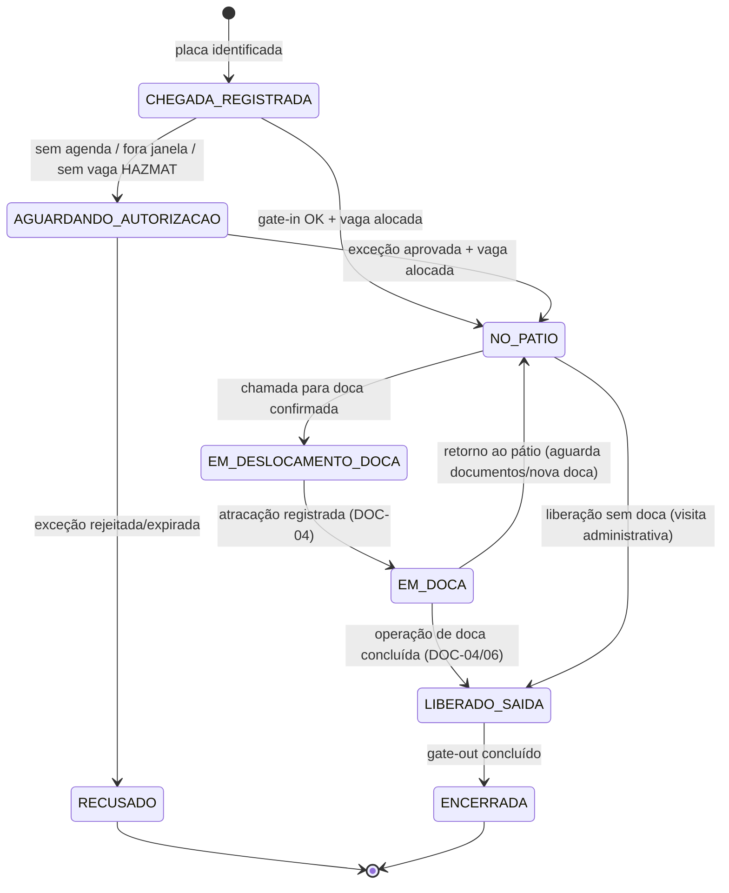

# DOC-03 — PORTARIA E PÁTIO
## Especificação de Requisitos do Sistema WMS Enterprise 3PL

| Metadado | Valor |
|---|---|
| Código do documento | DOC-03 |
| Versão | 1.0.0 |
| Status | APROVADO PARA USO |
| Data | 2026-08-10 |
| Depende de | DOC-00 v1.2.0, DOC-01, DOC-02, DOC-12 |
| Módulo (prefixo de requisitos) | POR |

---

## 1. ESCOPO E OBJETIVO

Este documento especifica: agendamento de veículos, controle de entrada e saída de pessoas, veículos e cargas na portaria (gate-in/gate-out), gestão do pátio de espera com fila priorizada, chamada para doca e integrações físicas (cancelas, catracas, câmeras LPR) via Edge Agent.

**Fronteiras:** a operação DENTRO da doca (atracação, descarga, conferência) é do DOC-04. A emissão/validação de documentos fiscais é do DOC-08 — aqui apenas se registra a presença e vinculação dos documentos. O protocolo técnico de cancelas/LPR é do DOC-11.

---

## 2. DEPENDÊNCIAS E TERMOS

Aplicam-se o Glossário (DOC-00 §4, em especial §4.6) e as regras globais. Termos adicionais:

| Termo | Identificador técnico | Definição única |
|---|---|---|
| Visita de Veículo | `vehicle_visit` | Ciclo completo de um veículo no site, do gate-in ao gate-out. Documento raiz da portaria. |
| Janela de Agendamento | `appointment_window` | Faixa de data/hora contratada para chegada (ex.: 08:00–09:00). |
| Chamada para Doca | `dock_call` | Convocação de um veículo do pátio para uma doca específica. |
| Tolerância de Atraso | `lateness_tolerance` | Minutos após o fim da janela em que o agendamento ainda é considerado válido (parâmetro). |

---

## 3. ATORES E PERMISSÕES ENVOLVIDAS

| Ator | Papel típico | Interação |
|---|---|---|
| Porteiro | `PORTEIRO` | Gate-in/gate-out, cadastro de visitantes/motoristas, acionamento de cancela |
| Líder de Turno | `LIDER_TURNO` | Fila de pátio, chamadas para doca, exceções |
| Cliente (portal) | `CLIENTE_OPERACAO` | Criação de agendamentos vinculados a ASN/pedido |
| Gestor do Armazém | `GESTOR_ARMAZEM` | Configuração de janelas, prioridades, tolerâncias |

**Catálogo de permissões deste módulo** (registradas em `permission`, DOC-12):

| Código | Escopo |
|---|---|
| `POR.GATE_IN` / `POR.GATE_OUT` | WAREHOUSE |
| `POR.CADASTRO_MOTORISTA_VISITANTE` | WAREHOUSE |
| `POR.DADO_PESSOAL_COMPLETO` | WAREHOUSE (RN-SEG-051) |
| `POR.AGENDAMENTO_CRIAR` | CLIENT_WAREHOUSE |
| `POR.AGENDAMENTO_GERIR` | WAREHOUSE |
| `POR.FILA_PRIORIZAR` | WAREHOUSE |
| `POR.CHAMADA_DOCA` | WAREHOUSE |
| `POR.ACIONAR_CANCELA` | WAREHOUSE |

**Catálogo de exceções deste módulo** (registradas em `exception_type`, DOC-12 §4.5):

| Código | Passos | Motivo obrigatório | Expira em |
|---|---|---|---|
| `POR.VEICULO_SEM_AGENDAMENTO` | 1 | sim | 4 h |
| `POR.FORA_DA_JANELA` | 1 | sim | 4 h |
| `POR.SAIDA_COM_PENDENCIA` | 2 | sim | 2 h |
| `POR.DIVERGENCIA_LACRE` | 1 | sim | 8 h |

---

## 4. REQUISITOS

### 4.1 Agendamento

**RF-POR-001 — Criação de agendamento**
QUANDO um usuário com `POR.AGENDAMENTO_CRIAR` (portal ou interno) criar um agendamento, o sistema DEVE exigir: armazém, cliente, sentido (`INBOUND` | `OUTBOUND`), janela (data + faixa horária dentre as janelas configuradas do armazém), tipo de veículo, e vínculo opcional a ASN (inbound) ou Pedidos (outbound). Número gerado pela máscara `AGD` (RN-DAD-040).

**RN-POR-002 — Capacidade de janela**
Cada janela do armazém possui capacidade máxima de agendamentos por sentido (configuração `POR.JANELA_CAPACIDADE`). QUANDO a capacidade estiver esgotada, o sistema DEVE rejeitar a criação oferecendo as 5 próximas janelas com vaga. É PROIBIDO overbooking.

**RF-POR-003 — Alterações e cancelamento**
Agendamento PODE ser remarcado ou cancelado até o início da janela pelo criador ou por `POR.AGENDAMENTO_GERIR`. Após o início da janela, apenas `POR.AGENDAMENTO_GERIR`. Todo cancelamento exige motivo (RG-003).

**RN-POR-004 — No-show**
QUANDO a janela + `lateness_tolerance` (parâmetro `POR.TOLERANCIA_ATRASO_MIN`, padrão 60) expirar sem gate-in, o `scheduler` DEVE marcar o agendamento como `NO_SHOW`, liberar a capacidade da janela e notificar o cliente (portal + evento).

### 4.2 Gate-in de veículos

**RF-POR-010 — Identificação na chegada**
QUANDO um veículo chegar, o sistema DEVE permitir identificação por: (a) leitura automática de placa via LPR (job Edge Agent, DOC-11) exibindo o agendamento candidato; ou (b) digitação da placa. A placa DEVE ser validada nos padrões Mercosul (`AAA9A99`) ou anterior (`AAA9999`).

**RF-POR-011 — Registro do gate-in**
O gate-in DEVE registrar: placa(s) (cavalo + até 2 reboques), motorista (CPF validado por dígito, nome, CNH e validade, telefone), transportadora (texto livre + CNPJ opcional), agendamento vinculado, documentos apresentados (chaves de NF-e lidas por código de barras/QR do DANFE — 44 dígitos validados), lacres (números), foto opcional do conjunto, quilometragem opcional. Motorista e veículo são reaproveitados de cadastros existentes por CPF/placa (RN-SEG-051 para mascaramento).

**RN-POR-012 — Validação contra agendamento**
- Chegada dentro da janela (com tolerância): gate-in normal.
- SE fora da janela + tolerância, ENTÃO o gate-in DEVE abrir exceção `POR.FORA_DA_JANELA`; aprovada, o veículo entra com prioridade rebaixada (RN-POR-021).
- SE sem agendamento, ENTÃO o gate-in DEVE abrir exceção `POR.VEICULO_SEM_AGENDAMENTO`; aprovada, o sistema cria agendamento retroativo `SEM_AGENDA` para rastreabilidade. ENQUANTO pendente, o veículo aguarda FORA do site (estado `AGUARDANDO_AUTORIZACAO`).

**RN-POR-013 — Espécies perigosas no gate-in [INVIOLÁVEL]**
QUANDO o agendamento/ASN vinculado contiver produtos das espécies `INFLAMAVEL`, `COMBUSTIVEL` ou `QUIMICO_CONTROLADO`, o sistema DEVE: exigir confirmação dos itens de sinalização (parâmetro checklist `POR.CHECKLIST_HAZMAT`: rótulos de risco, ficha de emergência), e restringir a alocação de pátio a vagas `HAZMAT` (§4.3). SE não houver vaga `HAZMAT` livre, ENTÃO o veículo permanece em `AGUARDANDO_AUTORIZACAO` com alerta.

**RF-POR-014 — Acionamento de cancela**
QUANDO o gate-in for concluído com sucesso, o sistema DEVE enviar job de abertura de cancela ao Edge Agent e registrar a passagem. SE o Edge Agent estiver indisponível (RNF-ARQ-061), a interface DEVE exibir instrução de operação manual da cancela e o porteiro DEVE registrar confirmação manual (auditada como `OVERRIDE`).

### 4.3 Pátio e fila

**RF-POR-020 — Alocação de vaga**
QUANDO o veículo entrar, o sistema DEVE sugerir vaga de pátio livre compatível (`WAITING`; `HAZMAT` quando RN-POR-013). O porteiro PODE alterar para outra vaga livre compatível. O painel de pátio (tópico `patio`) DEVE exibir em tempo real o mapa de vagas e estados.

**RN-POR-021 — Prioridade da fila [regra determinística]**
A posição na Fila de Pátio por sentido é calculada por pontuação decrescente:
```
prioridade = P1*no_horario + P2*perecivel + P3*hazmat + P4*prioridade_manual
desempate: ordem de chegada (gate-in mais antigo primeiro)
```
- `no_horario` = 1 se dentro da janela; 0 se `POR.FORA_DA_JANELA` aprovada
- `perecivel` = 1 se ASN/pedido contém espécies `REFRIGERADO` | `CONGELADO` | `ALIMENTO`
- `hazmat` = 1 se RN-POR-013
- `prioridade_manual` = 1 quando marcada por `POR.FILA_PRIORIZAR` (motivo obrigatório)
Pesos P1–P4 são parâmetros por armazém (`POR.PESO_PRIORIDADE_*`, padrão P1=4, P2=3, P3=2, P4=8). O cálculo é reexecutado a cada mudança de estado e o resultado é auditável (pontuação gravada).

**Exemplo normativo:** pesos padrão; veículo A (no horário, perecível) = 4+3 = 7; veículo B (fora da janela, hazmat) = 0+2 = 2; veículo C (no horário, prioridade manual) = 4+8 = 12. Ordem da fila: C, A, B.

**RF-POR-022 — Chamada para doca**
QUANDO uma doca compatível ficar `FREE` (DOC-04) e houver fila, o sistema DEVE sugerir automaticamente o primeiro da fila ao usuário com `POR.CHAMADA_DOCA`, que confirma a Chamada para Doca (a confirmação é humana; não há chamada automática sem confirmação). A chamada DEVE notificar o painel do pátio e registrar hora; o deslocamento até a doca muda o estado da visita para `EM_DESLOCAMENTO_DOCA` e reserva a doca (`RESERVED`, DOC-04).

### 4.4 Pessoas (visitantes e pedestres)

**RF-POR-030 — Registro de visitante**
O gate-in de pessoa DEVE registrar: nome, documento, empresa, motivo/anfitrião, áreas autorizadas (lista de zonas), validade da autorização (mesmo dia por padrão) e foto opcional. Saída registra gate-out. Catraca acionada via Edge Agent como na RF-POR-014. Dados sujeitos à RN-SEG-051 (retenção e mascaramento).

**RF-POR-031 — Permanência**
O painel de portaria DEVE listar todas as pessoas e veículos presentes no site em tempo real, com tempo de permanência, e alertar visitas de pessoa além da validade da autorização.

### 4.5 Gate-out de veículos

**RN-POR-040 — Pré-condições de saída [INVIOLÁVEL]**
QUANDO o gate-out de um veículo for solicitado, o sistema DEVE validar:
1. Visita sem etapas de Fluxo Operacional pendentes (RG-002): inbound = descarga concluída e documentos liberados; outbound = etapa `Carregamento` concluída e documentos fiscais autorizados (DOC-06/DOC-08);
2. Lacres de saída registrados quando exigidos pelo cliente (parâmetro `POR.EXIGE_LACRE_SAIDA`);
3. Nenhuma exceção `PENDING`/`ESCALATED` vinculada à visita.
SE qualquer validação falhar, ENTÃO a saída DEVE ser bloqueada com a lista exata de pendências; forçar a saída exige exceção `POR.SAIDA_COM_PENDENCIA` (2 aprovadores).

**RF-POR-041 — Registro do gate-out**
O gate-out DEVE registrar horário, conferência de lacres (divergência abre `POR.DIVERGENCIA_LACRE` e bloqueia até decisão), e acionar a cancela (RF-POR-014). O gate-out conclui a etapa `Saída` do Fluxo Operacional outbound e encerra a visita.

**RNF-POR-042 — Tempos de portaria**
O sistema DEVE registrar timestamps de todos os marcos (chegada, autorização, entrada, vaga, chamada, doca, saída) para os KPIs de permanência do DOC-10.

### 4.6 Eventos de domínio deste módulo

Catálogo (`event_type`): `portaria.agendamento_criado`, `portaria.agendamento_cancelado`, `portaria.agendamento_no_show`, `portaria.veiculo_chegou`, `portaria.gate_in_concluido`, `portaria.vaga_ocupada`, `portaria.fila_atualizada`, `portaria.chamada_doca`, `portaria.gate_out_concluido`, `portaria.pessoa_entrou`, `portaria.pessoa_saiu`.

---

## 5. MÁQUINAS DE ESTADO E FLUXOS

### 5.1 Visita de Veículo (`vehicle_visit`)



| Origem | Evento | Guarda | Destino | Efeitos |
|---|---|---|---|---|
| CHEGADA_REGISTRADA | gate-in | agendamento válido na janela, vaga compatível livre | NO_PATIO | cancela abre, vaga `OCCUPIED`, fila recalculada |
| NO_PATIO | chamada confirmada | doca compatível `FREE` | EM_DESLOCAMENTO_DOCA | doca `RESERVED`, painel notificado |
| EM_DOCA | conclusão de operação | RN-POR-040 itens atendidos | LIBERADO_SAIDA | evento para DOC-04/06 |
| LIBERADO_SAIDA | gate-out | RN-POR-040 completo | ENCERRADA | cancela abre, vaga liberada, visita fecha |

### 5.2 Agendamento (`appointment`)

`SCHEDULED → CONFIRMED_ARRIVAL (gate-in) → FULFILLED (visita encerrada)`; ramos: `CANCELLED` (RF-POR-003), `NO_SHOW` (RN-POR-004), `SEM_AGENDA` criado retroativamente já em `CONFIRMED_ARRIVAL`.

---

## 6. CRITÉRIOS DE ACEITE (GHERKIN)

```gherkin
Cenário: Gate-in dentro da janela
  Dado agendamento AGD-SP01-00000010 com janela hoje 08:00–09:00 e tolerância 60 min
  Quando o veículo ABC1D23 registrar chegada às 08:40
  Então o gate-in deve ser concluído sem exceção
  E a vaga sugerida deve estar livre e compatível
  E o job de abertura de cancela deve ser enviado ao Edge Agent

Cenário: Chegada fora da janela com tolerância excedida
  Dado o mesmo agendamento com janela 08:00–09:00 e tolerância 60 min
  Quando o veículo registrar chegada às 10:15
  Então o sistema deve abrir a exceção POR.FORA_DA_JANELA
  E o veículo deve permanecer em AGUARDANDO_AUTORIZACAO
  E após aprovação a pontuação de fila deve usar no_horario = 0

Cenário: Veículo sem agendamento recusado
  Dado um veículo sem agendamento com exceção POR.VEICULO_SEM_AGENDAMENTO rejeitada
  Quando a decisão for registrada
  Então a visita deve ir para RECUSADO
  E nenhuma vaga de pátio deve ser ocupada

Cenário: Hazmat exige vaga dedicada
  Dado ASN com produto da espécie INFLAMAVEL vinculado ao agendamento
  E todas as vagas HAZMAT ocupadas
  Quando o gate-in for tentado
  Então o veículo deve permanecer em AGUARDANDO_AUTORIZACAO
  E um alerta deve ser publicado no tópico alertas
  E ao liberar uma vaga HAZMAT o gate-in deve poder ser concluído somente nela

Cenário: Ordem determinística da fila (exemplo normativo RN-POR-021)
  Dado pesos padrão P1=4 P2=3 P3=2 P4=8
  E veículo A no horário e perecível, veículo B fora da janela e hazmat, veículo C no horário com prioridade manual
  Quando a fila for calculada
  Então a ordem deve ser C (12), A (7), B (2)
  E as pontuações devem ficar registradas para auditoria

Cenário: Bloqueio de gate-out com pendência
  Dado visita outbound com etapa Carregamento pendente
  Quando o porteiro solicitar o gate-out
  Então o sistema deve bloquear listando "Carregamento pendente"
  E a saída forçada deve exigir a exceção POR.SAIDA_COM_PENDENCIA com dois aprovadores distintos

Cenário: Divergência de lacre
  Dado visita com lacre de saída registrado "L-778899"
  Quando o porteiro conferir o lacre físico "L-778890"
  Então a exceção POR.DIVERGENCIA_LACRE deve ser aberta
  E o gate-out deve permanecer bloqueado até a decisão

Cenário: No-show libera capacidade
  Dado janela 08:00–09:00 com capacidade 5 e 5 agendamentos, um deles sem chegada
  Quando o relógio passar de 10:00 (janela + 60 min)
  Então o agendamento sem chegada deve ser marcado NO_SHOW
  E a capacidade da janela deve voltar a exibir 1 vaga em consultas históricas de ocupação
```

---

## 7. REQUISITOS DE DADOS (DELTA SOBRE O DOC-02)

| ID | Estrutura | Classificação | Observações |
|---|---|---|---|
| RD-POR-001 | `appointment` | TENANT | janela, sentido, vínculos ASN/pedidos, estado §5.2 |
| RD-POR-002 | `driver` | GLOBAL | CPF UNIQUE, CNH + validade, telefone; dados mascarados (RN-SEG-051) |
| RD-POR-003 | `vehicle` | GLOBAL | placa UNIQUE, tipo, reboques |
| RD-POR-004 | `visitor` + `person_visit` | GLOBAL | pessoa e suas visitas; retenção RN-SEG-051 |
| RD-POR-005 | `vehicle_visit` | TENANT | estado §5.1, timestamps de marcos, lacres, docs (chaves NF-e), fotos (S3) |
| RD-POR-006 | `yard_queue_entry` | TENANT | visita, pontuação calculada, componentes da pontuação, posição |
| RD-POR-007 | `appointment_window_config` | GLOBAL | janelas por armazém/dia da semana, capacidade por sentido |

Parâmetros (`app_parameter`): `POR.TOLERANCIA_ATRASO_MIN`, `POR.JANELA_CAPACIDADE`, `POR.PESO_PRIORIDADE_P1..P4`, `POR.CHECKLIST_HAZMAT`, `POR.EXIGE_LACRE_SAIDA`, `SEG.RETENCAO_PORTARIA_MESES`.

---

## 8. FORA DE ESCOPO (NÃO IMPLEMENTAR)

- Balança rodoviária de pesagem de veículo no gate (a pesagem desta versão é de volumes/paletes no DOC-06; pesagem de eixo/veículo é extensão futura).
- Gestão de frota própria, manutenção de veículos, jornada de motorista.
- Integração com sistemas de agendamento de terceiros.
- Reconhecimento facial e biometria de pessoas.
- Cobrança de estadia/diária de veículo (o tempo é registrado; tarifação fica no DOC-09 como serviço avulso manual).
- Controle de EPI e integração de segurança do trabalho (apenas checklist HAZMAT parametrizado).

---

## 9. MATRIZ DE RASTREABILIDADE LOCAL

| Necessidade (DOC-00 §8) | Requisitos deste documento |
|---|---|
| N01 Portaria pessoas/veículos/cargas | RF-POR-010..014, RF-POR-030..031, RF-POR-041 |
| N02 Pátio de espera | RF-POR-020..022, RN-POR-021 |
| N20 Periféricos (cancela/catraca/LPR) | RF-POR-010, RF-POR-014 (protocolo no DOC-11) |
| N17/RG-002 Fluxo sem salto (portaria) | RN-POR-040 |
| N18/RG-003 Auditoria | pontuações, overrides e marcos auditados |

---

## CHANGELOG

| Versão | Data | Alteração |
|---|---|---|
| 1.0.0 | 2026-08-10 | Versão inicial aprovada |
