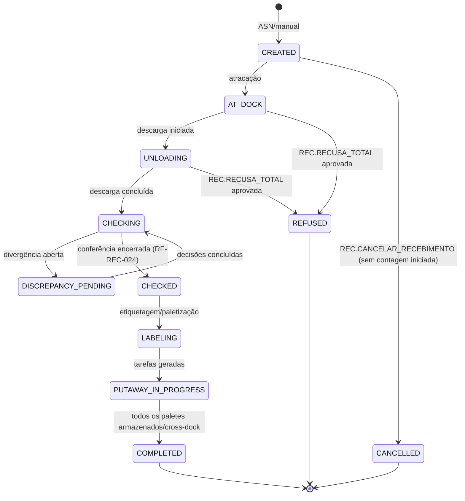

# DOC-04 — RECEBIMENTO E DOCAS
## Especificação de Requisitos do Sistema WMS Enterprise 3PL

| Metadado | Valor |
|---|---|
| Código do documento | DOC-04 |
| Versão | 1.0.0 |
| Status | APROVADO PARA USO |
| Data | 2026-08-10 |
| Depende de | DOC-00 v1.2.0, DOC-01, DOC-02, DOC-03, DOC-12 |
| Módulo (prefixo de requisitos) | REC |

---

## 1. ESCOPO E OBJETIVO

Este documento especifica o ciclo de entrada: alocação e operação de docas, criação da Ordem de Recebimento (a partir de ASN por XML de NF-e, integração ERP ou digitação), descarga, conferência (cega ou informada), gerenciamento das divergências, paletização e emissão de LPN, quarentena por espécie, o motor de putaway dirigido (AD-006) e o cross-docking.

**Fronteiras:** chegada e fila do veículo são do DOC-03. O crédito do Estoque Fiscal (RG-014 passo 2) e a validação/guarda de XML são do DOC-08 — aqui a NF de entrada é registrada e o prazo de regularização é iniciado. As regras de saldo e a matriz de compatibilidade de espécies são do DOC-05. A impressão física das etiquetas é do DOC-11.

---

## 2. DEPENDÊNCIAS E TERMOS

Aplicam-se o Glossário (DOC-00 §4) e as regras globais, em especial RG-002, RG-004, RG-005, RG-007, RG-014 e RG-015. Termos adicionais:

| Termo | Identificador técnico | Definição única |
|---|---|---|
| Atracação | `docking` | Registro do posicionamento físico do veículo na doca, início da operação de doca. |
| Conferência Cega | `blind_checking` | Contagem sem exibir ao conferente as quantidades esperadas. |
| Conferência Informada | `informed_checking` | Contagem com exibição das quantidades esperadas. |
| Recontagem | `recount` | Segunda contagem obrigatória disparada por divergência. |
| Motor de Putaway | `putaway_engine` | Componente que sugere endereços por filtros invioláveis + critérios ranqueados configuráveis. |

---

## 3. ATORES E PERMISSÕES ENVOLVIDAS

| Ator | Papel típico | Interação |
|---|---|---|
| Líder de Turno | `LIDER_TURNO` | Atracação, designação de conferentes, decisão de exceções |
| Conferente | `CONFERENTE` | Descarga assistida, contagem, registro de divergências e avarias |
| Operador de Empilhadeira | `OPERADOR_EMPILHADEIRA` | Execução de tarefas de putaway |
| Qualidade | papel com `REC.LIBERAR_QUARENTENA` | Liberação de lotes em quarentena |
| Cliente (portal) | `CLIENTE_OPERACAO` | Envio de ASN, acompanhamento e ciência de divergências |

**Catálogo de permissões deste módulo:**

| Código | Escopo |
|---|---|
| `REC.ATRACAR` / `REC.LIBERAR_DOCA` | WAREHOUSE |
| `REC.CONFERIR` | CLIENT_WAREHOUSE |
| `REC.RECONTAR` | CLIENT_WAREHOUSE |
| `REC.ENCERRAR_CONFERENCIA` | CLIENT_WAREHOUSE |
| `REC.LIBERAR_QUARENTENA` | CLIENT_WAREHOUSE (sensível) |
| `REC.CANCELAR_RECEBIMENTO` | CLIENT_WAREHOUSE (sensível) |

**Catálogo de exceções deste módulo** (DOC-12 §4.5):

| Código | Passos | Motivo obrigatório | Expira em |
|---|---|---|---|
| `REC.DIVERGENCIA_FALTA` | 1 | sim | 24 h |
| `REC.DIVERGENCIA_SOBRA` | 1 | sim | 24 h |
| `REC.DIVERGENCIA_AVARIA` | 1 | sim | 24 h |
| `REC.DIVERGENCIA_TROCA` | 1 | sim | 24 h |
| `REC.PRODUTO_SEM_CADASTRO` | 2 | sim | 24 h |
| `REC.RECUSA_TOTAL` | 2 | sim | 8 h |

---

## 4. REQUISITOS

### 4.1 Docas

**RN-REC-001 — Máquina de estados da doca**
Estados (`dock.status`, DOC-02): `FREE → RESERVED` (chamada para doca, RF-POR-022) `→ OCCUPIED` (atracação) `→ FREE` (liberação após operação). `BLOCKED`/`INACTIVE` por gestão, apenas quando `FREE`. É PROIBIDO atracar em doca não reservada para a visita.

**RF-REC-002 — Atracação**
QUANDO o veículo chegar à doca reservada, usuário com `REC.ATRACAR` DEVE registrar a atracação (visita → `EM_DOCA`, doca → `OCCUPIED`), com conferência de lacres de entrada quando registrados no gate-in (divergência abre `POR.DIVERGENCIA_LACRE`, DOC-03). A compatibilidade doca × sentido × tipo de veículo (DOC-02) DEVE ser validada.

**RF-REC-003 — Alocação inteligente de doca**
A sugestão de doca para a chamada (RF-POR-022) DEVE considerar, nesta ordem: sentido compatível, tipo de veículo, e menor distância média até as zonas preferenciais dos produtos do ASN (parâmetro `REC.MAPA_DISTANCIA_DOCA_ZONA`, matriz doca × zona em metros). Empate: menor código de doca.

### 4.2 Ordem de Recebimento e ASN

**RF-REC-010 — Origens da Ordem de Recebimento**
A Ordem de Recebimento (máscara `REC`, RN-DAD-040) DEVE ser criada a partir de:
(a) **ASN por XML de NF-e**: upload no portal/interno ou integração (DOC-13); o sistema extrai itens, quantidades, lotes (quando presentes em `rastro`), emitente e chave;
(b) **ASN por integração ERP** (DOC-13);
(c) **Digitação manual** (permissão `REC.CONFERIR` + itens do catálogo do cliente).
Uma Ordem PODE consolidar múltiplas NF-e da mesma visita/cliente.

**RN-REC-011 — Vínculo com o prazo fiscal (RG-014 passo 1)**
QUANDO a Ordem de Recebimento com NF-e de entrada for confirmada no gate-in, o sistema DEVE registrar a(s) `inbound_invoice` e iniciar o prazo de regularização (`client_warehouse_settings.inbound_invoice_deadline_days`), notificando o cliente. O controle do prazo e seus efeitos são do DOC-08.

**RN-REC-012 — Item sem cadastro**
SE um item da NF-e/ASN não casar com produto do catálogo do cliente (por SKU, EAN ou NCM+descrição), ENTÃO o sistema DEVE marcar o item como `SEM_CADASTRO` e abrir exceção `REC.PRODUTO_SEM_CADASTRO`. Aprovação exige a criação/vínculo do produto (pelo cliente no portal ou por interno autorizado) antes da conferência do item. ENQUANTO pendente, o item NÃO PODE ser conferido; os demais itens seguem normalmente.

### 4.3 Descarga e conferência

**RF-REC-020 — Fluxo Operacional de recebimento (RG-002)**
Toda Ordem de Recebimento instancia o Fluxo Operacional:
`Chegada → Doca → Descarga → Conferência → Etiquetagem → Putaway → Fim`
(etapa `Divergências` é intercalada dinamicamente entre Conferência e Etiquetagem quando existirem). Exibição verde/vermelho e navegação conforme RG-002 e DOC-10.

**RF-REC-021 — Modo de conferência**
ONDE `client_warehouse_settings.blind_checking = true` (padrão), a contagem DEVE ser cega: o coletor NÃO exibe quantidades esperadas; o conferente informa produto (leitura de EAN/DUN ou SKU), lote/validade (obrigatórios conforme RN-DAD-020), embalagem e quantidade contada. ONDE `false`, o coletor exibe o esperado e o conferente confirma/ajusta. A troca do modo em uma ordem específica exige `REC.ENCERRAR_CONFERENCIA` + motivo.

**RN-REC-022 — Apuração e recontagem [INVIOLÁVEL]**
QUANDO a contagem de um item divergir do esperado, o sistema DEVE exigir Recontagem por conferente DIFERENTE do primeiro (quando houver mais de um conferente disponível; caso contrário, o mesmo, com marcação). A quantidade final do item = resultado da recontagem. SE a recontagem confirmar a divergência, ENTÃO o sistema DEVE registrar a Divergência tipificada:
- contado < esperado → `FALTA` (quantidade = diferença)
- contado > esperado → `SOBRA`
- produto recebido ≠ documento → `TROCA` (par: item faltante + item excedente)
- unidades danificadas → `AVARIA` (quantidade avariada, com fotos obrigatórias ≥ 1, armazenadas no S3)

**RN-REC-023 — Efeitos das divergências [INVIOLÁVEL]**
Cada Divergência abre a exceção correspondente (§3) com efeito NO ITEM, não na ordem: itens sem divergência prosseguem para Etiquetagem/Putaway. Efeitos por decisão:

| Tipo | Aprovada (recebimento do apurado) | Rejeitada |
|---|---|---|
| `FALTA` | Ordem ajustada ao contado; carta de divergência gerada (PDF) e cliente notificado; reflexo fiscal no DOC-08 | Item volta para recontagem |
| `SOBRA` | Excedente recebido como saldo `BLOCKED` até regularização documental (DOC-08) OU devolvido no ato (registro de recusa parcial) — decisão do aprovador | Excedente recusado e registrado |
| `AVARIA` | Quantidade avariada recebida com parcela `qty_damaged` em zona `DAMAGED`, OU recusada no ato | Item volta para recontagem |
| `TROCA` | Item excedente tratado como SOBRA e faltante como FALTA, vinculados | Par volta para recontagem |

`REC.RECUSA_TOTAL` (veículo devolvido sem descarga ou com recusa integral) exige 2 aprovadores; a visita segue para gate-out com a recusa documentada.

**RF-REC-024 — Encerramento da conferência**
QUANDO todos os itens estiverem contados e sem exceção pendente, usuário com `REC.ENCERRAR_CONFERENCIA` DEVE encerrar a etapa. O encerramento congela as quantidades recebidas e habilita a Etiquetagem.

### 4.4 Etiquetagem e paletização

**RF-REC-030 — Formação de paletes e LPN (RG-007)**
Na Etiquetagem, o conferente DEVE formar os paletes informando o conteúdo (produto, lote, quantidade) de cada um; o sistema gera o LPN (RN-DAD-030) e envia o job de impressão da etiqueta (DOC-11). PODE haver sugestão automática de paletização pelo padrão `ballast × layers` da embalagem de palete do produto. Palete misto (múltiplos produtos/lotes) é permitido ONDE parâmetro `REC.PERMITE_PALETE_MISTO` (padrão true), sempre com conteúdo integral declarado.

**RN-REC-031 — Quarentena por espécie**
ONDE parâmetro `REC.QUARENTENA_ESPECIES` (lista por cliente×armazém; padrão inclui `MEDICAMENTO`) contiver a espécie do produto, o lote recebido DEVE entrar com `batch.status = QUARANTINE` e o putaway DEVE destinar exclusivamente zonas `QUARANTINE`. Liberação por `REC.LIBERAR_QUARENTENA` (com laudo/motivo) muda o lote para `RELEASED` e gera tarefas de transferência para armazenagem definitiva (DOC-05).

### 4.5 Motor de Putaway (AD-006)

**RN-REC-040 — Duas fases determinísticas [INVIOLÁVEL]**
Para cada palete, o motor DEVE executar:

**Fase 1 — Filtros invioláveis (ordem fixa, não configurável, sem override):**
1. `location.status = ACTIVE`;
2. Contenção do Armazém Lógico (RG-015);
3. Compatibilidade de espécie: zona `allowed_species` + matriz de compatibilidade (DOC-05/LAC-003) — RG-005;
4. Quarentena: lote `QUARANTINE` → apenas zonas `QUARANTINE` (RN-REC-031);
5. Capacidades do endereço (peso, volume, paletes, altura) considerando o saldo/ocupação atual;
6. Coerência física × giro (RN-DAD-010).
Endereço reprovado em qualquer filtro NÃO PODE ser sugerido nem aceito por override.

**Fase 2 — Ranqueamento configurável (lista ordenada por armazém, parâmetro `REC.CRITERIOS_PUTAWAY`):**
critérios disponíveis (catálogo fechado): `ZONA_PREFERENCIAL_PRODUTO` (product_warehouse_parameter.putaway_zone_preference), `CONSOLIDACAO_PRODUTO_LOTE` (proximidade de saldo igual), `CLASSE_ABC` (abc_class do endereço × giro), `MENOR_NIVEL`, `MENOR_DISTANCIA_DOCA` (matriz RF-REC-003), `MAIOR_OCUPACAO_ZONA` (completar zonas). O motor ordena os aprovados aplicando os critérios em sequência (critério seguinte só desempata o anterior). Empate final: menor `location.code`. O sistema DEVE apresentar o 1º colocado como sugestão e os 4 seguintes como alternativas.

**Exemplo normativo:** configuração `[ZONA_PREFERENCIAL_PRODUTO, CLASSE_ABC, MENOR_NIVEL]`; endereços aprovados E1 (zona pref., classe B, nível 03), E2 (zona pref., classe A, nível 04), E3 (outra zona, classe A, nível 00). Resultado: E2 (zona pref. + classe A), E1, E3. Sugestão = E2.

**RN-REC-041 — Override do operador**
Operador com `EST.PUTAWAY_OVERRIDE` PODE escolher endereço diferente da sugestão DESDE QUE aprovado na Fase 1; a escolha exige motivo e gera auditoria `OVERRIDE` (AD-006). Sem a permissão, apenas a sugestão e alternativas listadas são aceitas.

**RF-REC-042 — Execução do putaway**
Cada palete gera uma Tarefa de putaway atribuível (fila por prioridade e proximidade). A execução no coletor DEVE exigir: leitura do LPN → deslocamento → leitura da etiqueta do endereço destino (RN-DAD-011). Confirmação credita `stock_balance` no endereço (parcela conforme estado do lote) e registra `stock_movement`. Divergência de leitura (endereço ≠ designado) sem permissão de override DEVE ser rejeitada no ato. Operação disponível offline (RNF-ARQ-050).

**RF-REC-043 — Conclusão da ordem**
QUANDO todos os paletes estiverem armazenados (ou destinados a cross-docking), o Fluxo Operacional conclui (`Fim`), a doca é liberada (`REC.LIBERAR_DOCA` ou automática na saída do veículo) e o evento `recebimento.concluido` é publicado (insumo da reconciliação DOC-13 e faturamento DOC-09).

### 4.6 Cross-docking

**RN-REC-050 — Elegibilidade**
Item de ASN é elegível a cross-docking QUANDO vinculado, antes da conferência, a Pedido de saída aberto do mesmo cliente (vínculo manual por `LIDER_TURNO` ou automático via integração). O vínculo é por quantidade (parcial permitido).

**RF-REC-051 — Fluxo do cross-docking**
Após a conferência (obrigatória e idêntica ao fluxo normal), as quantidades vinculadas DEVEM ser paletizadas separadamente, etiquetadas e movidas para endereço de zona `CROSS_DOCKING` (staging), gerando saldo com Reserva imediata ao Pedido vinculado — sem putaway de armazenagem. O Pedido correspondente pula a etapa de Picking para essas quantidades (o palete de cross-docking entra direto em Packing/Expedição, DOC-06). SE o Pedido vinculado for cancelado, ENTÃO a reserva é desfeita e o sistema gera tarefas de putaway normal (motor RN-REC-040).

**RNF-REC-052 — Tempo máximo em cross-docking**
Parâmetro `REC.CROSSDOCK_TEMPO_MAX_H` (padrão 24 h): saldo em zona `CROSS_DOCKING` além do tempo gera alerta no painel e no tópico `alertas`.

### 4.7 Eventos de domínio deste módulo

`recebimento.ordem_criada`, `recebimento.atracado`, `recebimento.descarga_iniciada`, `recebimento.item_conferido`, `recebimento.divergencia_registrada`, `recebimento.conferencia_encerrada`, `recebimento.lpn_gerado`, `recebimento.putaway_concluido`, `recebimento.quarentena_liberada`, `recebimento.crossdock_reservado`, `recebimento.concluido`.

---

## 5. MÁQUINAS DE ESTADO E FLUXOS

### 5.1 Ordem de Recebimento



| Origem | Evento | Guarda | Destino | Efeitos |
|---|---|---|---|---|
| CHECKING | encerrar conferência | todos itens contados, zero exceções pendentes | CHECKED | quantidades congeladas, evento publicado |
| LABELING | LPN gerado | conteúdo do palete = quantidades conferidas restantes | LABELING | job de impressão (DOC-11) |
| PUTAWAY_IN_PROGRESS | confirmação de tarefa | leitura LPN + endereço OK, filtros Fase 1 OK | PUTAWAY_IN_PROGRESS ou COMPLETED | `stock_balance` +, `stock_movement`, RG-003 |

### 5.2 Tarefa de putaway

`CREATED → ASSIGNED → IN_EXECUTION → DONE`; ramos: `CANCELLED` (ordem recusada/cancelada), `REJECTED_SCAN` (leitura divergente, volta a `ASSIGNED`).

---

## 6. CRITÉRIOS DE ACEITE (GHERKIN)

```gherkin
Cenário: Conferência cega com divergência de falta
  Dado ordem com item esperado de 100 UN do SKU-1 e conferência cega ativa
  Quando o conferente contar 90 UN
  E a recontagem por outro conferente apurar 90 UN
  Então uma Divergência FALTA de 10 UN deve ser registrada
  E a exceção REC.DIVERGENCIA_FALTA deve bloquear apenas o item SKU-1
  E os demais itens devem prosseguir para etiquetagem

Cenário: Falta aprovada ajusta a ordem
  Dado a Divergência FALTA de 10 UN com exceção aprovada
  Quando a decisão for registrada
  Então a quantidade recebida do item deve ser 90 UN
  E a carta de divergência em PDF deve ser gerada e o cliente notificado

Cenário: Sobra recebida como bloqueada
  Dado item esperado 50 UN e contado/recontado 60 UN
  E exceção REC.DIVERGENCIA_SOBRA aprovada com destino "receber bloqueado"
  Quando o recebimento do item concluir
  Então 50 UN devem creditar saldo normal e 10 UN a parcela qty_blocked
  E as 10 UN devem permanecer bloqueadas até regularização documental

Cenário: Avaria exige foto
  Dado 5 UN danificadas identificadas na conferência
  Quando o conferente registrar a AVARIA sem anexar foto
  Então o sistema deve rejeitar o registro exigindo ao menos 1 foto

Cenário: Medicamento entra em quarentena
  Dado produto da espécie MEDICAMENTO com REC.QUARENTENA_ESPECIES contendo MEDICAMENTO
  Quando o lote L-01 for recebido
  Então o lote deve ficar com status QUARANTINE
  E o motor de putaway deve sugerir apenas endereços de zonas QUARANTINE
  E após liberação com REC.LIBERAR_QUARENTENA tarefas de transferência devem ser geradas

Cenário: Fase 1 não admite override
  Dado palete de produto INFLAMAVEL
  E um endereço em zona sem INFLAMAVEL em allowed_species
  Quando um operador com EST.PUTAWAY_OVERRIDE tentar escolher esse endereço
  Então o sistema deve rejeitar por violação de filtro inviolável (RG-005)

Cenário: Ranqueamento determinístico (exemplo normativo RN-REC-040)
  Dado critérios [ZONA_PREFERENCIAL_PRODUTO, CLASSE_ABC, MENOR_NIVEL]
  E endereços aprovados E1 (pref, B, 03), E2 (pref, A, 04), E3 (outra, A, 00)
  Quando o motor calcular a sugestão
  Então a ordem deve ser E2, E1, E3 e a sugestão deve ser E2

Cenário: Putaway exige dupla leitura
  Dado tarefa de putaway do LPN 129000000000012346 para o endereço A1-012-03-02
  Quando o operador ler o LPN e em seguida ler o endereço B2-001-01-01 sem permissão de override
  Então a confirmação deve ser rejeitada no ato
  E a tarefa deve permanecer pendente no endereço designado

Cenário: Cross-docking pula o picking
  Dado item de ASN vinculado ao pedido PED-SP01-00000200 por 40 UN
  Quando a conferência confirmar 40 UN e o palete for movido à zona CROSS_DOCKING
  Então o saldo deve nascer com reserva ao pedido PED-SP01-00000200
  E a etapa Picking do pedido deve constar concluída para essas 40 UN

Cenário: Cancelamento do pedido desfaz o cross-docking
  Dado o palete de cross-docking reservado ao pedido PED-SP01-00000200
  Quando o pedido for cancelado
  Então a reserva deve ser desfeita
  E tarefas de putaway pelo motor padrão devem ser geradas para o palete
```

---

## 7. REQUISITOS DE DADOS (DELTA SOBRE O DOC-02)

| ID | Estrutura | Classificação | Observações |
|---|---|---|---|
| RD-REC-001 | `inbound_order` + `inbound_order_item` | TENANT | estado §5.1; item guarda esperado, contado, recebido, vínculo NF-e/ASN |
| RD-REC-002 | `inbound_invoice` | TENANT | chave 44, emitente, valores, XML no S3; prazo RG-014 (efeitos no DOC-08) |
| RD-REC-003 | `checking` + `checking_item` | TENANT | contagens 1ª/recontagem, conferentes, modo cego/informado |
| RD-REC-004 | `discrepancy` | TENANT | tipo, quantidades, fotos (S3), vínculo à exceção do DOC-12 |
| RD-REC-005 | `putaway_task` | TENANT (particionada como `task`, RNF-ARQ-090) | LPN, endereço designado, execução |
| RD-REC-006 | `crossdock_link` | TENANT | ASN item × pedido × quantidade × reserva |

Parâmetros: `REC.MAPA_DISTANCIA_DOCA_ZONA`, `REC.PERMITE_PALETE_MISTO`, `REC.QUARENTENA_ESPECIES`, `REC.CRITERIOS_PUTAWAY`, `REC.CROSSDOCK_TEMPO_MAX_H`.

---

## 8. FORA DE ESCOPO (NÃO IMPLEMENTAR)

- Recebimento por RFID ou visão computacional (somente leitura de códigos).
- Agendamento de mão de obra/dimensionamento de equipe de descarga.
- Qualidade laboratorial (o laudo de quarentena é registro textual/anexo; sem integração LIMS).
- Devolução a fornecedor do cliente pós-recebimento (é fluxo do DOC-07 — Logística Reversa).
- Putaway intercalado/task interleaving entre putaway e picking (otimização futura).
- Cubagem automática por câmera/scanner dimensional.

---

## 9. MATRIZ DE RASTREABILIDADE LOCAL

| Necessidade (DOC-00 §8) | Requisitos deste documento |
|---|---|
| N03 Docas: conferência, divergências, alocação | §4.1, §4.3, RF-REC-003, RN-REC-040 |
| N04 Cross-docking | §4.6 |
| N10 Etiquetas de palete (geração) | RF-REC-030 |
| N08 Segregação (na entrada) | RN-REC-031, RN-REC-040 Fase 1 |
| N27 Estoque fiscal (início do ciclo) | RN-REC-011 |
| N17/RG-002 Fluxo sem salto | RF-REC-020, §5.1 |

---

## CHANGELOG

| Versão | Data | Alteração |
|---|---|---|
| 1.0.0 | 2026-08-10 | Versão inicial aprovada |
