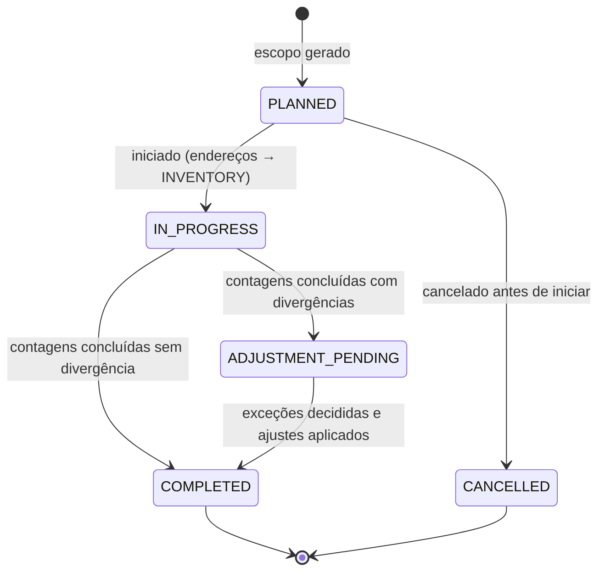

# DOC-05 — ESTOQUE E MOVIMENTAÇÃO
## Especificação de Requisitos do Sistema WMS Enterprise 3PL

| Metadado | Valor |
|---|---|
| Código do documento | DOC-05 |
| Versão | 1.0.0 |
| Status | APROVADO PARA USO |
| Data | 2026-08-10 |
| Depende de | DOC-00 v1.2.0, DOC-01, DOC-02, DOC-04, DOC-12 |
| Módulo (prefixo de requisitos) | EST |

---

## 1. ESCOPO E OBJETIVO

Este documento especifica o núcleo de estoque: catálogo fechado de movimentações, políticas de giro (FEFO/FIFO/LIFO/JIT) com algoritmos determinísticos de seleção de saldo, shelf life mínimo, matriz de compatibilidade de espécies (resolve LAC-003), bloqueios, estoque de segurança, kanban e reposição de picking, transferências (internas e entre armazéns) e os sete tipos de inventário.

**Este documento resolve:** LAC-003 (matriz de compatibilidade entre espécies).
**Fronteiras:** o crédito/débito do Estoque Fiscal é do DOC-08 (RG-014). O consumo de saldo por pedidos (reserva/picking) é orquestrado pelo DOC-06 usando os algoritmos daqui. A entrada de saldo é do DOC-04. Reversa é do DOC-07.

---

## 2. DEPENDÊNCIAS E TERMOS

Aplicam-se o Glossário e as regras globais, em especial RG-004, RG-005, RG-006, RG-015. Termos adicionais:

| Termo | Identificador técnico | Definição única |
|---|---|---|
| Seleção de Saldo | `stock_selection` | Algoritmo que ordena os saldos candidatos ao atendimento de uma demanda conforme a política de giro. |
| Reposição | `replenishment` | Transferência dirigida de saldo de armazenagem para endereço de picking. |
| Ajuste de Inventário | `inventory_adjustment` | Movimentação que iguala o saldo do sistema à contagem física aprovada. |
| Classe de Segregação | `segregation_class` | Agrupamento de espécies para a matriz de compatibilidade (DOC-02 §5.3). |

---

## 3. ATORES E PERMISSÕES ENVOLVIDAS

| Ator | Papel típico | Interação |
|---|---|---|
| Operadores de campo | `OPERADOR_EMPILHADEIRA`, `OPERADOR_PICKING` | Transferências, reposições, contagens |
| Inventariante | `INVENTARIANTE` | Planejamento e execução de inventários |
| Líder de Turno / Gestor | `LIDER_TURNO`, `GESTOR_ARMAZEM` | Bloqueios, aprovação de ajustes, quebras de política |
| Cliente (portal) | `CLIENTE_CONSULTA` | Consulta de saldos, validades e movimentações do próprio estoque |

**Catálogo de permissões deste módulo** (além das transversais do DOC-12 §RD-SEG-014):

| Código | Escopo |
|---|---|
| `EST.TRANSFERIR_INTERNO` | CLIENT_WAREHOUSE |
| `EST.TRANSFERIR_ARMAZEM` | CLIENT_WAREHOUSE (sensível) |
| `EST.BLOQUEAR_SALDO` / `EST.DESBLOQUEAR_SALDO` | CLIENT_WAREHOUSE |
| `EST.INVENTARIO_PLANEJAR` | WAREHOUSE |
| `EST.INVENTARIO_CONTAR` | CLIENT_WAREHOUSE |
| `EST.INVENTARIO_APROVAR_AJUSTE` | CLIENT_WAREHOUSE (sensível) |
| `EST.DESCARTE` | CLIENT_WAREHOUSE (sensível) |

**Catálogo de exceções deste módulo:**

| Código | Passos | Motivo obrigatório | Expira em |
|---|---|---|---|
| `EST.QUEBRA_FEFO` (qualquer quebra de política de giro) | 1 | sim | 8 h |
| `EST.AJUSTE_INVENTARIO` | 1 (2 acima da alçada) | sim | 48 h |
| `EST.DESCARTE_SALDO` | 2 | sim | 72 h |
| `EST.TRANSBORDO_ARMAZEM_LOGICO` (RG-015 item 3) | 1 | sim | 8 h |

## 4. REQUISITOS

### 4.1 Catálogo fechado de movimentações

**RN-EST-001 — Tipos de movimentação [INVIOLÁVEL]**
`stock_movement.movement_type` admite exclusivamente:

| Tipo | Efeito nas parcelas | Origem |
|---|---|---|
| `ENTRADA_RECEBIMENTO` | + available (ou +quarantine/+blocked/+damaged conforme DOC-04) | DOC-04 |
| `PUTAWAY` | move entre endereços, mesma parcela | DOC-04 |
| `RESERVA` / `LIBERACAO_RESERVA` | available ↔ reserved | DOC-06 |
| `PICKING` | − reserved (saída do endereço) | DOC-06 |
| `TRANSFERENCIA_INTERNA` | move entre endereços/paletes | este doc |
| `TRANSFERENCIA_SAIDA_ARMAZEM` / `TRANSFERENCIA_ENTRADA_ARMAZEM` | − no origem (via in_transit) / + no destino | este doc + DOC-08 |
| `REPOSICAO` | move armazenagem → picking | este doc |
| `BLOQUEIO` / `DESBLOQUEIO` | available ↔ blocked | este doc |
| `LIBERACAO_QUARENTENA` | quarantine → available | DOC-04 |
| `RECLASSIFICACAO_AVARIA` | available/blocked → damaged (e inverso mediante aprovação) | este doc / DOC-07 |
| `AJUSTE_INVENTARIO_POS` / `AJUSTE_INVENTARIO_NEG` | ± conforme ajuste aprovado | este doc |
| `DESCARTE` | − damaged/blocked | este doc / DOC-07 |
| `ENTRADA_REVERSA` | + conforme triagem | DOC-07 |
| `SAIDA_EXPEDICAO` | baixa final no carregamento | DOC-06 |

Todo tipo novo exige nova versão deste documento. Toda movimentação registra `requirement_id`, documento causador e tarefa (quando houver) — RG-003.

### 4.2 Políticas de giro e Seleção de Saldo (RG-006)

**RN-EST-010 — Universo de candidatos [INVIOLÁVEL]**
Para qualquer demanda de saída/reserva, os saldos candidatos são exclusivamente: parcela `qty_available > 0`, lote `RELEASED`, endereço `ACTIVE` (ou `PICKING`), respeitando contenção RG-015 e, para expedição a cliente final, o Shelf Life Mínimo (RN-EST-012).

**RN-EST-011 — Ordenação por política [INVIOLÁVEL]**
Sobre os candidatos, a ordenação é:

| Política | Ordenação primária | Desempates (nesta ordem) |
|---|---|---|
| `FEFO` | menor `expiration_date` | menor data de entrada do saldo; endereço tipo `PICKING` antes de `STORAGE`; menor `location.code` |
| `FIFO` | menor data de entrada do saldo (primeiro `stock_movement` de entrada) | menor `expiration_date` (se houver); `PICKING` antes de `STORAGE`; menor `location.code` |
| `LIFO` | maior data de entrada do saldo | `PICKING` antes de `STORAGE`; menor `location.code` |
| `JIT` | saldo em zona `CROSS_DOCKING` primeiro; depois FIFO | como FIFO |

A política do produto resolve por: `product.giro_policy` → `client_warehouse_settings.default_giro_policy`. Estruturas `LIFO_PHYSICAL` limitam candidatos ao palete acessível (RN-DAD-010).

**Exemplo normativo (FEFO):** demanda de 150 UN; candidatos: S1 (lote L1, val. 2026-09-01, picking, 80 UN), S2 (lote L2, val. 2026-09-01, storage, 100 UN), S3 (lote L3, val. 2026-10-15, picking, 200 UN). Ordem: S1 (val. mais curta + picking), S2, S3. Atendimento: 80 de S1 + 70 de S2. S3 intocado.

**RN-EST-012 — Shelf Life Mínimo [INVIOLÁVEL]**
QUANDO a demanda for de expedição a cliente, saldos cuja vida útil restante `(expiration_date − hoje) / shelf_life_days × 100` for inferior ao `min_shelf_life_pct` resolvido (produto → cliente) DEVEM ser excluídos dos candidatos. **Exemplo normativo:** produto com `shelf_life_days = 365`, `min_shelf_life_pct = 30`; hoje 2026-08-10; lote com validade 2026-11-10 → restam 92 dias = 25,2% → **excluído**; lote com validade 2027-01-10 → 153 dias = 41,9% → elegível.

**RN-EST-013 — Quebra de política**
QUANDO um usuário solicitar seleção fora da ordem (ex.: lote específico por exigência do cliente), o sistema DEVE exigir `EST.QUEBRA_POLITICA_GIRO` + exceção `EST.QUEBRA_FEFO` aprovada ANTES de efetivar a reserva; a movimentação resultante é marcada `policy_break = true` com motivo (RG-006). Exclusões por shelf life (RN-EST-012) admitem quebra apenas com autorização registrada do cliente (anexo obrigatório na exceção).

**RN-EST-014 — Alerta de vencimento**
O `scheduler` DEVE gerar diariamente alertas de lotes a vencer em 90/60/30/15/0 dias (parâmetro `EST.ALERTA_VENCIMENTO_DIAS`) e mover automaticamente saldo VENCIDO (validade < hoje) de `available` para `blocked` com movimentação `BLOQUEIO` motivo `VENCIDO`, notificando cliente e painel.

### 4.3 Matriz de compatibilidade de espécies (resolve LAC-003)

**RN-EST-020 — Classes de segregação**
`product_species.segregation_class` assume: `FARMA` (MEDICAMENTO), `ALIMENTAR` (ALIMENTO, REFRIGERADO, CONGELADO), `INFLAMAVEIS` (INFLAMAVEL, COMBUSTIVEL), `QUIMICA` (QUIMICO_CONTROLADO), `NEUTRA` (GERAL, FRAGIL, VALIOSO).

**RN-EST-021 — Matriz de coabitação de ZONA [INVIOLÁVEL]**
Valores: `P` = permitido; `L` = proibição LEGAL (sem override, RG-005); `O` = proibição OPERACIONAL (override com `EST.PUTAWAY_OVERRIDE` + motivo).

| Zona com ↓ / entrar → | FARMA | ALIMENTAR | INFLAMAVEIS | QUIMICA | NEUTRA |
|---|---|---|---|---|---|
| **FARMA** | P | L | L | L | O |
| **ALIMENTAR** | L | P | L | L | O |
| **INFLAMAVEIS** | L | L | P | O | L |
| **QUIMICA** | L | L | O | P | L |
| **NEUTRA** | O | O | L | L | P |

Regras adicionais invioláveis: `INFLAMAVEIS` somente em zonas `CLASSIFIED_FLAMMABLE`; `QUIMICA` somente em zonas `CONTROLLED`; `REFRIGERADO`/`CONGELADO` somente em zonas `COLD`/`FROZEN` com faixa de temperatura compatível; `FARMA` somente em zonas cujo `allowed_species` contenha `MEDICAMENTO`. A matriz complementa (não substitui) o `zone.allowed_species`.

**RN-EST-022 — Coabitação de ENDEREÇO [INVIOLÁVEL]**
Um mesmo endereço PODE conter múltiplos produtos SOMENTE quando todas as espécies presentes pertencerem à MESMA classe de segregação; misturar classes no mesmo endereço é PROIBIDO sem exceção, inclusive `NEUTRA` com qualquer outra.

### 4.4 Bloqueios e reclassificações

**RF-EST-030 — Bloqueio/desbloqueio manual**
Usuário com `EST.BLOQUEAR_SALDO` PODE mover quantidade de `available` → `blocked` (e inverso com `EST.DESBLOQUEAR_SALDO`), sempre com motivo tipificado (`VENCIDO`, `QUALIDADE`, `DIVERGENCIA`, `ORDEM_CLIENTE`, `OUTRO`+texto). Saldo `blocked`/`damaged`/`quarantine` NUNCA entra em Seleção de Saldo (RN-EST-010).

**RF-EST-031 — Reclassificação para avaria e descarte**
Avaria identificada pós-armazenagem gera `RECLASSIFICACAO_AVARIA` (fotos obrigatórias como no DOC-04) e transferência sugerida para zona `DAMAGED`. Descarte físico exige exceção `EST.DESCARTE_SALDO` (2 passos), gera `DESCARTE`, termo de descarte em PDF e notificação ao cliente; reflexo fiscal no DOC-08.

### 4.5 Estoque de segurança, kanban e reposição

**RF-EST-040 — Estoque de segurança**
ONDE `product_warehouse_parameter.safety_stock_qty` estiver definido, o `scheduler` (execução horária) e todo evento de baixa DEVEM avaliar: SE `disponível_total < safety_stock_qty`, ENTÃO gerar/atualizar alerta `ESTOQUE_SEGURANCA` no painel e notificar o cliente (uma notificação por cruzamento de limiar, não por movimentação).

**RF-EST-041 — Kanban**
ONDE `kanban_enabled = true`: QUANDO o saldo disponível no(s) endereço(s) de picking do produto atingir `kanban_trigger_qty`, o sistema DEVE gerar automaticamente uma tarefa de Reposição de `kanban_replenish_qty` (arredondada para cima em embalagens de picking), selecionando origem pela política de giro do produto. É PROIBIDO gerar nova tarefa kanban enquanto houver reposição aberta do mesmo produto×endereço.

**RF-EST-042 — Reposição de picking**
A Reposição é tarefa dirigida (origem storage → destino picking) com dupla leitura como no putaway (RF-REC-042), disponível offline. Reposições têm prioridade sobre putaway na fila de tarefas quando o endereço de picking estiver abaixo do gatilho E houver pedido liberado dependente (informação do DOC-06).

### 4.6 Transferências

**RF-EST-050 — Transferência interna**
Movimentação endereço→endereço ou palete→palete dentro do armazém, por tarefa dirigida (dupla leitura) ou imediata em tela (com permissão). Passa pelos filtros Fase 1 do motor (RN-REC-040) no destino. Documento `TRF` (RN-DAD-040) para transferências planejadas em lote.

**RF-EST-051 — Transferência entre armazéns**
Fluxo: criação do documento `TRF` inter-armazém → picking no origem (baixa via `in_transit`) → expedição com documento fiscal quando exigido (DOC-08) → recebimento no destino como Ordem de Recebimento vinculada (conferência obrigatória) → crédito no destino. ENQUANTO em trânsito, o saldo aparece na parcela `qty_in_transit` do armazém origem, visível ao cliente. Divergência no destino segue RN-REC-022/023 com vínculo automático à TRF.

**RN-EST-052 — Transferência e armazém lógico**
Transferências de produto de cliente com Armazém Lógico ativo obedecem RG-015 no destino (mesmo em outro armazém físico: destino = armazém lógico do cliente lá, se existir).

### 4.7 Inventários

**RF-EST-060 — Tipos e geração do escopo [catálogo fechado]**
Documento `INV` (RN-DAD-040) com tipo:

| Tipo | Escopo gerado |
|---|---|
| `GERAL` | todos os endereços com saldo (e vazios opcionais) do armazém, por cliente ou todos |
| `ROTATIVO_PRODUTO` | todos os endereços com saldo dos produtos selecionados |
| `ROTATIVO_DIA` | N endereços/dia (parâmetro `EST.INV_ROTATIVO_QTD_DIA`) priorizando: maior tempo desde a última contagem, depois classe ABC (A primeiro) |
| `POR_SORTEIO` | N endereços aleatórios; semente do sorteio registrada para reprodutibilidade |
| `POR_ZONA` | endereços das zonas selecionadas |
| `POR_ESPECIE` | endereços com saldo das espécies selecionadas |
| `POR_ENDERECO` | lista explícita de endereços |

**RN-EST-061 — Congelamento do endereço [INVIOLÁVEL]**
QUANDO um endereço entrar em contagem, seu status muda para `INVENTORY`: novas movimentações de/para ele são bloqueadas até a conclusão da contagem do endereço (reservas existentes não são canceladas, apenas suspensas na execução). O planejamento DEVE exibir conflitos com pedidos liberados antes de iniciar.

**RN-EST-062 — Rodadas de contagem [INVIOLÁVEL]**
1ª contagem cega (sem exibir saldo do sistema). SE 1ª = saldo do sistema → endereço concluído. SE divergente → 2ª contagem cega por operador DIFERENTE. SE 2ª = sistema → concluído sem ajuste. SE 2ª = 1ª → divergência confirmada. SE 2ª ≠ 1ª ≠ sistema → 3ª contagem por `LIDER_TURNO`, cujo resultado prevalece. Todas as contagens são registradas.

**RN-EST-063 — Ajuste com alçada**
Divergência confirmada abre exceção `EST.AJUSTE_INVENTARIO` (dimensões: quantidade e valor = quantidade × custo informado pelo cliente quando disponível). Aprovação gera `AJUSTE_INVENTARIO_POS/NEG`; ajuste NEGATIVO em produto com Estoque Fiscal reflete no DOC-08 (regularização documental listada na pendência do cliente). Rejeição exige nova contagem (volta à 1ª rodada).

**RF-EST-064 — Acuracidade**
Ao concluir o inventário, o sistema DEVE apurar e publicar: acuracidade por endereço (endereços corretos ÷ contados), por quantidade (1 − |Σajustes| ÷ Σsaldo contado) e por cliente, alimentando os KPIs do DOC-10.

### 4.8 Eventos de domínio deste módulo

`estoque.saldo_alterado` (genérico, com tipo), `estoque.transferencia_criada`, `estoque.transferencia_concluida`, `estoque.reposicao_gerada`, `estoque.kanban_disparado`, `estoque.estoque_seguranca_violado`, `estoque.lote_a_vencer`, `estoque.lote_vencido_bloqueado`, `estoque.inventario_iniciado`, `estoque.endereco_contado`, `estoque.ajuste_aplicado`, `estoque.inventario_concluido`, `estoque.descarte_efetivado`.

---

## 5. MÁQUINAS DE ESTADO E FLUXOS

### 5.1 Inventário



Conclusão de cada endereço libera seu status individualmente (não espera o inventário inteiro).

### 5.2 Transferência entre armazéns

`CREATED → PICKING → IN_TRANSIT → RECEIVING → COMPLETED`; ramo `CANCELLED` (antes do picking); divergência no destino não cria estado novo — vincula Divergências DOC-04 à TRF.

---

## 6. CRITÉRIOS DE ACEITE (GHERKIN)

```gherkin
Cenário: Seleção FEFO com desempates (exemplo normativo RN-EST-011)
  Dado demanda de 150 UN e os saldos S1 (val 2026-09-01, picking, 80), S2 (val 2026-09-01, storage, 100), S3 (val 2026-10-15, picking, 200)
  Quando a seleção FEFO executar
  Então o atendimento deve ser 80 de S1 e 70 de S2
  E S3 não deve ser tocado

Cenário: Shelf life mínimo exclui lote (exemplo normativo RN-EST-012)
  Dado produto com shelf_life_days 365 e min_shelf_life_pct 30 e data atual 2026-08-10
  E lote A com validade 2026-11-10 e lote B com validade 2027-01-10
  Quando a seleção para expedição executar
  Então o lote A deve ser excluído dos candidatos
  E o lote B deve ser elegível

Cenário: Quebra de FEFO exige aprovação prévia
  Dado cliente exigindo o lote L9 que não é o primeiro da ordem FEFO
  Quando o usuário solicitar a reserva do lote L9
  Então a reserva só deve efetivar após aprovação da exceção EST.QUEBRA_FEFO
  E a movimentação deve registrar policy_break = true com o motivo

Cenário: Lote vencido é bloqueado automaticamente
  Dado lote com validade 2026-08-09 e 40 UN disponíveis
  Quando a rotina diária do scheduler executar em 2026-08-10
  Então as 40 UN devem mover de available para blocked com motivo VENCIDO
  E cliente e painel devem ser notificados

Cenário: Zona FARMA rejeita químico sem possibilidade de override
  Dado zona com classe FARMA
  Quando qualquer movimentação tentar destinar produto QUIMICO_CONTROLADO a ela
  Então o sistema deve rejeitar por proibição LEGAL (RN-EST-021)
  E nenhuma permissão deve viabilizar a operação

Cenário: Endereço não mistura classes
  Dado endereço com saldo de produto GERAL (classe NEUTRA)
  Quando o putaway sugerir o mesmo endereço para produto FRAGIL (classe NEUTRA)
  Então a coabitação deve ser permitida
  E quando tentar produto ALIMENTO (classe ALIMENTAR)
  Então deve ser rejeitada (RN-EST-022)

Cenário: Kanban dispara uma única reposição
  Dado produto com kanban_trigger_qty 24 e kanban_replenish_qty 120 no endereço de picking P-01
  E saldo em P-01 caindo de 30 para 22 UN
  Quando o evento de baixa for processado
  Então uma tarefa de reposição de 120 UN deve ser gerada (origem pela política de giro)
  E novas baixas antes da conclusão não devem gerar segunda tarefa

Cenário: Rodadas de contagem (RN-EST-062)
  Dado endereço com saldo de sistema 100 UN
  E 1ª contagem 95 UN por João e 2ª contagem 95 UN por Maria
  Quando as rodadas concluírem
  Então a divergência de −5 UN deve ser confirmada
  E a exceção EST.AJUSTE_INVENTARIO deve ser aberta com quantidade 5

Cenário: Terceira contagem decide
  Dado sistema 100, 1ª contagem 95, 2ª contagem 98
  Quando o LIDER_TURNO executar a 3ª contagem com resultado 98
  Então a divergência confirmada deve ser −2 UN

Cenário: Endereço congelado durante contagem
  Dado endereço A1-010-02-01 em contagem (status INVENTORY)
  Quando uma tarefa de picking tentar consumir saldo desse endereço
  Então a execução deve ser bloqueada com mensagem de inventário em andamento
  E liberada automaticamente quando a contagem do endereço concluir

Cenário: Sorteio reprodutível
  Dado inventário POR_SORTEIO de 50 endereços com semente registrada 20260810-001
  Quando a mesma semente for reaplicada em auditoria
  Então a mesma lista de 50 endereços deve ser gerada
```

---

## 7. REQUISITOS DE DADOS (DELTA SOBRE O DOC-02)

| ID | Estrutura | Classificação | Observações |
|---|---|---|---|
| RD-EST-001 | `stock_transfer` + `stock_transfer_item` | TENANT | interna e inter-armazém, estado §5.2 |
| RD-EST-002 | `replenishment_task` | TENANT (particionada como task) | gatilho (KANBAN/MANUAL/DEMANDA), origem/destino |
| RD-EST-003 | `inventory_count` + `inventory_count_location` + `inventory_count_round` | TENANT | tipo, escopo, semente do sorteio, rodadas por operador |
| RD-EST-004 | `stock_block_reason` (motivos tipificados) | GLOBAL | catálogo RF-EST-030 |
| RD-EST-005 | colunas adicionais em `stock_movement`: `policy_break boolean`, `break_reason` | — | RN-EST-013 |

Parâmetros: `EST.ALERTA_VENCIMENTO_DIAS`, `EST.INV_ROTATIVO_QTD_DIA`, `EST.INV_INCLUI_VAZIOS`.

---

## 8. FORA DE ESCOPO (NÃO IMPLEMENTAR)

- Custeio de estoque (custo médio, PEPS contábil) — o valor unitário, quando usado (alçadas/inventário), é informado pelo cliente via cadastro/integração.
- Previsão de demanda, MRP e sugestão de compra.
- Otimização de slotting automático contínuo (re-slotting é operação manual por transferências).
- Rastreabilidade serializada por unidade (número de série) — controle é por lote.
- Contagem por drone/câmera.
- WCS/automação de equipamentos de movimentação (transelevadores, esteiras) — o `CARROSSEL` é operado por tarefa manual nesta versão.

---

## 9. MATRIZ DE RASTREABILIDADE LOCAL

| Necessidade (DOC-00 §8) | Requisitos deste documento |
|---|---|
| N06 Inventários (todos os tipos) | §4.7 |
| N08 Segregação por espécie | §4.3 (LAC-003 resolvida) |
| N11 FIFO/FEFO/LIFO, shelf life, JIT, vencimento, transferência | §4.2, §4.6 |
| N12 Estoque de segurança | RF-EST-040 |
| N13 Kanban | RF-EST-041 |
| N28 Armazém lógico (movimentação) | RN-EST-052 |
| RG-006 política de giro | RN-EST-010..013 |

---

## CHANGELOG

| Versão | Data | Alteração |
|---|---|---|
| 1.0.0 | 2026-08-10 | Versão inicial aprovada |
