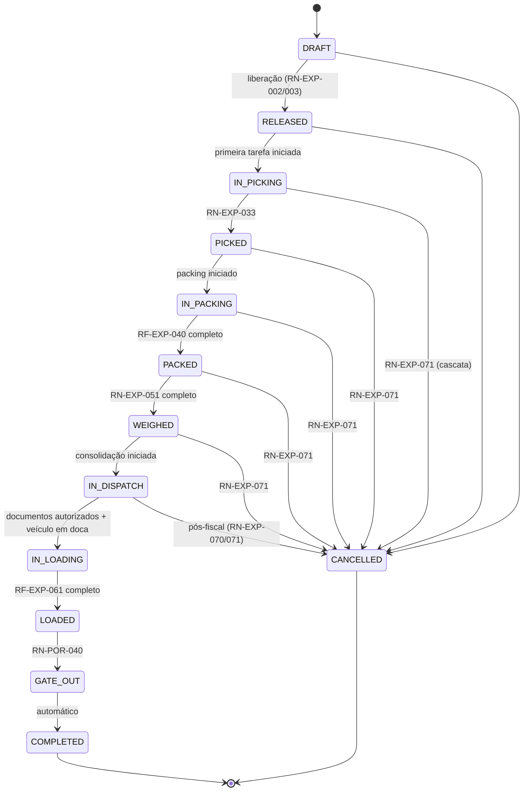

# DOC-06 — EXPEDIÇÃO
## Especificação de Requisitos do Sistema WMS Enterprise 3PL

| Metadado | Valor |
|---|---|
| Código do documento | DOC-06 |
| Versão | 1.0.0 |
| Status | APROVADO PARA USO |
| Data | 2026-08-10 |
| Depende de | DOC-00 v1.2.0, DOC-01, DOC-02, DOC-03, DOC-04, DOC-05, DOC-12 |
| Módulo (prefixo de requisitos) | EXP |

---

## 1. ESCOPO E OBJETIVO

Este documento especifica o ciclo de saída: Pedido, ondas, reserva de saldo, picking, packing, pesagem, expedição, carregamento e saída — incluindo a **máquina de estados formal do Fluxo Operacional** exigida pela RG-002 (etapas verde/vermelho, navegação sem salto), estornos e cancelamentos por estado.

**Fronteiras:** a Seleção de Saldo é a do DOC-05 (RN-EST-010..013). A emissão dos documentos fiscais (NF-e e Nota de Devolução de Armazenagem) e a ordem de consumo do Estoque Fiscal (LAC-008) são do DOC-08 — aqui se define QUANDO cada gatilho fiscal ocorre. O gate-out é do DOC-03 (RN-POR-040). A exibição do Painel de Operações é do DOC-10 — aqui se define o comportamento normativo do fluxo.

---

## 2. DEPENDÊNCIAS E TERMOS

Termos adicionais ao Glossário:

| Termo | Identificador técnico | Definição única |
|---|---|---|
| Etapa de Fluxo | `flow_step` | Nó da máquina de estados do Fluxo Operacional, com estado `DONE` (verde) ou `PENDING` (vermelho). |
| Volume | `package` | Unidade física de expedição gerada no packing (caixa, palete fechado), identificada por LPN próprio (`pallet_type = VOLUME` ou palete). |
| Peso Teórico | `theoretical_weight` | Peso calculado: Σ(quantidade × `gross_weight_kg`) + tara das embalagens. |
| Corte (Short) | `pick_short` | Quantidade não separada por indisponibilidade física constatada na execução. |

---

## 3. ATORES E PERMISSÕES ENVOLVIDAS

| Ator | Papel típico | Interação |
|---|---|---|
| Cliente (portal/API/ERP) | `CLIENTE_OPERACAO` | Criação e acompanhamento de pedidos |
| Líder de Turno | `LIDER_TURNO` | Ondas, liberação, exceções, estornos |
| Operador de Picking | `OPERADOR_PICKING` | Execução de picking e packing |
| Conferente de Expedição | `CONFERENTE` | Pesagem, conferência de carregamento |
| Faturista | `FATURISTA` | Etapa Expedição (documentos) |

**Catálogo de permissões:**

| Código | Escopo |
|---|---|
| `EXP.PEDIDO_CRIAR` | CLIENT_WAREHOUSE |
| `EXP.PEDIDO_LIBERAR` / `EXP.ONDA_GERIR` | CLIENT_WAREHOUSE |
| `EXP.PICKING_EXECUTAR` / `EXP.PACKING_EXECUTAR` | CLIENT_WAREHOUSE |
| `EXP.PESAGEM_EXECUTAR` | WAREHOUSE |
| `EXP.EXPEDICAO_LIBERAR` | CLIENT_WAREHOUSE |
| `EXP.CARREGAMENTO_EXECUTAR` | WAREHOUSE |
| `EXP.PEDIDO_CANCELAR` | CLIENT_WAREHOUSE (sensível) |
| `EXP.ESTORNO` | CLIENT_WAREHOUSE (sensível) |

**Catálogo de exceções:**

| Código | Passos | Motivo obrigatório | Expira em |
|---|---|---|---|
| `EXP.CORTE_PICKING` | 1 | sim | 8 h |
| `EXP.DIVERGENCIA_PESO` | 1 | sim | 8 h |
| `EXP.ESTORNO_PICKING` | 1 | sim | 8 h |
| `EXP.ESTORNO_POS_FISCAL` | 2 | sim | 24 h |
| `EXP.CANCELAMENTO_TARDIO` | 2 | sim | 24 h |

---

## 4. REQUISITOS

### 4.1 Pedido

**RF-EXP-001 — Criação**
Pedido (máscara `PED`, RN-DAD-040) criado por portal, API/ERP (DOC-13) ou digitação interna, com: cliente, armazém, destinatário (dados fiscais quando emissão própria — DOC-08), itens (produto do catálogo, quantidade > 0 na unidade base ou embalagem com conversão RN-DAD-021), data prevista de expedição, transportadora prevista (texto), vínculo opcional a Agendamento outbound (DOC-03).

**RN-EXP-002 — Validações na liberação [INVIOLÁVEL]**
QUANDO o Pedido for liberado (`DRAFT → RELEASED`), o sistema DEVE validar, item a item:
1. Saldo disponível suficiente pela Seleção de Saldo (RN-EST-010/011, incluindo shelf life RN-EST-012);
2. ONDE o cliente controlar Estoque Fiscal (RG-014): saldo fiscal disponível total ≥ quantidade do item (a alocação por nota é do DOC-08; aqui valida-se a suficiência);
3. Ausência de bloqueios do cliente/produto (RF-DAD-052).
SE qualquer validação falhar, ENTÃO a liberação é rejeitada com a lista determinística de pendências por item (saldo físico faltante, saldo fiscal faltante, bloqueios). Liberação parcial (somente itens válidos) é permitida ONDE parâmetro `EXP.PERMITE_LIBERACAO_PARCIAL` (padrão true), gerando pedido remanescente vinculado.

**RN-EXP-003 — Reserva na liberação [INVIOLÁVEL]**
A liberação efetiva a Reserva (`RESERVA`, RN-EST-001) dos saldos selecionados pela política de giro, gravando o detalhamento saldo→item. A reserva expira e é liberada automaticamente SE o pedido for cancelado ou permanecer sem picking iniciado por mais de `EXP.RESERVA_VALIDADE_H` (padrão 72 h — expiração notifica e devolve o pedido a `RELEASED_EXPIRED` para nova liberação).

### 4.2 Fluxo Operacional do pedido (RG-002) — NORMATIVO

**RN-EXP-010 — Etapas e correspondência de estados [INVIOLÁVEL]**
Todo pedido instancia o Fluxo Operacional com as etapas fixas, na ordem:

| # | Etapa (exibição) | Conclui quando | Estado do pedido ao concluir |
|---|---|---|---|
| 1 | Pedido | liberação efetivada (RN-EXP-002/003) | `RELEASED` |
| 2 | Picking | todas as tarefas de picking `DONE` (ou supridas por cross-docking RF-REC-051) e cortes decididos | `PICKED` |
| 3 | Embalagem | todos os itens embalados em Volumes com conteúdo declarado | `PACKED` |
| 4 | Pesagem | todos os Volumes pesados dentro da tolerância (ou divergências decididas) | `WEIGHED` |
| 5 | Expedição | documentos fiscais autorizados (DOC-08) e carga consolidada em staging de expedição | `IN_DISPATCH` concluída = `DISPATCH_OK` |
| 6 | Carregamento | todos os Volumes lidos no veículo na doca | `LOADED` |
| 7 | Saída | gate-out concluído (RN-POR-040) | `GATE_OUT` |
| 8 | Fim | automático após Saída | `COMPLETED` |

**RN-EXP-011 — Regras de navegação do fluxo [INVIOLÁVEL — comportamento do painel]**
1. Etapas `DONE` exibem VERDE; `PENDING` exibem VERMELHO.
2. A ÚNICA etapa acionável (clique abre a tela da operação) é a primeira `PENDING` cuja antecessora esteja `DONE`.
3. Clique em etapa `PENDING` posterior à primeira DEVE ser inerte, exibindo aviso "conclua a etapa anterior" — em interface E em API (tentativa via API retorna erro determinístico `FLOW_STEP_ORDER_VIOLATION`).
4. Etapa `DONE` clicada abre em modo CONSULTA (somente leitura + opção de estorno quando aplicável, §4.8).
5. Exceção `PENDING`/`ESCALATED` vinculada à etapa mantém a etapa VERMELHA com indicador de bloqueio (RN-SEG-042).
6. A conclusão de cada etapa publica evento e atualiza o painel em ≤ 2 s (RNF-ARQ-088).

### 4.3 Ondas

**RF-EXP-020 — Formação e liberação de ondas**
Usuário com `EXP.ONDA_GERIR` PODE agrupar pedidos `RELEASED` em Onda por filtros (cliente, transportadora, agendamento, zona de picking, data prevista). A liberação da onda gera as tarefas de picking de todos os pedidos consolidando o sequenciamento (RF-EXP-030). Pedido sem onda PODE ser liberado individualmente (onda unitária implícita). Limites: `EXP.ONDA_MAX_PEDIDOS` (padrão 200).

### 4.4 Picking

**RF-EXP-030 — Tarefas e rota**
Cada linha de reserva vira Tarefa de picking com: endereço origem, LPN (quando saldo paletizado), produto, lote, quantidade, embalagem de picking padrão. O sequenciamento da rota DEVE ordenar por: zona → rua (serpenteando ruas alternadas em ordem crescente/decrescente de módulo) → módulo → nível. Tarefas são atribuídas por operador (auto-atribuição de fila ou designação do líder).

**RF-EXP-031 — Execução com dupla leitura**
No coletor (online ou offline, RNF-ARQ-050): ler etiqueta do endereço → ler LPN ou EAN do produto → confirmar quantidade (teclado; quantidade ≠ sugerida exige seleção de motivo). Produto `is_weight_variable = true` DEVE ter cada unidade/volume pesado na estação (job de balança) OU peso digitado com permissão `EST.DIGITACAO_LPN` equivalente (`EXP.PESO_MANUAL`, auditado). Destino físico do picking: posição de consolidação da onda/pedido em zona `PACKING`.

**RN-EXP-032 — Corte (short) [INVIOLÁVEL]**
SE o operador constatar indisponibilidade física (saldo do sistema > físico), ENTÃO DEVE registrar Corte com quantidade e motivo. O Corte: (a) abre exceção `EXP.CORTE_PICKING`; (b) bloqueia o saldo divergente (`BLOQUEIO` motivo `DIVERGENCIA`) e agenda contagem do endereço (inventário `POR_ENDERECO` automático); (c) a decisão da exceção escolhe: re-seleção de saldo alternativo (nova tarefa pela RN-EST-011) OU corte definitivo do item (pedido segue parcial, cliente notificado). ENQUANTO pendente, a etapa Picking permanece VERMELHA.

**RN-EXP-033 — Conclusão da etapa Picking**
A etapa conclui quando: Σ separado + Σ cross-docking + Σ cortes definitivos = Σ pedido, sem exceções pendentes. Quantidades cortadas definitivamente são retiradas do pedido (registradas para o relatório de atendimento/OTIF do DOC-10).

### 4.5 Packing

**RF-EXP-040 — Volumação**
Na estação de packing, o operador forma Volumes: cada Volume recebe LPN (RN-DAD-030), tipo de embalagem (catálogo `EXP.EMBALAGENS_VOLUME` com tara), e conteúdo declarado por leitura (produto/quantidade). O sistema DEVE validar conteúdo total = quantidade separada do pedido (nem mais, nem menos) para concluir a etapa. Etiqueta de volume impressa via DOC-11 (inclui pedido, sequência do volume `n/N`, destinatário).

### 4.6 Pesagem

**RF-EXP-050 — Pesagem por volume**
Cada Volume DEVE ser pesado em balança integrada (job Edge Agent, DOC-11); o peso lido é gravado com identificação da balança. Digitação manual apenas com `EXP.PESO_MANUAL` + motivo (balança indisponível — RNF-ARQ-061), auditada.

**RN-EXP-051 — Tolerância [INVIOLÁVEL]**
Tolerância = `EXP.TOLERANCIA_PESO_PCT` (padrão 2%) sobre o Peso Teórico do volume. SE |peso lido − teórico| / teórico > tolerância, ENTÃO abrir exceção `EXP.DIVERGENCIA_PESO` (bloqueia a etapa para o volume); decisão: aceitar peso lido (motivo) OU devolver o volume ao packing para reconferência de conteúdo (estorno da volumação do volume específico). Produtos `is_weight_variable` usam o peso apurado no picking como teórico do conteúdo.

**Exemplo normativo:** volume com 10 UN × 1,200 kg + tara 0,350 kg → teórico 12,350 kg; tolerância 2% → faixa aceita 12,103–12,597 kg; leitura 12,480 kg → aprovado; leitura 12,900 kg → exceção.

### 4.7 Expedição, carregamento e saída

**RF-EXP-060 — Etapa Expedição (documental)**
A etapa consolida os volumes em staging `DISPATCH` (leitura de conferência) e dispara os gatilhos fiscais do pedido conforme o `fiscal_mode` do cliente (DOC-08): emissão da NF-e de venda (quando própria) e da Nota de Devolução de Armazenagem (RG-014 passo 3 — a alocação fiscal definitiva por nota ocorre AQUI, na emissão, pela ordem do DOC-08/LAC-008). A etapa SÓ conclui com todos os documentos AUTORIZADOS. Rejeição fiscal mantém a etapa VERMELHA com o erro da SEFAZ/ERP exibido.

**RF-EXP-061 — Carregamento**
Com veículo `EM_DOCA` (DOC-03/04) vinculado ao(s) pedido(s): cada Volume é lido (LPN) ao embarcar; o sistema valida pertencimento ao(s) pedido(s) da carga e acusa volume estranho no ato. A etapa conclui quando todos os volumes de todos os pedidos da carga estiverem lidos. A conclusão efetiva a movimentação `SAIDA_EXPEDICAO` (baixa definitiva do saldo físico — RN-EST-001).

**RF-EXP-062 — Saída e Fim**
Gate-out conforme RN-POR-040 conclui a etapa Saída; `Fim` é automático, muda o pedido para `COMPLETED`, publica `expedicao.pedido_concluido` (insumos: reconciliação DOC-13, faturamento DOC-09, OTIF DOC-10).

### 4.8 Estornos e cancelamento

**RN-EXP-070 — Estorno por etapa [INVIOLÁVEL]**
Estorno devolve o fluxo à etapa anterior desfazendo TODOS os efeitos da etapa estornada (atomicidade — nunca parcial):

| Etapa estornada | Exceção exigida | Efeitos desfeitos |
|---|---|---|
| Picking (itens já separados) | `EXP.ESTORNO_PICKING` | retorno físico dirigido dos itens aos endereços de origem (tarefas de devolução com dupla leitura), reservas recompostas |
| Embalagem | `EXP.ESTORNO_PICKING` | volumes desfeitos (LPNs cancelados), conteúdo volta à consolidação |
| Pesagem | não exige exceção | pesos invalidados, volumes voltam a pendente de pesagem |
| Expedição (documentos autorizados) | `EXP.ESTORNO_POS_FISCAL` (2 passos) | aciona cancelamento fiscal no DOC-08 (dentro do prazo legal); volumes voltam ao staging |
| Carregamento | `EXP.ESTORNO_POS_FISCAL` | volumes descarregados por leitura, `SAIDA_EXPEDICAO` revertida |

Estorno após gate-out é PROIBIDO — o retorno de mercadoria expedida é Logística Reversa (DOC-07).

**RN-EXP-071 — Cancelamento**
`DRAFT`/`RELEASED` (sem picking iniciado): cancelamento direto com `EXP.PEDIDO_CANCELAR` (reservas liberadas). Do picking iniciado até antes da emissão fiscal: exige `EXP.CANCELAMENTO_TARDIO` (2 passos) e executa os estornos em cascata da RN-EXP-070. Após emissão fiscal: somente via estorno pós-fiscal + cancelamento; após gate-out: PROIBIDO (usar DOC-07).

### 4.9 Eventos de domínio

`expedicao.pedido_criado`, `expedicao.pedido_liberado`, `expedicao.reserva_efetivada`, `expedicao.onda_liberada`, `expedicao.tarefa_picking_concluida`, `expedicao.corte_registrado`, `expedicao.etapa_concluida` (payload: pedido, etapa, nº ordem), `expedicao.volume_criado`, `expedicao.volume_pesado`, `expedicao.divergencia_peso`, `expedicao.documentos_autorizados`, `expedicao.volume_carregado`, `expedicao.pedido_concluido`, `expedicao.pedido_cancelado`, `expedicao.estorno_executado`.

---

## 5. MÁQUINAS DE ESTADO E FLUXOS

### 5.1 Pedido (`outbound_order`) — estados canônicos (REG-GLO-004)



Estados de retrocesso por estorno seguem a tabela RN-EXP-070 (o estado volta ao da etapa anterior; não há estados adicionais). `RELEASED_EXPIRED` (RN-EXP-003) é substado de `RELEASED` exibido como alerta.

### 5.2 Tarefa de picking

`CREATED → ASSIGNED → IN_EXECUTION → DONE`; ramos: `SHORT_REPORTED` (→ decisão RN-EXP-032 → `DONE` parcial ou nova tarefa), `CANCELLED`, `REVERSED` (estorno).

---

## 6. CRITÉRIOS DE ACEITE (GHERKIN)

```gherkin
Cenário: Liberação bloqueada por saldo fiscal insuficiente
  Dado cliente com controle de Estoque Fiscal
  E item do pedido com 700 UN demandadas e saldo fiscal total de 600 UN
  Quando a liberação for solicitada
  Então o sistema deve rejeitar o item listando "saldo fiscal insuficiente: disponível 600"
  E com EXP.PERMITE_LIBERACAO_PARCIAL ativo os demais itens devem poder liberar

Cenário: Navegação do fluxo sem salto (RN-EXP-011)
  Dado pedido com etapas Pedido=verde, Picking=verde, Embalagem=vermelha, Pesagem=vermelha
  Quando o operador clicar em Pesagem
  Então nada deve abrir e o aviso "conclua a etapa anterior" deve ser exibido
  E quando o operador clicar em Embalagem
  Então a tela de packing do pedido deve abrir

Cenário: Violação de ordem via API
  Dado o mesmo pedido com Embalagem pendente
  Quando uma chamada de API tentar registrar pesagem de volume
  Então a resposta deve ser erro FLOW_STEP_ORDER_VIOLATION

Cenário: Corte bloqueia saldo e agenda contagem
  Dado tarefa de picking de 50 UN no endereço A1-020-01-01 e físico encontrado de 42 UN
  Quando o operador registrar corte de 8 UN
  Então a exceção EXP.CORTE_PICKING deve ser aberta
  E 8 UN devem mover para blocked com motivo DIVERGENCIA
  E um inventário POR_ENDERECO do A1-020-01-01 deve ser criado automaticamente

Cenário: Re-seleção após corte aprovado
  Dado o corte de 8 UN com decisão "re-seleção"
  Quando a decisão for registrada
  Então uma nova tarefa de picking de 8 UN deve ser criada no próximo saldo da ordem FEFO
  E a etapa Picking deve permanecer vermelha até sua conclusão

Cenário: Packing valida conteúdo exato
  Dado pedido com 120 UN separadas do SKU-1
  Quando os volumes declararem no total 118 UN
  Então a etapa Embalagem não deve concluir, listando diferença de 2 UN
  E quando declararem 120 UN
  Então a etapa deve concluir

Cenário: Tolerância de pesagem (exemplo normativo RN-EXP-051)
  Dado volume com peso teórico 12,350 kg e tolerância 2%
  Quando a balança ler 12,480 kg
  Então o volume deve ser aprovado
  E quando a balança ler 12,900 kg
  Então a exceção EXP.DIVERGENCIA_PESO deve ser aberta e a etapa bloqueada para o volume

Cenário: Expedição só conclui com documentos autorizados
  Dado pedido de cliente com emissão própria e NF-e rejeitada pela SEFAZ
  Quando o faturista consultar a etapa Expedição
  Então a etapa deve estar vermelha exibindo o código e a mensagem de rejeição
  E o Carregamento deve permanecer inacessível

Cenário: Volume estranho no carregamento
  Dado carregamento da carga com pedidos PED-SP01-00000300 e PED-SP01-00000301
  Quando um volume do pedido PED-SP01-00000399 for lido
  Então o sistema deve recusar o volume no ato identificando o pedido de origem

Cenário: Estorno de carregamento desfaz baixa
  Dado pedido LOADED com 5 volumes e SAIDA_EXPEDICAO efetivada
  Quando a exceção EXP.ESTORNO_POS_FISCAL for aprovada e os 5 volumes descarregados por leitura
  Então a movimentação de baixa deve ser revertida integralmente
  E o pedido deve retornar ao estado IN_DISPATCH com a etapa Carregamento vermelha

Cenário: Estorno proibido após gate-out
  Dado pedido em GATE_OUT
  Quando um usuário solicitar estorno
  Então o sistema deve rejeitar orientando o fluxo de Logística Reversa
```

---

## 7. REQUISITOS DE DADOS (DELTA SOBRE O DOC-02)

| ID | Estrutura | Classificação | Observações |
|---|---|---|---|
| RD-EXP-001 | `outbound_order` + `outbound_order_item` | TENANT | estados §5.1; item: pedido, reservado, separado, cortado, embalado |
| RD-EXP-002 | `operation_flow` + `flow_step` | TENANT | instância do fluxo RG-002 por documento (reutilizada pelo DOC-04/07); etapa, ordem, estado, timestamps, exceções vinculadas |
| RD-EXP-003 | `wave` | TENANT | filtros aplicados, pedidos, estado |
| RD-EXP-004 | `picking_task` | TENANT (particionada como task) | reserva vinculada, rota (sequência), execução, cortes |
| RD-EXP-005 | `package` + `package_content` | TENANT | LPN do volume, tara, pesos teórico/lido, balança, sequência n/N |
| RD-EXP-006 | `loading` + `loading_scan` | TENANT | carga × veículo × doca, leituras de embarque |
| RD-EXP-007 | `fiscal_allocation` | TENANT | pedido item × nota de armazenagem × quantidade (efetivada no DOC-08) |

Parâmetros: `EXP.PERMITE_LIBERACAO_PARCIAL`, `EXP.RESERVA_VALIDADE_H`, `EXP.ONDA_MAX_PEDIDOS`, `EXP.TOLERANCIA_PESO_PCT`, `EXP.EMBALAGENS_VOLUME`.

---

## 8. FORA DE ESCOPO (NÃO IMPLEMENTAR)

- Roteirização de entrega, TMS, frete e tabelas de transportadora.
- Cubagem/otimização de montagem de carga no veículo (sequência de carregamento é livre).
- Picking por voz, pick-to-light, put-wall automatizado.
- Etiquetas de transportadora (correios/carriers) — somente etiqueta de volume própria (DOC-11).
- Agendamento de entrega com o destinatário final.
- Batch picking multi-pedido com sorting posterior (a onda sequencia tarefas, mas cada tarefa pertence a um pedido).

---

## 9. MATRIZ DE RASTREABILIDADE LOCAL

| Necessidade (DOC-00 §8) | Requisitos deste documento |
|---|---|
| N09 Pedidos, picking, packing, pesagem | §4.1, §4.4, §4.5, §4.6 |
| N17 Painel de fluxo verde/vermelho sem salto | RN-EXP-010, RN-EXP-011, RD-EXP-002 |
| N27 Estoque fiscal (validação e gatilho) | RN-EXP-002 item 2, RF-EXP-060 |
| N24 Tempo real | RN-EXP-011 item 6, eventos §4.9 |
| RG-002 | §4.2, §4.8 |
| RG-014 passo 3 | RF-EXP-060, RD-EXP-007 |

---

## CHANGELOG

| Versão | Data | Alteração |
|---|---|---|
| 1.0.0 | 2026-08-10 | Versão inicial aprovada |
