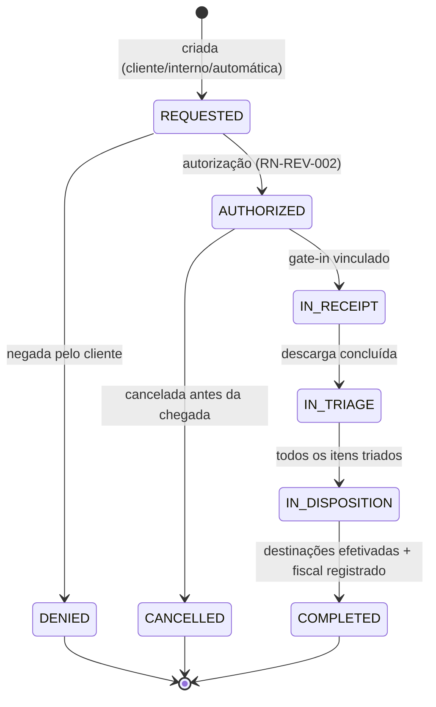

# DOC-07 — LOGÍSTICA REVERSA
## Especificação de Requisitos do Sistema WMS Enterprise 3PL

| Metadado | Valor |
|---|---|
| Código do documento | DOC-07 |
| Versão | 1.0.0 |
| Status | APROVADO PARA USO |
| Data | 2026-08-10 |
| Depende de | DOC-00 v1.2.0, DOC-03, DOC-04, DOC-05, DOC-06, DOC-12 |
| Módulo (prefixo de requisitos) | REV |

---

## 1. ESCOPO E OBJETIVO

Este documento especifica o fluxo de retorno de mercadorias ao armazém: autorização da devolução, recepção, triagem com destinações determinísticas (reintegração, avaria, quarentena, descarte, retorno ao cliente), recall de lotes e os ganchos fiscais e de faturamento.

**Fronteiras:** portaria/pátio (DOC-03), mecânica de doca/descarga/conferência (DOC-04) e movimentações (DOC-05) são REUTILIZADAS — este documento define apenas o que difere. Os documentos fiscais de devolução e a recomposição do Estoque Fiscal são do DOC-08. A cobrança do serviço de reversa é do DOC-09.

---

## 2. DEPENDÊNCIAS E TERMOS

| Termo | Identificador técnico | Definição única |
|---|---|---|
| Ordem de Devolução | `return_order` | Documento raiz da reversa (máscara `DEV`, RN-DAD-040), sempre vinculado a um Cliente. |
| Triagem | `triage` | Inspeção item a item da mercadoria retornada com atribuição de Destinação. |
| Destinação | `disposition` | Resultado da triagem por quantidade: `REINTEGRAR`, `AVARIA`, `QUARENTENA`, `DESCARTE`, `RETORNO_CLIENTE`. |
| Recall | `recall` | Bloqueio e recolhimento de um lote por determinação do Cliente/autoridade. |

---

## 3. ATORES E PERMISSÕES ENVOLVIDAS

| Ator | Papel típico | Interação |
|---|---|---|
| Cliente (portal/API) | `CLIENTE_OPERACAO` | Autorização de devoluções, decisão de destinações reservadas, recall |
| Conferente | `CONFERENTE` | Descarga e triagem |
| Líder de Turno | `LIDER_TURNO` | Exceções, destinações |
| Qualidade | `REC.LIBERAR_QUARENTENA` | Liberação pós-quarentena |

**Catálogo de permissões:** `REV.AUTORIZAR` (CLIENT_WAREHOUSE), `REV.TRIAGEM` (CLIENT_WAREHOUSE), `REV.DESTINACAO` (CLIENT_WAREHOUSE), `REV.RECALL` (CLIENT_WAREHOUSE, sensível).

**Catálogo de exceções:**

| Código | Passos | Motivo obrigatório | Expira em |
|---|---|---|---|
| `REV.SEM_AUTORIZACAO` (retorno chegou sem ordem) | 1 | sim | 8 h |
| `REV.ITEM_NAO_EXPEDIDO` (item não consta do pedido de origem) | 1 | sim | 24 h |
| `REV.REINTEGRACAO_VENCIDO` (tentativa de reintegrar fora de shelf life) | — PROIBIDA, sem exceção | — | — |

---

## 4. REQUISITOS

### 4.1 Origem e autorização

**RF-REV-001 — Tipos de Ordem de Devolução [catálogo fechado]**
- `DEVOLUCAO_CLIENTE_FINAL`: mercadoria expedida retorna (devolução comercial do destinatário do cliente). Vínculo OBRIGATÓRIO ao Pedido de origem (`COMPLETED`);
- `RECUSA_ENTREGA`: veículo retorna com carga total/parcialmente recusada. Vínculo obrigatório ao Pedido; criada automaticamente quando o veículo da expedição retorna (gate-in referenciando a visita de saída);
- `AVARIA_TRANSPORTE`: retorno por dano no transporte. Vínculo obrigatório ao Pedido;
- `RECALL`: recolhimento de lote (RF-REV-030);
- `REVERSA_AVULSA`: retorno sem pedido de origem no sistema (mercadoria expedida antes da implantação). Exige aprovação do cliente item a item.

**RN-REV-002 — Autorização prévia [INVIOLÁVEL]**
QUANDO um veículo de devolução chegar SEM Ordem de Devolução autorizada, o gate-in DEVE abrir `REV.SEM_AUTORIZACAO`; ENQUANTO pendente, aplica-se DOC-03 RN-POR-012 (aguarda fora). A autorização é do Cliente (`REV.AUTORIZAR` no portal) ou de interno com a permissão + registro da anuência do cliente (anexo).

**RN-REV-003 — Validação contra a origem**
Itens informados na Ordem DEVEM existir no Pedido de origem com quantidade retornada ≤ quantidade expedida (acumulada entre devoluções do mesmo pedido). Item fora do pedido de origem abre `REV.ITEM_NAO_EXPEDIDO`; aprovado, é recebido como `REVERSA_AVULSA` vinculada.

### 4.2 Recepção e fluxo

**RF-REV-010 — Fluxo Operacional da reversa (RG-002)**
`Chegada → Doca → Descarga → Triagem → Destinação → Fim`
Chegada/Doca/Descarga reutilizam DOC-03/DOC-04 (incluindo docas `INBOUND`, atracação e fila). A conferência do DOC-04 é substituída pela Triagem (§4.3), que é sempre CEGA em quantidades e aberta em estado físico.

### 4.3 Triagem

**RF-REV-020 — Registro por item**
Para cada item físico: leitura do produto (EAN/SKU), lote (obrigatório conforme espécie — RN-DAD-020; lote ilegível/ausente → tratado como `QUARENTENA` com lote provisório `DEV-<ordem>-<seq>`), quantidade, estado físico observado (íntegro / embalagem violada / danificado / vencido), fotos obrigatórias quando não íntegro.

**RN-REV-021 — Matriz de destinação [INVIOLÁVEL]**
A Destinação sugerida é determinística; alteração manual apenas para destinação MAIS restritiva (nunca menos), exceto decisão formal do cliente:

| Estado observado | Validade | Destinação sugerida | Pode reintegrar? |
|---|---|---|---|
| Íntegro, embalagem original | dentro do shelf life mínimo (RN-EST-012) | `REINTEGRAR` | sim, via quarentena quando espécie exigir (RN-REC-031) |
| Íntegro | abaixo do shelf life mínimo e não vencido | `QUARENTENA` → decisão do cliente: `RETORNO_CLIENTE` ou `DESCARTE` | NÃO como disponível para expedição |
| Embalagem violada | qualquer | `QUARENTENA` → decisão do cliente | somente após liberação de qualidade |
| Danificado | qualquer | `AVARIA` (zona `DAMAGED`) | não |
| Vencido | validade < hoje | `DESCARTE` sugerido; alternativa única: `RETORNO_CLIENTE` | **NUNCA** (proibição sem exceção) |

Espécies `MEDICAMENTO`: reintegração SEMPRE via `QUARENTENA` com liberação de qualidade, independentemente do estado.

**RN-REV-022 — Efeitos de saldo por destinação**
Movimentação `ENTRADA_REVERSA` (RN-EST-001) credita conforme a Destinação: `REINTEGRAR` → `available` (ou `quarantine` quando aplicável) com putaway pelo motor (RN-REC-040); `QUARENTENA` → `qty_quarantine` em zona `QUARANTINE`; `AVARIA` → `qty_damaged` em zona `DAMAGED`; `DESCARTE` → crédito em `blocked` + fluxo `EST.DESCARTE_SALDO` (DOC-05); `RETORNO_CLIENTE` → crédito em `blocked` até a expedição de retorno (pedido de saída tipo retorno, sem picking de armazenagem).

**RN-REV-023 — Gancho fiscal**
QUANDO a Destinação for confirmada, o sistema DEVE acionar o DOC-08 para: registro da NF-e de devolução recebida (quando o retorno vier acobertado por nota do destinatário) e recomposição do Estoque Fiscal do cliente para as quantidades que retornam à armazenagem (regras e documentos exatos no DOC-08). A etapa `Destinação` SÓ conclui com o tratamento fiscal registrado (ou dispensado quando `fiscal_mode = INTEGRADO_ERP` com confirmação do ERP).

### 4.4 Recall

**RF-REV-030 — Recall de lote**
QUANDO o Cliente acionar recall de um lote (`REV.RECALL`, portal ou interno com anuência anexada), o sistema DEVE imediatamente: (1) mudar `batch.status = RECALLED`; (2) bloquear todo saldo do lote (`BLOQUEIO` motivo `ORDEM_CLIENTE`) em TODOS os armazéns; (3) cancelar reservas não separadas do lote (pedidos afetados notificados, itens re-selecionados pela política de giro quando houver saldo alternativo); (4) listar pedidos JÁ expedidos com o lote (relatório de rastreabilidade por `stock_movement`) para recolhimento externo; (5) criar Ordem(ns) de Devolução tipo `RECALL` para os retornos. Mercadoria de recall retornada tem destinação restrita a `QUARENTENA`, `DESCARTE` ou `RETORNO_CLIENTE` — nunca `REINTEGRAR`.

### 4.5 Eventos de domínio

`reversa.ordem_criada`, `reversa.ordem_autorizada`, `reversa.triagem_item`, `reversa.destinacao_confirmada`, `reversa.reintegrado`, `reversa.recall_acionado`, `reversa.concluida`.

---

## 5. MÁQUINAS DE ESTADO E FLUXOS

### 5.1 Ordem de Devolução



---

## 6. CRITÉRIOS DE ACEITE (GHERKIN)

```gherkin
Cenário: Retorno sem autorização aguarda fora
  Dado veículo declarando devolução sem Ordem de Devolução autorizada
  Quando o gate-in for tentado
  Então a exceção REV.SEM_AUTORIZACAO deve ser aberta
  E o veículo deve permanecer em AGUARDANDO_AUTORIZACAO sem ocupar vaga

Cenário: Quantidade devolvida não excede a expedida
  Dado pedido de origem com 100 UN expedidas do SKU-1 e devolução anterior de 30 UN
  Quando uma nova Ordem de Devolução informar 80 UN do SKU-1
  Então o sistema deve rejeitar o item informando o limite restante de 70 UN

Cenário: Vencido jamais reintegra
  Dado item triado com validade 2026-07-01 (vencido)
  Quando qualquer usuário tentar atribuir a destinação REINTEGRAR
  Então o sistema deve rejeitar sem possibilidade de exceção
  E as opções devem ser apenas DESCARTE ou RETORNO_CLIENTE

Cenário: Medicamento reintegra somente via quarentena
  Dado item da espécie MEDICAMENTO íntegro e dentro do shelf life
  Quando a destinação REINTEGRAR for confirmada
  Então o crédito deve ocorrer na parcela quarantine em zona QUARANTINE
  E a disponibilidade só deve ocorrer após liberação com REC.LIBERAR_QUARENTENA

Cenário: Recall bloqueia em todos os armazéns
  Dado lote L-77 com saldo em SP01 (300 UN) e RJ01 (120 UN) e reserva não separada de 50 UN
  Quando o recall do lote L-77 for acionado
  Então o lote deve ficar RECALLED
  E 420 UN devem mover para blocked nos dois armazéns
  E a reserva de 50 UN deve ser cancelada com re-seleção pela política de giro
  E o relatório de pedidos já expedidos com L-77 deve ser gerado

Cenário: Destinação só conclui com fiscal registrado
  Dado destinações confirmadas de uma ordem de cliente com emissão própria
  Quando o tratamento fiscal do DOC-08 ainda não estiver registrado
  Então a etapa Destinação deve permanecer vermelha
  E a ordem não deve concluir
```

---

## 7. REQUISITOS DE DADOS (DELTA SOBRE O DOC-02)

| ID | Estrutura | Classificação | Observações |
|---|---|---|---|
| RD-REV-001 | `return_order` + `return_order_item` | TENANT | tipo, vínculo ao pedido origem, quantidades autorizadas/recebidas |
| RD-REV-002 | `triage_record` | TENANT | item, estado físico, fotos (S3), lote (inclusive provisório), destinação sugerida/confirmada |
| RD-REV-003 | `recall` | TENANT | lote, acionamento, abrangência, relatório de expedidos |

---

## 8. FORA DE ESCOPO (NÃO IMPLEMENTAR)

- Logística de coleta externa (transporte do recolhimento) — o sistema registra os retornos que chegam.
- Reparo/refurbishment e beneficiamento de mercadoria.
- Crédito financeiro ao destinatário final (relação comercial do cliente).
- Reversa de embalagens retornáveis/paletes vazios como ativo controlado (controle de vasilhame).

---

## 9. MATRIZ DE RASTREABILIDADE LOCAL

| Necessidade (DOC-00 §8) | Requisitos deste documento |
|---|---|
| N05 Logística reversa | documento completo |
| N27 Estoque fiscal (recomposição) | RN-REV-023 (detalhe no DOC-08) |
| RG-002 | RF-REV-010, §5.1 |
| RG-005/RN-DAD-020 | RF-REV-020, RN-REV-021 |

---

## CHANGELOG

| Versão | Data | Alteração |
|---|---|---|
| 1.0.0 | 2026-08-10 | Versão inicial aprovada |
