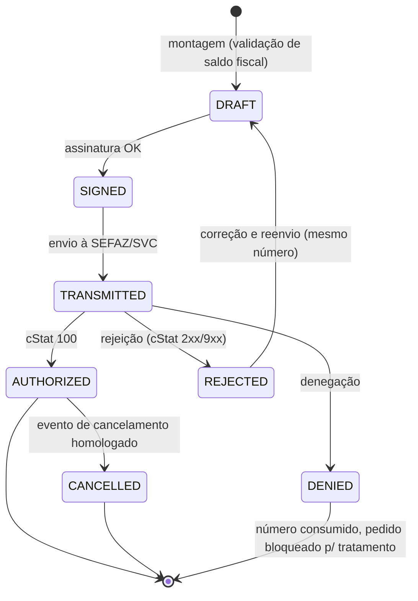

# DOC-08 — FISCAL
## Especificação de Requisitos do Sistema WMS Enterprise 3PL

| Metadado | Valor |
|---|---|
| Código do documento | DOC-08 |
| Versão | 1.0.0 |
| Status | APROVADO PARA USO — itens marcados [VALIDAR CONTABILIDADE] pendentes de homologação contábil do cliente |
| Data | 2026-08-10 |
| Depende de | DOC-00 v1.2.0, DOC-01, DOC-02, DOC-04, DOC-06, DOC-07, DOC-12 |
| Módulo (prefixo de requisitos) | FIS |

---

## 1. ESCOPO E OBJETIVO

Este documento especifica o módulo fiscal: modos fiscais por cliente, o ciclo completo do Estoque Fiscal (RG-014) — registro da NF de entrada, prazo de regularização, Nota de Armazenagem, ordem de consumo e Nota de Devolução de Armazenagem —, o motor de emissão de NF-e (autorização, contingência, cancelamento, CCe, inutilização), certificados digitais, guarda de XML e os reflexos fiscais de transferências, descartes e reversa.

**Este documento resolve:** LAC-007 (prazo da NF de entrada), LAC-008 (ordem de consumo fiscal) e LAC-009 (CFOPs/naturezas) — as três com posição padrão adotada e marcador **[VALIDAR CONTABILIDADE]** onde a homologação contábil do operador é obrigatória antes da produção.

**Fronteiras:** os GATILHOS de emissão estão nos módulos operacionais (DOC-06 RF-EXP-060, DOC-05 RF-EST-051, DOC-07 RN-REV-023) — aqui está o MOTOR e as regras documentais. Escrituração (SPED) é do cliente/ERP — fora de escopo (§8).

---

## 2. DEPENDÊNCIAS E TERMOS

Aplicam-se o Glossário (DOC-00 §4.7) e a RG-014 integralmente. Termos adicionais:

| Termo | Identificador técnico | Definição única |
|---|---|---|
| Documento Fiscal | `fiscal_document` | Registro unificado de NF-e no sistema (emitida ou recebida), com tipo, XML e ciclo de vida. |
| Emitente Fiscal | `fiscal_issuer` | CNPJ habilitado a emitir pelo sistema: filiais do operador (`warehouse.cnpj`) e clientes que delegarem emissão. |
| Natureza de Operação | `operation_nature` | Parametrização CFOP + descrição + finalidade por tipo de documento × âmbito (interna/interestadual). |
| Consumo Fiscal | `fiscal_consumption` | Efetivação da Alocação Fiscal na autorização da Nota de Devolução de Armazenagem (débito do saldo fiscal). |

---

## 3. ATORES E PERMISSÕES ENVOLVIDAS

| Ator | Papel típico | Interação |
|---|---|---|
| Fiscal/Faturista | `FISCAL` | Emissão, cancelamento, CCe, monitoração de rejeições |
| Cliente (portal/API) | `CLIENTE_OPERACAO` | Upload da Nota de Armazenagem, acompanhamento de prazos e pendências |
| Gestor | `GESTOR_ARMAZEM` | Configuração de naturezas, séries e certificados |

**Catálogo de permissões:** `FIS.EMITIR` (CLIENT_WAREHOUSE, sensível), `FIS.CANCELAR` (CLIENT_WAREHOUSE, sensível), `FIS.CCE` (CLIENT_WAREHOUSE), `FIS.INUTILIZAR` (WAREHOUSE, sensível), `FIS.CONFIG` (GLOBAL, sensível), `FIS.CERTIFICADO` (GLOBAL, sensível).

**Catálogo de exceções:**

| Código | Passos | Motivo obrigatório | Expira em |
|---|---|---|---|
| `FIS.PRAZO_ENTRADA_EXPIRADO` (operar além do prazo) | 2 | sim | 24 h |
| `FIS.CANCELAMENTO_NFE` | 2 | sim | 4 h |
| `FIS.CONSUMO_MANUAL` (ordem de consumo manual, RN-FIS-030) | 1 | sim | 8 h |

---

## 4. REQUISITOS

### 4.1 Modos fiscais por cliente (AD-002)

**RN-FIS-001 — Comportamento por modo [INVIOLÁVEL]**
`client_warehouse_settings.fiscal_mode`:
- `EMISSAO_PROPRIA`: o sistema emite os documentos do armazém (Nota de Devolução de Armazenagem, transferências) E, quando o cliente delegar (certificado A1 do cliente cadastrado), os documentos do cliente (Nota de Armazenagem; NF-e de venda NÃO — permanece do cliente/ERP, ver §8);
- `INTEGRADO_ERP`: nenhuma emissão pelo sistema; documentos entram/saem via DOC-13; o sistema mantém o Estoque Fiscal a partir dos documentos integrados e BLOQUEIA as etapas dependentes até a confirmação do ERP;
- `HIBRIDO`: emissão própria dos documentos do armazém + integração para os documentos do cliente.
O modo é imutável com documentos fiscais em aberto (troca exige zerar pendências).

### 4.2 NF de entrada e prazo de regularização (resolve LAC-007)

**RN-FIS-010 — Controle do prazo [posição padrão] [VALIDAR CONTABILIDADE]**
Prazo = `client_warehouse_settings.inbound_invoice_deadline_days` (padrão global `FIS.PRAZO_ENTRADA_DIAS` = 10 dias corridos a partir do gate-in). O `scheduler` DEVE emitir alertas ao cliente e ao painel em 50%, 80% e 100% do prazo. QUANDO o prazo expirar sem Nota de Armazenagem cobrindo as quantidades da NF de entrada:
1. O saldo físico correspondente permanece armazenado e visível;
2. Novas LIBERAÇÕES de pedido contendo produtos com quantidade descoberta DAQUELE cliente ficam bloqueadas na validação RN-EXP-002 item 2 (sem lastro fiscal não há saída — efeito natural da RG-014), com mensagem específica de prazo expirado;
3. Item de painel `CRIT` é criado e a pendência entra no relatório mensal do cliente (DOC-09);
4. Operação excepcional além do prazo (ex.: recebimento adicional do mesmo cliente) prossegue normalmente — o bloqueio é de SAÍDA fiscal, não de entrada física. Endurecimento adicional (bloquear novos recebimentos) é configurável por `FIS.BLOQUEIO_RECEBIMENTO_PRAZO` (padrão false), acionável mediante exceção `FIS.PRAZO_ENTRADA_EXPIRADO`.

### 4.3 Nota de Armazenagem (RG-014 passo 2)

**RF-FIS-020 — Registro e validação**
A Nota de Armazenagem entra por: upload de XML (portal/interno), integração (DOC-13) ou emissão delegada (RN-FIS-001). O sistema DEVE validar: emitente = CNPJ do cliente; destinatário = CNPJ do armazém (`warehouse.cnpj`); natureza compatível (RN-FIS-050); referência à(s) NF de entrada (chave em `NFref` ou vínculo manual auditado); e, por produto, quantidade ≤ quantidade recebida ainda não coberta (soma das entradas físicas conferidas − já cobertas por outras Notas de Armazenagem). Divergência de quantidade rejeita o registro com o detalhamento por item.

**RN-FIS-021 — Crédito do Estoque Fiscal [INVIOLÁVEL]**
Registro validado credita `fiscal_stock_balance` (`qty_credited`) por (produto × nota), tornando o saldo elegível a consumo (RG-014). Uma Nota de Armazenagem PODE cobrir múltiplas NF de entrada e vice-versa (cobertura por quantidade).

### 4.4 Ordem de consumo fiscal (resolve LAC-008)

**RN-FIS-030 — Ordem de consumo [posição padrão] [VALIDAR CONTABILIDADE]**
Parâmetro `FIS.ORDEM_CONSUMO` por cliente×armazém, valores:
- `FIFO_EMISSAO` (PADRÃO): consome as Notas de Armazenagem por data de emissão crescente; desempate: menor número da nota;
- `LIFO_EMISSAO`: data de emissão decrescente;
- `MANUAL`: o Fiscal seleciona as notas na emissão, mediante exceção `FIS.CONSUMO_MANUAL` por emissão (uso restrito).
A ordem de consumo fiscal é **independente do lote físico expedido** (o vínculo fiscal é por quantidade, não por unidade física) — decisão explícita conforme DOC-00 v1.1.0.

**Exemplo normativo (o mesmo da RG-014, agora com ordem definida):** saldo fiscal do produto X: nota 1000234 (emitida 2026-05-01) = 500; nota 2356899 (2026-06-10) = 100; nota 3216544 (2026-07-02) = 400. Pedido de 700 UN com `FIFO_EMISSAO` → linhas da Nota de Devolução: 500 ref. 1000234 + 100 ref. 2356899 + 100 ref. 3216544. Saldos finais: 0 / 0 / 300. Pedido de 1.001 UN → emissão rejeitada com "saldo fiscal disponível: 1.000".

### 4.5 Nota de Devolução de Armazenagem (RG-014 passos 3–4)

**RN-FIS-040 — Composição [INVIOLÁVEL]**
Na etapa Expedição (RF-EXP-060), o sistema DEVE gerar a Nota de Devolução de Armazenagem com: emitente = `warehouse.cnpj`; destinatário = cliente; UMA linha por (produto × Nota de Armazenagem consumida), quantidade da alocação, e referência da nota consumida em `NFref` + número citado no `infAdProd` do item; validação de saldo fiscal na montagem E na autorização (dupla checagem — RG-014 item 4). O Consumo Fiscal (`qty_consumed` +=) efetiva-se SOMENTE na AUTORIZAÇÃO da nota pela SEFAZ; rejeição não consome.

**RN-FIS-041 — Reversa e recomposição [posição padrão] [VALIDAR CONTABILIDADE]**
QUANDO mercadoria retornar (DOC-07) com destinação que a mantenha em armazenagem (`REINTEGRAR`, `QUARENTENA`, `AVARIA`), o sistema DEVE estornar o Consumo Fiscal correspondente (`qty_consumed` −= quantidade retornada) na(s) mesma(s) Nota(s) de Armazenagem da alocação original do pedido de origem, vinculando a NF-e de devolução recebida (ou emitida) como lastro do estorno. `DESCARTE` e `RETORNO_CLIENTE` não recompõem. Alternativa contábil (cliente emitir nova Nota de Armazenagem em vez de estorno) é selecionável por `FIS.RECOMPOSICAO_MODO` = `ESTORNO` (padrão) | `NOVA_NOTA`.

### 4.6 Naturezas de operação e CFOP (resolve LAC-009)

**RN-FIS-050 — Tabela parametrizada [posição padrão] [VALIDAR CONTABILIDADE]**
Tabela `operation_nature` por cliente×armazém×tipo×âmbito, com padrões de instalação (regime de armazém geral):

| Tipo de documento | Âmbito interno | Interestadual |
|---|---|---|
| Nota de Armazenagem (remessa p/ armazém geral, emitida pelo cliente) | CFOP 5905 | CFOP 6905 |
| Nota de Devolução de Armazenagem (retorno, emitida pelo armazém) | CFOP 5906 | CFOP 6906 |
| Transferência entre armazéns do operador | CFOP 5905/5906 conforme sentido | 6905/6906 |
A parametrização de CST/CSOSN, alíquotas e campos de impostos por natureza acompanha a tabela. É PROIBIDO emitir com natureza não cadastrada para o par cliente×tipo.

### 4.7 Motor de emissão NF-e

**RNF-FIS-060 — Ciclo de emissão [INVIOLÁVEL]**
Worker fiscal dedicado (RNF-ARQ-003) processa a fila de emissão: montagem do XML (leiaute 4.00) → assinatura (certificado do emitente) → transmissão síncrona (autorização) à SEFAZ da UF do emitente → tratamento do retorno. Estados: §5.1. Numeração: série própria por emitente×armazém (parâmetro `FIS.SERIE`), sequencial sem lacunas; números pulados por falha DEVEM ser inutilizados (evento de inutilização) pelo `scheduler` mensal com `FIS.INUTILIZAR`.

**RNF-FIS-061 — Contingência**
SE a SEFAZ da UF estiver indisponível (timeout/erro reiterado por 3 tentativas com backoff), ENTÃO o sistema DEVE alternar automaticamente para SVC (SVC-AN ou SVC-RS conforme a UF) marcando `tpEmis` correspondente, e retornar ao modo normal quando o monitor de disponibilidade (verificação a cada 5 min) normalizar. Etapas dependentes aguardam a autorização (nunca prosseguem com nota pendente — RF-EXP-060).

**RNF-FIS-062 — Cancelamento, CCe e prazos**
Cancelamento: permitido dentro de `FIS.PRAZO_CANCELAMENTO_H` (padrão 24 h) da autorização, sem circulação da mercadoria (pedido não pode estar `GATE_OUT`), via exceção `FIS.CANCELAMENTO_NFE`; efetiva o estorno do Consumo Fiscal. CCe: permitida para correções que não alterem valores/quantidades/impostos, até 20 eventos por nota. Ambos registrados com o XML do evento.

**RNF-FIS-063 — Certificados e guarda**
Certificados A1 (PFX) armazenados cifrados (AES-256-GCM, chave no secret manager — RNF-ARQ-100), com alerta de expiração em 30/15/7 dias. TODOS os XML (emitidos, recebidos e eventos) gravados no S3 com object-lock ≥ 5 anos (RNF-ARQ-006/092), indexados por chave de acesso; consulta e download auditados (RN-SEG-032).

**RF-FIS-064 — DANFE**
O sistema DEVE gerar o DANFE (PDF) de toda nota autorizada e disponibilizá-lo para impressão via Edge Agent (DOC-11) e download no portal.

### 4.8 Reflexos de descarte e ajustes

**RN-FIS-070 — Pendências documentais**
Descarte aprovado (DOC-05) e ajuste negativo de inventário em produto com Estoque Fiscal geram PENDÊNCIA DOCUMENTAL do cliente (baixa fiscal por perda/quebra é documento do cliente): o sistema lista as pendências no portal e no relatório mensal, e BLOQUEIA a redução de `qty_credited` até o registro do documento de baixa do cliente (ou confirmação via ERP). O saldo fiscal disponível para consumo, porém, é imediatamente reduzido pela quantidade descartada/ajustada (trava preventiva `qty_pending_writeoff`, nova coluna) para impedir consumo de lastro inexistente.

### 4.9 Eventos de domínio

`fiscal.nf_entrada_registrada`, `fiscal.prazo_entrada_alerta`, `fiscal.prazo_entrada_expirado`, `fiscal.nota_armazenagem_registrada`, `fiscal.saldo_fiscal_creditado`, `fiscal.emissao_solicitada`, `fiscal.nota_autorizada`, `fiscal.nota_rejeitada`, `fiscal.nota_cancelada`, `fiscal.cce_registrada`, `fiscal.contingencia_ativada`, `fiscal.consumo_efetivado`, `fiscal.consumo_estornado`, `fiscal.pendencia_documental_criada`.

---

## 5. MÁQUINAS DE ESTADO E FLUXOS

### 5.1 Documento fiscal emitido



| Origem | Evento | Guarda | Destino | Efeitos |
|---|---|---|---|---|
| DRAFT | montagem | saldo fiscal ≥ alocação (RG-014) | SIGNED | XML gerado e gravado |
| TRANSMITTED | retorno 100 | — | AUTHORIZED | Consumo Fiscal efetivado (RN-FIS-040), DANFE gerado, etapa Expedição liberada |
| AUTHORIZED | cancelamento | dentro do prazo, sem circulação, exceção aprovada | CANCELLED | Consumo Fiscal estornado, pedido conforme RN-EXP-070 |

---

## 6. CRITÉRIOS DE ACEITE (GHERKIN)

```gherkin
Cenário: Consumo FIFO por emissão (exemplo normativo RN-FIS-030)
  Dado notas de armazenagem 1000234 (2026-05-01, 500), 2356899 (2026-06-10, 100), 3216544 (2026-07-02, 400)
  E ordem de consumo FIFO_EMISSAO
  Quando a Nota de Devolução de 700 UN do produto X for montada
  Então ela deve conter 3 linhas: 500 ref 1000234, 100 ref 2356899, 100 ref 3216544
  E cada linha deve citar a nota referenciada no item
  E após a autorização os saldos fiscais devem ser 0, 0 e 300

Cenário: Emissão acima do saldo fiscal é rejeitada
  Dado saldo fiscal total de 1000 UN do produto X
  Quando a montagem de Nota de Devolução de 1001 UN for solicitada
  Então o sistema deve rejeitar com "saldo fiscal disponível: 1.000"
  E nenhum consumo deve ocorrer

Cenário: Consumo só efetiva na autorização
  Dado Nota de Devolução transmitida e REJEITADA pela SEFAZ (cStat 539)
  Quando o retorno for processado
  Então qty_consumed das notas de armazenagem não deve ser alterado
  E a etapa Expedição deve permanecer vermelha exibindo o código 539

Cenário: Nota de armazenagem não excede o recebido
  Dado 800 UN do produto X recebidas e conferidas e 500 UN já cobertas por nota anterior
  Quando o cliente registrar Nota de Armazenagem com 400 UN do produto X
  Então o registro deve ser rejeitado informando cobertura restante de 300 UN

Cenário: Prazo expirado bloqueia liberação de saída
  Dado NF de entrada com prazo de 10 dias expirado sem Nota de Armazenagem
  Quando um pedido do cliente contendo o produto descoberto for liberado
  Então a validação deve rejeitar o item com mensagem de prazo expirado (RN-FIS-010)
  E o recebimento físico de novas cargas do cliente deve permanecer permitido

Cenário: Contingência automática
  Dado 3 falhas consecutivas de comunicação com a SEFAZ
  Quando a próxima emissão for processada
  Então ela deve ser transmitida via SVC com tpEmis de contingência
  E ao normalizar o monitor o modo normal deve ser retomado

Cenário: Recomposição fiscal na reversa (RN-FIS-041)
  Dado pedido expedido com consumo de 100 UN da nota 3216544 (saldo restante 300)
  E devolução de 40 UN com destinação REINTEGRAR e FIS.RECOMPOSICAO_MODO = ESTORNO
  Quando o tratamento fiscal da reversa for registrado
  Então qty_consumed da nota 3216544 deve reduzir em 40
  E o saldo fiscal disponível da nota deve ser 340

Cenário: Descarte trava o lastro imediatamente
  Dado 50 UN descartadas de produto com estoque fiscal
  Quando o descarte for efetivado sem documento de baixa do cliente
  Então qty_pending_writeoff deve registrar 50
  E o saldo fiscal disponível para consumo deve reduzir em 50
  E a pendência documental deve constar no portal do cliente
```

---

## 7. REQUISITOS DE DADOS (DELTA SOBRE O DOC-02)

| ID | Estrutura | Classificação | Observações |
|---|---|---|---|
| RD-FIS-001 | `fiscal_document` + `fiscal_document_item` | TENANT | unifica emitidos/recebidos; tipo (`NF_ENTRADA`, `NOTA_ARMAZENAGEM`, `NOTA_DEVOLUCAO_ARMAZENAGEM`, `NF_TRANSFERENCIA`, `NF_DEVOLUCAO_RECEBIDA`); chave 44 UNIQUE; XML no S3; estado §5.1 |
| RD-FIS-002 | `fiscal_allocation` (efetivação) | TENANT | complementa RD-EXP-007: nota consumida, quantidade, estado (ALOCADA/CONSUMIDA/ESTORNADA) |
| RD-FIS-003 | `operation_nature` | TENANT | RN-FIS-050 |
| RD-FIS-004 | `fiscal_issuer` + certificados cifrados | GLOBAL | CNPJ, série, ambiente (homolog/prod), certificado, validade |
| RD-FIS-005 | coluna `qty_pending_writeoff` em `fiscal_stock_balance` | — | RN-FIS-070; CHECK consumed + pending_writeoff ≤ credited |
| RD-FIS-006 | `fiscal_pending_document` | TENANT | pendências documentais do cliente (prazo, descarte, ajuste) |

Parâmetros: `FIS.PRAZO_ENTRADA_DIAS`, `FIS.BLOQUEIO_RECEBIMENTO_PRAZO`, `FIS.ORDEM_CONSUMO`, `FIS.RECOMPOSICAO_MODO`, `FIS.SERIE`, `FIS.PRAZO_CANCELAMENTO_H`, `FIS.AMBIENTE` (homologação/produção por emitente).

---

## 8. FORA DE ESCOPO (NÃO IMPLEMENTAR)

- Emissão de NF-e de VENDA do cliente (permanece no cliente/ERP; o sistema apenas recebe a chave para vincular à carga quando informada).
- CT-e e MDF-e (o operador não é o transportador nesta versão; extensão futura).
- NFS-e de serviços de armazenagem (a Pré-Fatura do DOC-09 alimenta o faturamento de serviços no ERP do operador; emissão de NFS-e municipal é fora de escopo da v1).
- Escrituração fiscal (SPED Fiscal/Contribuições) — o sistema exporta XMLs e relatórios; a escrituração é do contador/ERP.
- Cálculo tributário avançado (ST, DIFAL, benefícios estaduais) além dos campos parametrizados por natureza — configuração assistida pela contabilidade na implantação.
- Manifestação do destinatário (MD-e) automatizada.

---

## 9. MATRIZ DE RASTREABILIDADE LOCAL

| Necessidade (DOC-00 §8) | Requisitos deste documento |
|---|---|
| N25 Emissão fiscal opcional por cliente | RN-FIS-001, §4.7 |
| N27 / RG-014 Estoque fiscal (ciclo completo) | §4.2–§4.5, §4.8 |
| LAC-007 | RN-FIS-010 |
| LAC-008 | RN-FIS-030 |
| LAC-009 | RN-FIS-050 |
| RN-REV-023 (gancho da reversa) | RN-FIS-041 |

---

## CHANGELOG

| Versão | Data | Alteração |
|---|---|---|
| 1.0.0 | 2026-08-10 | Versão inicial; LAC-007/008/009 resolvidas com posição padrão [VALIDAR CONTABILIDADE] |
