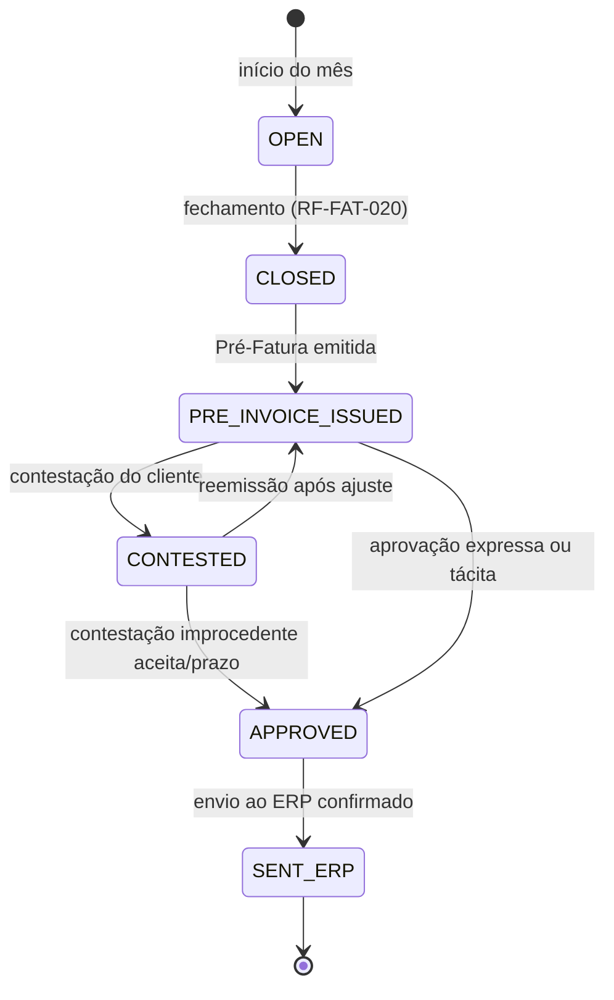

# DOC-09 — FATURAMENTO DE SERVIÇOS DE ARMAZENAGEM
## Especificação de Requisitos do Sistema WMS Enterprise 3PL

| Metadado | Valor |
|---|---|
| Código do documento | DOC-09 |
| Versão | 1.0.0 |
| Status | APROVADO PARA USO |
| Data | 2026-08-10 |
| Depende de | DOC-00 v1.2.0, DOC-02, DOC-05, DOC-06, DOC-07, DOC-12 |
| Módulo (prefixo de requisitos) | FAT |

---

## 1. ESCOPO E OBJETIVO

Este documento especifica o motor de tarifação e faturamento dos serviços de armazenagem (AD-003): contratos e tabelas de tarifas por cliente, catálogo fechado de itens tarifáveis, apuração determinística (armazenagem por snapshot diário + movimentações por evento), fechamento de período, Pré-Fatura com ciclo de conferência/contestação pelo cliente e envio ao ERP do operador.

**Fronteiras:** NÃO há gateway de pagamento, cobrança, boleto ou dados de cartão (AD-003). NÃO há emissão de NFS-e (DOC-08 §8) — a Pré-Fatura aprovada é enviada ao ERP/financeiro do operador (DOC-13), onde ocorre o faturamento definitivo.

---

## 2. DEPENDÊNCIAS E TERMOS

| Termo | Identificador técnico | Definição única |
|---|---|---|
| Contrato de Serviços | `service_contract` | Acordo comercial cliente × armazém com vigência e tabela de tarifas. |
| Item Tarifável | `billable_item_type` | Tipo de serviço do catálogo fechado (§4.2) passível de cobrança. |
| Período de Apuração | `billing_period` | Intervalo mensal (calendário civil) de acumulação dos itens tarifáveis por contrato. |
| Lançamento | `billing_entry` | Registro individual apurado (1 dia de armazenagem, 1 movimentação, 1 serviço avulso). |
| Snapshot de Armazenagem | `storage_snapshot` | Fotografia diária às 23:59 (fuso do armazém) das bases de cobrança de armazenagem. |

---

## 3. ATORES E PERMISSÕES ENVOLVIDAS

| Ator | Papel típico | Interação |
|---|---|---|
| Gestor de Contas | `GESTOR_ARMAZEM` | Contratos e tarifas |
| Faturista | `FATURISTA` | Fechamento, Pré-Fatura, ajustes |
| Cliente (portal) | `CLIENTE_OPERACAO` | Conferência, aprovação ou contestação da Pré-Fatura |

**Catálogo de permissões:** `FAT.CONTRATO_GERIR` (CLIENT_WAREHOUSE, sensível), `FAT.FECHAR_PERIODO` (WAREHOUSE, sensível), `FAT.PREFATURA_EMITIR` (CLIENT_WAREHOUSE), `FAT.LANCAMENTO_AVULSO` (CLIENT_WAREHOUSE), `FAT.AJUSTAR` (CLIENT_WAREHOUSE, sensível).

**Catálogo de exceções:**

| Código | Passos | Motivo obrigatório | Expira em |
|---|---|---|---|
| `FAT.AJUSTE_APURACAO` (inclusão/remoção/alteração de lançamento após fechamento) | 2 | sim | 72 h |
| `FAT.CONTESTACAO_CLIENTE` (aberta pelo cliente na conferência) | 1 (decisão do operador) | sim | 120 h |

---

## 4. REQUISITOS

### 4.1 Contrato e tarifas

**RF-FAT-001 — Contrato de Serviços**
Por cliente×armazém: vigência (início/fim), moeda BRL, dia de fechamento = último dia do mês civil, faturamento mínimo mensal opcional (`min_monthly_brl`), e a tabela de tarifas: linhas (Item Tarifável do catálogo §4.2, unidade, preço unitário `NUMERIC(14,4)`, faixa de vigência dentro do contrato). Alterações de tarifa criam NOVA linha com vigência (nunca sobrescrevem — apuração histórica preservada). Contrato ativo é pré-requisito para operar o cliente no armazém (bloqueio de liberação de novos documentos sem contrato vigente, com alerta).

### 4.2 Catálogo fechado de Itens Tarifáveis [INVIOLÁVEL]

| Código | Unidade de cobrança | Base de apuração |
|---|---|---|
| `ARM_PALETE_DIA` | palete × dia | snapshot diário: paletes com saldo do cliente |
| `ARM_POSICAO_DIA` | posição × dia | snapshot diário: endereços ocupados pelo cliente |
| `ARM_M3_DIA` | m³ × dia | snapshot diário: Σ volume dos saldos (qty × volume unitário) |
| `MOV_RECEBIMENTO_PALETE` | palete | evento `recebimento.lpn_gerado` |
| `MOV_RECEBIMENTO_VOLUME` | volume conferido | itens de conferência encerrada |
| `MOV_EXPEDICAO_LINHA` | linha de pedido expedida | `expedicao.pedido_concluido` (linhas atendidas) |
| `MOV_EXPEDICAO_VOLUME` | volume expedido | volumes do pedido concluído |
| `MOV_REVERSA_ITEM` | item triado | `reversa.triagem_item` |
| `MOV_CROSSDOCK_PALETE` | palete | `recebimento.crossdock_reservado` |
| `SEG_AD_VALOREM` | % sobre valor declarado médio armazenado | snapshot diário: Σ (qty × valor unitário declarado) × taxa ÷ dias do mês |
| `SRV_INVENTARIO_EXTRA` | inventário | lançamento avulso vinculado a `INV` |
| `SRV_ETIQUETAGEM` | etiqueta | lançamento avulso |
| `SRV_PALETIZACAO` | palete | lançamento avulso |
| `SRV_HORA_EXTRA_OPERACAO` | hora | lançamento avulso |
| `SRV_OUTROS` | unidade livre | lançamento avulso com descrição obrigatória |

O contrato ativa apenas os itens pactuados; item sem tarifa vigente NÃO gera Lançamento (registrado em log de apuração como "sem tarifa"). Valor unitário declarado (para `SEG_AD_VALOREM`) vem do cadastro/integração do cliente; produto sem valor declarado fica FORA da base ad valorem com aviso mensal ao cliente.

### 4.3 Apuração determinística

**RN-FAT-010 — Armazenagem por snapshot [INVIOLÁVEL]**
O `scheduler` executa o Snapshot de Armazenagem diariamente às 23:59 do fuso do armazém, congelando as bases (paletes, posições, m³, valor declarado) por cliente e gerando 1 Lançamento por item tarifável ativo × dia. Dia sem snapshot (falha) = alerta `CRIT` + reexecução retroativa determinística a partir de `stock_movement` (reconstrução do saldo do dia). Saldo em `TRANSBORDO` (RG-015) conta normalmente; saldo `in_transit` de transferência inter-armazém conta no armazém de ORIGEM até o recebimento no destino.

**RN-FAT-011 — Movimentação por evento [INVIOLÁVEL]**
Lançamentos de movimentação são gerados por consumo idempotente dos eventos de domínio (chave `event_id`, RG-009) no worker de faturamento. Estorno operacional (RN-EXP-070) gera Lançamento NEGATIVO espelhado no mesmo período (ou no período aberto, se o original já fechou — com referência cruzada).

**RN-FAT-012 — Cálculo e arredondamento (RG-010)**
Valor do Lançamento = quantidade apurada × preço unitário vigente na DATA do lançamento, calculado com 4 casas; a consolidação da Pré-Fatura soma os lançamentos e arredonda o TOTAL por item tarifável para 2 casas com half-even.

**Exemplo normativo:** contrato com `ARM_PALETE_DIA` a R$ 1,3350 e `MOV_EXPEDICAO_LINHA` a R$ 0,8725. Junho: snapshots somam 3.847 paletes-dia → 3.847 × 1,3350 = R$ 5.135,7450 → consolidado R$ 5.135,74 (half-even sobre ...745 → 74). Linhas expedidas: 12.410 → 12.410 × 0,8725 = R$ 10.827,7250 → consolidado R$ 10.827,72. Faturamento mínimo contratual R$ 18.000,00; total apurado R$ 15.963,46 → lançamento `COMPLEMENTO_MINIMO` de R$ 2.036,54 gerado automaticamente.

**RN-FAT-013 — Faturamento mínimo**
QUANDO o total do período < `min_monthly_brl`, o fechamento gera lançamento `COMPLEMENTO_MINIMO` pela diferença exata.

### 4.4 Fechamento e Pré-Fatura

**RF-FAT-020 — Fechamento do período**
No 1º dia útil seguinte (ou manualmente por `FAT.FECHAR_PERIODO`), o período fecha: novos lançamentos do período ficam PROIBIDOS exceto via exceção `FAT.AJUSTE_APURACAO` (2 passos, lançamento de ajuste identificado — o original nunca é editado). O fechamento valida completude: todos os dias com snapshot, fila de eventos de faturamento zerada para o período.

**RF-FAT-021 — Pré-Fatura**
Documento `FAT` (RN-DAD-040) por contrato×período: itens consolidados por tipo, memória de cálculo acessível (drill até o Lançamento individual — dia a dia, evento a evento), PDF gerado, disponibilizada no portal com prazo de conferência `FAT.PRAZO_CONFERENCIA_DIAS` (padrão 5 dias úteis).

**RN-FAT-022 — Conferência do cliente**
No portal, o cliente APROVA ou CONTESTA (por item, com motivo — abre `FAT.CONTESTACAO_CLIENTE`). Decisão da contestação: procedente → ajuste via `FAT.AJUSTE_APURACAO` e RE-EMISSÃO da Pré-Fatura (nova versão, anterior preservada); improcedente → resposta fundamentada ao cliente. Sem manifestação no prazo → APROVAÇÃO TÁCITA (registrada como tal).

**RF-FAT-023 — Envio ao ERP**
Pré-Fatura APROVADA (expressa ou tácita) é enviada ao ERP do operador via DOC-13 (evento `faturamento.prefatura_aprovada` + payload canônico) para faturamento definitivo. O retorno do ERP (número do faturamento) é registrado. O ciclo do dinheiro (NFS-e, cobrança, baixa) é EXTERNO.

### 4.5 Eventos de domínio

`faturamento.snapshot_executado`, `faturamento.lancamento_gerado`, `faturamento.periodo_fechado`, `faturamento.prefatura_emitida`, `faturamento.contestacao_aberta`, `faturamento.prefatura_aprovada`, `faturamento.prefatura_reemitida`, `faturamento.enviada_erp`.

---

## 5. MÁQUINAS DE ESTADO E FLUXOS

### 5.1 Período de apuração / Pré-Fatura



---

## 6. CRITÉRIOS DE ACEITE (GHERKIN)

```gherkin
Cenário: Consolidação com half-even (exemplo normativo RN-FAT-012)
  Dado 3.847 paletes-dia a R$ 1,3350
  Quando o período consolidar
  Então o item ARM_PALETE_DIA deve totalizar R$ 5.135,74

Cenário: Complemento de mínimo exato
  Dado faturamento mínimo de R$ 18.000,00 e total apurado de R$ 15.963,46
  Quando o período fechar
  Então um lançamento COMPLEMENTO_MINIMO de R$ 2.036,54 deve ser gerado
  E o total da Pré-Fatura deve ser R$ 18.000,00

Cenário: Snapshot reconstruível
  Dado falha do snapshot de 2026-08-05 detectada em 2026-08-06
  Quando a reexecução retroativa rodar
  Então as bases de 2026-08-05 devem ser reconstruídas a partir de stock_movement
  E os lançamentos gerados devem ser idênticos aos que o snapshot original geraria

Cenário: Tarifa vigente na data do lançamento
  Dado tarifa ARM_PALETE_DIA de R$ 1,3350 até 2026-08-15 e R$ 1,4000 a partir de 2026-08-16
  Quando os lançamentos de 15/08 e 16/08 forem gerados
  Então o de 15/08 deve usar 1,3350 e o de 16/08 deve usar 1,4000

Cenário: Estorno gera lançamento negativo
  Dado pedido concluído em julho com 20 linhas tarifadas e estorno pós-fiscal executado em agosto
  Quando o worker de faturamento processar o estorno
  Então 20 lançamentos negativos devem ser gerados no período aberto de agosto
  E com referência cruzada aos lançamentos originais de julho

Cenário: Contestação reabre por ajuste, nunca por edição
  Dado Pré-Fatura contestada em item com 100 unidades apuradas e decisão procedente de reduzir 10
  Quando o ajuste for aprovado (2 passos)
  Então um lançamento de ajuste de −10 deve ser criado
  E o lançamento original deve permanecer intacto
  E a Pré-Fatura deve ser reemitida como nova versão preservando a anterior

Cenário: Aprovação tácita
  Dado Pré-Fatura emitida em 2026-08-03 com prazo de 5 dias úteis
  Quando o prazo expirar sem manifestação do cliente
  Então a Pré-Fatura deve constar APROVADA com marcação de aprovação tácita
  E o envio ao ERP deve ser disparado

Cenário: Item sem tarifa não fatura silenciosamente
  Dado contrato sem tarifa para MOV_REVERSA_ITEM
  Quando itens de reversa forem triados
  Então nenhum lançamento deve ser gerado
  E o log de apuração deve registrar os eventos como "sem tarifa"
```

---

## 7. REQUISITOS DE DADOS (DELTA SOBRE O DOC-02)

| ID | Estrutura | Classificação | Observações |
|---|---|---|---|
| RD-FAT-001 | `service_contract` + `contract_tariff` | TENANT | tarifas versionadas por vigência |
| RD-FAT-002 | `billing_period` | TENANT | estado §5.1 |
| RD-FAT-003 | `billing_entry` | TENANT (particionada mensal) | lançamento imutável; ajustes = novos lançamentos com referência |
| RD-FAT-004 | `storage_snapshot` | TENANT (particionada mensal) | bases congeladas por dia×cliente |
| RD-FAT-005 | `pre_invoice` + `pre_invoice_item` + versões | TENANT | PDF no S3, aprovação (expressa/tácita), retorno do ERP |
| RD-FAT-006 | `product_declared_value` | TENANT | valor unitário declarado (base ad valorem), versionado por vigência |

Parâmetros: `FAT.PRAZO_CONFERENCIA_DIAS`.

---

## 8. FORA DE ESCOPO (NÃO IMPLEMENTAR)

- Gateway de pagamento, PIX, boleto, cartão, régua de cobrança, baixa financeira (AD-003).
- Emissão de NFS-e (DOC-08 §8).
- Reajuste automático por índice (IGP-M/IPCA) — reajuste é nova linha de tarifa manual.
- Rateio de custos internos, rentabilidade por cliente, DRE.
- Tarifação de estadia de veículo automática (registrável como `SRV_OUTROS` manual; automação futura).
- Multimoeda.

---

## 9. MATRIZ DE RASTREABILIDADE LOCAL

| Necessidade (DOC-00 §8) | Requisitos deste documento |
|---|---|
| N22 Faturamento de serviços | documento completo |
| AD-003 | §4.2 (catálogo), §8 (exclusões) |
| RG-010 (moeda/arredondamento) | RN-FAT-012 |
| RG-015 item 5 (visão por armazém lógico) | RN-FAT-010 (transbordo conta normalmente; visão consolidada disponível) |

---

## CHANGELOG

| Versão | Data | Alteração |
|---|---|---|
| 1.0.0 | 2026-08-10 | Versão inicial aprovada |
