# DOC-11 — ETIQUETAS E PERIFÉRICOS (WMS EDGE AGENT)
## Especificação de Requisitos do Sistema WMS Enterprise 3PL

| Metadado | Valor |
|---|---|
| Código do documento | DOC-11 |
| Versão | 1.0.0 |
| Status | APROVADO PARA USO — modelos exatos de hardware confirmados na implantação de cada armazém |
| Data | 2026-08-10 |
| Depende de | DOC-00 v1.2.0, DOC-01, DOC-02, DOC-03, DOC-06, DOC-12 |
| Módulo (prefixo de requisitos) | PER |

---

## 1. ESCOPO E OBJETIVO

Este documento especifica: o protocolo do WMS Edge Agent (registro, heartbeat, jobs), os drivers de periféricos (impressoras térmicas ZPL, impressoras de documentos, balanças, cancelas/catracas, câmeras LPR), o conteúdo normativo dos códigos de barras/QR (padrão GS1) e os leiautes das etiquetas do sistema.

**Este documento resolve:** LAC-001 (protocolos de balança) e LAC-002 (leiaute das etiquetas). Os MODELOS físicos exatos instalados em cada armazém são configuração de implantação dentro dos drivers aqui especificados.

**Fronteiras:** a regra "navegador nunca fala com hardware" e o enfileiramento em indisponibilidade são RG-008/RNF-ARQ-060/061 (DOC-01). QUANDO cada etiqueta é emitida é regra dos módulos operacionais.

---

## 2. DEPENDÊNCIAS E TERMOS

| Termo | Identificador técnico | Definição única |
|---|---|---|
| Job de Periférico | `peripheral_job` | Comando unitário enviado ao Edge Agent (imprimir, pesar, abrir cancela, etc.), com ciclo de vida próprio. |
| Estação | `workstation` | Posto de trabalho lógico (ex.: `PACK-01`, `PORTARIA-1`) ao qual periféricos são vinculados; o navegador declara sua Estação na sessão. |
| Driver | `peripheral_driver` | Módulo do Edge Agent que traduz jobs para o protocolo do dispositivo. Catálogo fechado (§4.4–§4.7). |
| Peso Estável | `stable_weight` | Leitura de balança repetida dentro da tolerância do driver por N amostras consecutivas. |

---

## 3. ATORES E PERMISSÕES ENVOLVIDAS

| Ator | Interação |
|---|---|
| Administrador de Sistema | Registro de agents, dispositivos, estações e templates |
| Operadores | Consomem os periféricos da sua Estação de forma transparente |
| Edge Agent (ator técnico) | Autentica por token de dispositivo, executa jobs, reporta telemetria |

**Permissões:** `PER.GESTAO_DISPOSITIVOS` (WAREHOUSE, sensível), `PER.GESTAO_TEMPLATES` (GLOBAL, sensível), `PER.REIMPRESSAO` (WAREHOUSE — reimpressão de etiqueta é auditada, RN-SEG-032 `PRINT`).

Sem exceções próprias (falhas de periférico seguem RNF-ARQ-061 e RF-POR-014).

---

## 4. REQUISITOS

### 4.1 Protocolo do Edge Agent

**RNF-PER-001 — Registro e sessão**
O Edge Agent (serviço instalado em máquina da rede local do armazém; Windows e Linux) autentica-se por token de dispositivo (hash em `edge_agent`, RD-ARQ-003) e mantém conexão WebSocket outbound com heartbeat a cada 15 s. 2 heartbeats perdidos = agent `OFFLINE` (alerta RNF-ARQ-072). Um armazém PODE ter N agents; cada dispositivo pertence a exatamente 1 agent.

**RNF-PER-002 — Envelope de job [INVIOLÁVEL]**
Mensagens JSON bidirecionais:
```json
// backend → agent
{ "job_id": "uuid-v7", "job_type": "PRINT_ZPL|PRINT_PDF|WEIGH|GATE_OPEN|LPR_STATUS",
  "device_code": "ZBR-PACK-01", "timeout_ms": 15000,
  "payload": { }, "issued_at": "..." }
// agent → backend
{ "job_id": "...", "status": "EXECUTANDO|CONCLUIDO|FALHA",
  "result": { }, "error_code": "DEVICE_OFFLINE|TIMEOUT|PROTOCOL_ERROR|PAPER_OUT|...",
  "finished_at": "..." }
```
Estados do job (RNF-ARQ-060): `PENDENTE → ENVIADO → EXECUTANDO → CONCLUIDO | FALHA | EXPIRADO`. Reenvio é idempotente por `job_id` (RG-009): agent que já executou responde o resultado original. Catálogo de `error_code` fechado por driver.

**RNF-PER-003 — Telemetria de dispositivos**
O agent reporta a cada 60 s o estado de cada dispositivo (`ONLINE`/`OFFLINE`/`ERRO` + detalhe: sem papel, ribbon, porta serial indisponível). O painel de dispositivos do armazém exibe em tempo real (tópico `alertas` para transições a `OFFLINE`/`ERRO`).

**RF-PER-004 — Estações**
Toda tela que usa periférico resolve o dispositivo pela Estação declarada na sessão do usuário (seleção no login da área operacional; memorizada por dispositivo/navegador). Mapa Estação × dispositivo por função: `IMPRESSORA_ETIQUETA`, `IMPRESSORA_DOCUMENTO`, `BALANCA`, `CANCELA`, `CATRACA`. Estação sem dispositivo da função exigida = mensagem determinística com instrução de configuração.

### 4.2 Conteúdo normativo dos códigos (GS1)

**RN-PER-010 — Codificação [INVIOLÁVEL]**
- **LPN (palete/volume):** código de barras GS1-128 com AI (00) + SSCC de 18 dígitos (RN-DAD-030); QR Code com a MESMA element string GS1 `(00)129000000000012346` — um único conteúdo, duas simbologias (leitores 1D e 2D).
- **Endereço:** Code 128 subset B com o `location.code` literal (RN-DAD-011, ex.: `A1-012-03-02`); QR idêntico.
- **Etiqueta de lote interno (quando exigida):** GS1-128 `(01)GTIN (10)LOTE (17)AAMMDD` — GTIN derivado do EAN cadastrado; produto sem EAN usa (02) proibido → usa código interno em Code 128 simples com prefixo `P|` + SKU.
- **Volume de expedição:** SSCC do volume + segmento legível `n/N`.
Leitura no coletor DEVE aceitar ambas as simbologias e validar dígito verificador SSCC antes de aceitar.

### 4.3 Leiautes de etiqueta (resolve LAC-002)

**RN-PER-020 — Templates ZPL parametrizados [INVIOLÁVEL]**
Templates armazenados em `label_template` (ZPL II com placeholders `${campo}`), versionados; os padrões de instalação abaixo são obrigatórios e editáveis apenas por `PER.GESTAO_TEMPLATES`:

| Template | Tamanho (mm) | Campos obrigatórios |
|---|---|---|
| `LPN_PALETE` | 100 × 150 | SSCC em GS1-128 (inferior, ≥ 32 mm altura) + QR (≥ 30×30 mm) + LPN legível + cliente (code) + produto principal/`MISTO` + lote + validade + qty + data/hora + armazém |
| `LPN_VOLUME` | 100 × 100 | SSCC + QR + pedido + destinatário (nome/cidade/UF) + volume `n/N` + peso |
| `ENDERECO` | 100 × 50 | Code128 do código + código legível grande (≥ 20 mm) + zona |
| `LOTE_INTERNO` | 60 × 40 | GS1-128 (01)(10)(17) + SKU + descrição truncada 30 chars + lote + validade |
| `CONTEUDO_PALETE` (A4 via PDF, opcional) | A4 | lista completa do conteúdo do palete misto |

**Exemplo normativo (esqueleto `ENDERECO`):**
```zpl
^XA^PW799^LL399
^FO40,30^A0N,60,60^FD${location_code}^FS
^FO40,110^A0N,28,28^FDZona: ${zone_code}^FS
^FO40,170^BY3^BCN,140,N,N,N^FD${location_code}^FS
^XZ
```
A validação de template exige impressão de teste aprovada antes da ativação da versão.

**RF-PER-021 — Fila de impressão e reimpressão**
Jobs `PRINT_*` seguem RNF-ARQ-061 (fila com validade 30 min quando agent offline). Reimpressão de qualquer etiqueta exige `PER.REIMPRESSAO` + motivo; a etiqueta reimpressa carrega marca `RE` + contador (`RE1`, `RE2`) para rastrear duplicatas físicas.

### 4.4 Driver de impressoras

**RNF-PER-030 — Térmicas (etiquetas):** protocolo ZPL II por TCP 9100 (raw). Impressoras não-ZPL nativas (ex.: Argox) DEVEM operar em modo de emulação ZPL ou ser substituídas — é PROIBIDO manter dois idiomas de etiqueta. Configuração por dispositivo: IP, porta, densidade (dpmm), calibração.
**RNF-PER-031 — Documentos (DANFE, cartas, termos, pré-faturas):** job `PRINT_PDF` com o PDF em base64 ou URL S3 pré-assinada; o agent imprime via spooler do SO (impressora laser/jato local ou de rede) na impressora `IMPRESSORA_DOCUMENTO` da estação.

### 4.5 Driver de balanças (resolve LAC-001)

**RNF-PER-040 — Interface única, protocolos plugáveis [INVIOLÁVEL]**
Job `WEIGH` → resposta `{ weight_kg, unit, stable, device_code, raw_frame }`. O driver DEVE entregar somente Peso Estável: N=5 leituras consecutivas com variação ≤ 1 divisão da balança; timeout do job (padrão 10 s) sem estabilidade = `FALHA/TIMEOUT` (operador re-solicita). Protocolos suportados no catálogo (parametrização por dispositivo: porta serial RS-232 via conversor serial-TCP ou TCP nativo, baud, frame):
- `TOLEDO_P05` — protocolo contínuo Toledo (frame STX...ETX com status/peso);
- `FILIZOLA_CS` — protocolo contínuo Filizola;
- `GENERICO_CONTINUO` — parser configurável por expressão (offset/tamanho do campo de peso, fator, caractere de status de estabilidade) para marcas fora do catálogo.
O peso gravado no negócio (RF-EXP-050) SEMPRE inclui `device_code` e `raw_frame` para perícia. Modelos físicos por armazém = configuração de implantação.

### 4.6 Driver de cancelas e catracas

**RNF-PER-050 — Acionamento**
Job `GATE_OPEN` → pulso de abertura via: (a) placa de relé IP (HTTP GET/POST parametrizável) ou (b) Modbus TCP (coil configurável). Resposta `CONCLUIDO` = comando aceito pelo controlador (a passagem física é confirmada pelo operador na tela — RF-POR-014). Catracas idem, com sentido (entrada/saída). Sem retenção de estado no agent: cada abertura é um job.

### 4.7 Driver LPR

**RNF-PER-060 — Recepção de placas**
Câmeras LPR entregam leituras ao Edge Agent por push HTTP (endpoint local do agent, formato configurável por marca — JSON/multipart) OU por polling à API da câmera. O agent normaliza `{ plate, confidence, lane, captured_at, image_ref }` e encaminha ao backend, que publica no tópico da portaria (RF-POR-010) associando ao gate-in em andamento da pista. Leitura com `confidence < PER.LPR_CONFIANCA_MIN` (padrão 0,85) é exibida como sugestão editável, nunca preenchimento automático confirmado. Imagens de captura vão ao S3 com a retenção da portaria (RN-SEG-051).

### 4.8 Eventos de domínio

`perifericos.agent_online`, `perifericos.agent_offline`, `perifericos.dispositivo_erro`, `perifericos.job_concluido`, `perifericos.job_falha`, `perifericos.placa_lida`.

---

## 5. MÁQUINAS DE ESTADO E FLUXOS

### 5.1 Job de periférico

```mermaid
stateDiagram-v2
    [*] --> PENDENTE: criado pelo backend
    PENDENTE --> ENVIADO: agent conectado recebe
    PENDENTE --> EXPIRADO: validade excedida (fila RNF-ARQ-061)
    ENVIADO --> EXECUTANDO: agent iniciou
    EXECUTANDO --> CONCLUIDO: resultado OK
    EXECUTANDO --> FALHA: error_code do catálogo
    ENVIADO --> FALHA: timeout_ms excedido
    FALHA --> PENDENTE: retry (máx. 3 para PRINT_*; WEIGH/GATE não fazem retry automático)
    CONCLUIDO --> [*]
    EXPIRADO --> [*]
    FALHA --> [*]: retries esgotados (alerta)
```



Retry automático SOMENTE para impressão (idempotente por natureza física controlada via `job_id`); pesagem e cancela são re-solicitadas pelo operador (evitar dupla abertura/pesagem fantasma).

---

## 6. CRITÉRIOS DE ACEITE (GHERKIN)

```gherkin
Cenário: Job idempotente no reenvio
  Dado job de impressão job_id "01J..." executado pelo agent com CONCLUIDO
  Quando o backend reenviar o mesmo job por falha de rede na resposta
  Então o agent deve responder o resultado original CONCLUIDO
  E nenhuma segunda etiqueta deve ser impressa

Cenário: Conteúdo GS1 do LPN
  Dado o LPN 129000000000012346
  Quando a etiqueta LPN_PALETE for gerada
  Então o GS1-128 deve conter a element string (00)129000000000012346
  E o QR deve conter exatamente o mesmo conteúdo
  E o coletor deve validar o dígito verificador antes de aceitar a leitura

Cenário: Peso apenas estável
  Dado balança TOLEDO_P05 com carga oscilando
  Quando o job WEIGH for executado e 5 leituras consecutivas não convergirem em 10 s
  Então o job deve retornar FALHA com error_code TIMEOUT
  E nenhum peso deve ser gravado no negócio

Cenário: Peso gravado com evidência
  Dado job WEIGH concluído com 12,480 kg estável
  Quando o peso for gravado na pesagem do volume
  Então o registro deve conter device_code e raw_frame da leitura

Cenário: Reimpressão marcada e auditada
  Dado etiqueta LPN já impressa
  Quando um usuário com PER.REIMPRESSAO reimprimir com motivo "etiqueta danificada"
  Então a nova etiqueta deve exibir a marca RE1
  E um registro de auditoria com action PRINT deve ser gerado

Cenário: Fila de impressão com agent offline
  Dado agent do armazém OFFLINE
  Quando 3 jobs de impressão forem criados
  Então devem permanecer PENDENTE por até 30 minutos
  E ao reconectar o agent devem ser executados na ordem
  E jobs além de 30 minutos devem expirar com alerta

Cenário: LPR abaixo da confiança não confirma sozinho
  Dado leitura LPR com confidence 0,72 e mínimo 0,85
  Quando a placa chegar à tela de gate-in
  Então deve aparecer como sugestão editável destacada
  E o porteiro deve confirmar ou corrigir manualmente

Cenário: Cancela sem retry automático
  Dado job GATE_OPEN com timeout excedido
  Quando o resultado FALHA for processado
  Então nenhum retry automático deve ocorrer
  E a tela do porteiro deve oferecer nova solicitação manual
```

---

## 7. REQUISITOS DE DADOS (DELTA SOBRE O DOC-02)

| ID | Estrutura | Classificação | Observações |
|---|---|---|---|
| RD-PER-001 | `peripheral_device` | GLOBAL | agent, função, driver, parâmetros de conexão (IP/porta/serial), estado |
| RD-PER-002 | `workstation` + `workstation_device` | GLOBAL | mapa estação × função × dispositivo |
| RD-PER-003 | `peripheral_job` | GLOBAL (particionada mensal, RNF-ARQ-090) | envelope, estados, resultado, raw_frame |
| RD-PER-004 | `label_template` | GLOBAL | ZPL versionado, tamanho, status (teste aprovado/ativo) |
| RD-PER-005 | `lpr_reading` | GLOBAL | placa, confiança, pista, imagem (S3), vínculo à visita |

Parâmetros: `PER.LPR_CONFIANCA_MIN`, `PER.WEIGH_TIMEOUT_MS`, `PER.PRINT_FILA_VALIDADE_MIN`.

---

## 8. FORA DE ESCOPO (NÃO IMPLEMENTAR)

- RFID (leitores/portais/etiquetas).
- Impressão e aplicação automática de etiquetas (print & apply).
- Balança rodoviária de veículos (DOC-03 §8).
- Integração com PLC/esteiras/sorters (WCS — DOC-05 §8).
- Coleta de imagens de câmeras de segurança (CFTV) além das capturas LPR.
- Assinatura em tablet/pad de assinatura.
- Elaboração de artes de etiqueta pelo usuário final em editor visual (templates são ZPL versionado).

---

## 9. MATRIZ DE RASTREABILIDADE LOCAL

| Necessidade (DOC-00 §8) | Requisitos deste documento |
|---|---|
| N10 Etiquetas QR + código de barras | RN-PER-010, RN-PER-020 (LAC-002 resolvida) |
| N20 Comunicação com impressoras e periféricos | §4.1, §4.4–§4.7 |
| RG-008 Edge Agent exclusivo | RNF-PER-001..003 |
| LAC-001 balanças | RNF-PER-040 |
| RF-EXP-050 pesagem | RNF-PER-040 |
| RF-POR-010/014 LPR e cancelas | RNF-PER-050, RNF-PER-060 |

---

## CHANGELOG

| Versão | Data | Alteração |
|---|---|---|
| 1.0.0 | 2026-08-10 | Versão inicial; LAC-001 e LAC-002 resolvidas |
