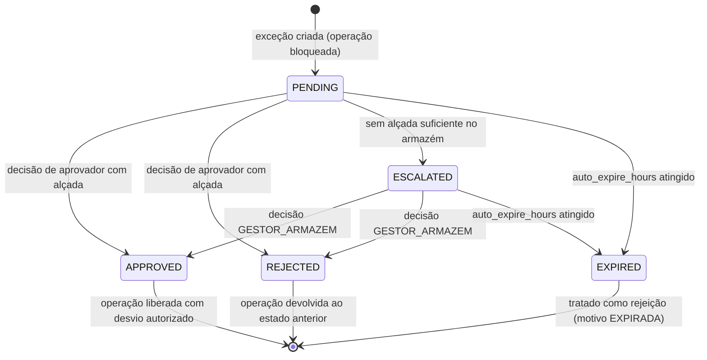

# DOC-12 — SEGURANÇA, PERMISSÕES E AUDITORIA
## Especificação de Requisitos do Sistema WMS Enterprise 3PL

| Metadado | Valor |
|---|---|
| Código do documento | DOC-12 |
| Versão | 1.0.0 |
| Status | APROVADO PARA USO |
| Data | 2026-08-10 |
| Depende de | DOC-00 v1.2.0, DOC-01 v1.0.0, DOC-02 v1.0.0 |
| Módulo (prefixo de requisitos) | SEG |

---

## 1. ESCOPO E OBJETIVO

Este documento especifica: autenticação e sessões, o modelo RBAC multi-dimensional (papel × cliente × armazém), alçadas, o motor genérico de Workflow de Aprovação (AD-007), a trilha de auditoria funcional (RG-003) e os requisitos de LGPD.

**Este documento NÃO cobre:** quais exceções de negócio existem (declaradas em cada módulo operacional, que as registra no catálogo do §4.5), segurança de transporte e segredos (RNF-ARQ-100, DOC-01).

---

## 2. DEPENDÊNCIAS E TERMOS

Aplicam-se o Glossário (DOC-00 §4) e as regras RG-001 a RG-015. Termos adicionais:

| Termo | Identificador técnico | Definição única |
|---|---|---|
| Permissão | `permission` | Código atômico e imutável de uma capacidade do sistema (ex.: `EST.PUTAWAY_OVERRIDE`). Catálogo fechado, declarado pelos documentos-módulo. |
| Atribuição | `user_role_assignment` | Vínculo usuário × papel × escopo (armazém e/ou cliente) que concede as permissões do papel naquele escopo. |
| Escopo de Permissão | `permission_scope` | Dimensão de validade: `GLOBAL`, `WAREHOUSE`, `CLIENT_WAREHOUSE`. |
| Exceção Operacional | `operational_exception` | Ocorrência tipificada que exige Workflow de Aprovação (AD-007). |
| Trilha de Auditoria | `audit_log` | Registro funcional imutável exigido pela RG-003. |

---

## 3. ATORES E PERMISSÕES ENVOLVIDAS

| Ator | Interação |
|---|---|
| Administrador de Segurança (operador logístico) | Gestão de papéis, atribuições, alçadas, consulta de auditoria |
| Todos os usuários internos | Autenticação, execução conforme permissões |
| Usuários do portal do cliente | Autenticação no portal, escopo restrito ao próprio cliente |
| Aprovadores | Atuação nos Workflows de Aprovação conforme alçada |
| Encarregado LGPD (DPO) | Atendimento a titulares, relatórios de acesso a dados pessoais |

---

## 4. REQUISITOS

### 4.1 Autenticação e sessões

**RF-SEG-001 — Identidade individual obrigatória [INVIOLÁVEL]**
Toda ação no sistema DEVE ser executada sob identidade de usuário individual autenticado. É PROIBIDO usuário compartilhado, genérico ou "de setor". Coletores compartilhados entre turnos exigem login individual; a troca de operador exige logout/login.

**RF-SEG-002 — Credenciais e senha**
Login por e-mail ou matrícula + senha. Senhas armazenadas exclusivamente com Argon2id. Política mínima (parâmetros em `app_parameter`, chaves `SEG.PASSWORD_*`): 10 caracteres, 3 classes de caracteres, bloqueio por 15 min após 5 falhas consecutivas, histórico das últimas 5 senhas, troca obrigatória no primeiro acesso.

**RF-SEG-003 — Tokens e sessão**
Conforme RNF-ARQ-100: access token JWT de 15 min contendo `user_id`, `assignments_hash` e área (`INTERNAL` | `CLIENT_PORTAL`); refresh token rotativo de 8 h (interno) / 24 h (portal), vinculado ao dispositivo, revogável. QUANDO uma atribuição do usuário mudar, o sistema DEVE invalidar os tokens ativos (comparação de `assignments_hash`).

**RF-SEG-004 — Re-bloqueio em coletores**
ONDE o dispositivo for coletor (área de campo do PWA), após 5 min de inatividade a tela DEVE bloquear exigindo PIN pessoal de 6 dígitos (definido pelo usuário, armazenado como hash); após 3 falhas de PIN, exige login completo. O bloqueio NÃO descarta a `sync_queue`.

**RF-SEG-005 — MFA**
ONDE o usuário possuir papel com permissão de escopo `GLOBAL` (administração), MFA TOTP é obrigatório. Para os demais usuários internos, MFA é opcional por parâmetro `SEG.MFA_REQUIRED` (escopo armazém). Portal do cliente: MFA opcional por cliente.

**RF-SEG-006 — Separação do portal do cliente [INVIOLÁVEL]**
Usuários do portal (`CLIENT_PORTAL`) autenticam por endpoint próprio, recebem tokens com `tenant_ids` fixado no próprio cliente e NÃO PODEM receber atribuições de área `INTERNAL`. Nenhuma tela interna é acessível com token de portal e vice-versa.

### 4.2 Modelo RBAC multi-dimensional (AD-004)

**RD-SEG-010 — Estruturas**

**`permission`** (GLOBAL, catálogo fechado)
- `code` — text PK — formato `<MÓDULO>.<AÇÃO>` (ex.: `EST.PUTAWAY_OVERRIDE`)
- `scope` — enum [N] — `GLOBAL` | `WAREHOUSE` | `CLIENT_WAREHOUSE`
- `description` — text [N]
- `is_sensitive` — boolean [N] — permissões sensíveis exigem MFA ativo e aparecem destacadas em auditoria

**`role`** (GLOBAL)
- `code`, `name` — text [N]; `area` — enum [N] — `INTERNAL` | `CLIENT_PORTAL`
- `status` — enum [N] — `ACTIVE` | `INACTIVE`
- Vínculo N:N com `permission` (`role_permission`)

**`user_role_assignment`** (UNIQUE(`user_id`,`role_id`,`warehouse_id`,`client_id`))
- `user_id`, `role_id` — uuid [N]
- `warehouse_id` — uuid — NULL apenas quando o papel só contém permissões `GLOBAL`
- `client_id` — uuid — NULL quando o papel só contém permissões `GLOBAL`/`WAREHOUSE`
- `valid_from`, `valid_until` — date — vigência opcional

**RN-SEG-011 — Resolução de permissão [INVIOLÁVEL]**
Um usuário possui a permissão P no contexto (armazém W, cliente C) SE E SOMENTE SE existir atribuição vigente cujo papel contenha P e cujo escopo case com o contexto:
- P de escopo `GLOBAL`: exige atribuição com papel contendo P (dimensões ignoradas);
- P de escopo `WAREHOUSE`: exige `warehouse_id = W`;
- P de escopo `CLIENT_WAREHOUSE`: exige `warehouse_id = W` E `client_id = C`.
NÃO existem valores curinga em atribuições (RN-ARQ-013): acesso a N clientes = N atribuições (a interface DEVE oferecer atribuição em massa). A lista `app.tenant_ids` da RLS (RNF-ARQ-010) é derivada exclusivamente das atribuições vigentes.

**RN-SEG-012 — Deny por omissão [INVIOLÁVEL]**
Tudo que não é explicitamente permitido é negado. Não existem permissões negativas nem exceções de negação. Toda rota de API e todo handler de WebSocket DEVEM declarar a permissão exigida; rota sem declaração NÃO PODE ser registrada (falha no boot da aplicação).

**RF-SEG-013 — Papéis semente**
O sistema DEVE criar na instalação os papéis iniciais (editáveis): `ADMIN_SISTEMA`, `ADMIN_SEGURANCA`, `GESTOR_ARMAZEM`, `LIDER_TURNO`, `PORTEIRO`, `CONFERENTE`, `OPERADOR_EMPILHADEIRA`, `OPERADOR_PICKING`, `FATURISTA`, `FISCAL`, `INVENTARIANTE`, `CLIENTE_CONSULTA` (portal), `CLIENTE_OPERACAO` (portal: pedidos/agendamentos). A composição inicial de permissões de cada papel é declarada em anexo gerado ao final da especificação, consolidando os catálogos dos módulos.

**RD-SEG-014 — Catálogo inicial de permissões transversais**
Permissões já exigidas pelas regras globais (os módulos declaram as demais):

| Código | Escopo | Origem |
|---|---|---|
| `EST.PUTAWAY_OVERRIDE` | CLIENT_WAREHOUSE | AD-006 |
| `EST.QUEBRA_POLITICA_GIRO` | CLIENT_WAREHOUSE | RG-006 |
| `EST.LOGICAL_WAREHOUSE_OVERFLOW` | CLIENT_WAREHOUSE | RG-015 |
| `EST.VINCULO_ARMAZEM_LOGICO` | CLIENT_WAREHOUSE | RG-015 item 4 |
| `EST.DIGITACAO_LPN` | WAREHOUSE | RG-007 |
| `DAD.BLOQUEIO_CADASTRO` | CLIENT_WAREHOUSE | RF-DAD-052 |
| `SEG.CONSULTA_AUDITORIA` | WAREHOUSE | §4.4 |
| `SEG.GESTAO_PAPEIS` | GLOBAL | §4.2 |
| `SEG.GESTAO_ATRIBUICOES` | GLOBAL | §4.2 |
| `SEG.APROVACAO_EXCECAO` | CLIENT_WAREHOUSE | §4.5 (combinada à alçada) |

### 4.3 Alçadas

**RD-SEG-020 — `approval_authority`** (UNIQUE(`role_id`,`exception_type`,`warehouse_id`))
- `role_id` — uuid [N]
- `exception_type` — text [N] — FK ao catálogo de exceções (§4.5)
- `warehouse_id` — uuid [N]
- `max_qty` — numeric(18,6) — limite quantitativo (NULL = sem limite de quantidade)
- `max_value_brl` — numeric(14,4) — limite por valor (NULL = sem limite de valor)

**RN-SEG-021 — Aplicação da alçada**
QUANDO um aprovador atuar em uma exceção, o sistema DEVE validar que ele possui `SEG.APROVACAO_EXCECAO` no contexto E alçada para o `exception_type` cujo `max_qty`/`max_value_brl` (quando definidos) sejam ≥ aos da exceção. SE a exceção exceder todas as alçadas configuradas do armazém, ENTÃO ela DEVE escalar automaticamente ao papel `GESTOR_ARMAZEM` com alerta no tópico `alertas`.

### 4.4 Trilha de auditoria (RG-003)

**RD-SEG-030 — `audit_log`** (particionada mensal, RNF-ARQ-090; append-only)
- `occurred_at` — timestamptz [N] (UTC)
- `tenant_id` — uuid — NULL apenas em eventos de tabelas globais
- `warehouse_id`, `user_id` — uuid [N]
- `origin` — enum [N] — `WEB` | `PWA` | `PORTAL` | `API` | `EDGE` | `SCHEDULER` | `SYNC`
- `device_id` — text — identificação do dispositivo/agent
- `entity`, `entity_id` — text/uuid [N] — o que foi afetado
- `action` — enum [N] — `CREATE` | `UPDATE` | `STATUS_CHANGE` | `MOVE` | `APPROVE` | `REJECT` | `OVERRIDE` | `LOGIN` | `LOGOUT` | `EXPORT` | `PRINT`
- `requirement_id` — text — ID do requisito de negócio aplicável (RG-003)
- `before`, `after` — jsonb — estado anterior/posterior (apenas campos alterados)
- `reason` — text — obrigatório quando a regra de origem exigir motivo
- `correlation_id` — uuid — amarra ações da mesma operação/fluxo

**RN-SEG-031 — Imutabilidade [INVIOLÁVEL]**
É PROIBIDO UPDATE e DELETE em `audit_log` por qualquer papel e pela própria aplicação (revogação de privilégios no banco: usuário da aplicação possui apenas INSERT e SELECT). Expurgo além da retenção (RNF-ARQ-092) ocorre por exportação para objeto S3 seguida de DROP de partição, executado pelo `scheduler` e registrado.

**RN-SEG-032 — Cobertura obrigatória**
DEVEM gerar auditoria, no mínimo: toda escrita em entidades de negócio; toda mudança de estado de Fluxo Operacional; todo override e aprovação/rejeição; login/logout e falhas de autenticação; toda exportação de dados e impressão de documento; toda leitura de dado pessoal sensível (§4.6). Consultas operacionais comuns NÃO geram auditoria (volume), exceto as marcadas como sensíveis.

**RF-SEG-033 — Consulta de auditoria**
Usuários com `SEG.CONSULTA_AUDITORIA` DEVEM poder filtrar por período, usuário, entidade, ação, armazém, cliente e `correlation_id`, com exportação CSV (a própria exportação é auditada). A tela DEVE exibir before/after em diff legível.

### 4.5 Motor de Workflow de Aprovação (AD-007)

**RD-SEG-040 — Catálogo de exceções**
Tabela GLOBAL `exception_type`: `code` (text PK, formato `<MÓDULO>.<EXCEÇÃO>`), `name`, `default_steps` (int, 1 ou 2), `requires_reason` (boolean), `auto_expire_hours` (int). Cada documento-módulo declara suas exceções neste catálogo (ex.: DOC-04 declarará `REC.DIVERGENCIA_FALTA`, `REC.PRODUTO_SEM_CADASTRO`; DOC-06 declarará `EXP.ESTORNO_PICKING`; DOC-05 declarará `EST.QUEBRA_FEFO`). A IA geradora NÃO PODE criar exceção fora dos catálogos declarados.

**RD-SEG-041 — `operational_exception`** (tenant)
- `exception_type` — text [N] — FK catálogo
- `warehouse_id` — uuid [N]; `entity`, `entity_id` — referência ao objeto (tarefa, documento, saldo)
- `qty`, `value_brl` — dimensões para alçada (quando aplicáveis)
- `reason_request` — text — motivo do solicitante (obrigatório se `requires_reason`)
- `status` — enum [N] — máquina de estados do §5.1
- `requested_by`, `decided_by` — uuid; `decided_at` — timestamptz; `reason_decision` — text [N em decisão]

**RN-SEG-042 — Efeito suspensivo [INVIOLÁVEL]**
ENQUANTO uma exceção estiver `PENDING` ou `ESCALATED`, a operação que a originou permanece bloqueada no ponto exato do fluxo (RG-002). Aprovação libera a continuidade com o desvio autorizado; rejeição devolve a operação ao estado anterior à tentativa, exigindo tratamento padrão. Expiração por `auto_expire_hours` equivale a rejeição automática com motivo `EXPIRADA`.

**RN-SEG-043 — Segregação de funções**
O solicitante NÃO PODE aprovar a própria exceção, ainda que possua alçada. Fluxos de 2 passos exigem aprovadores distintos entre si e distintos do solicitante.

**RF-SEG-044 — Notificação**
QUANDO uma exceção for criada, os usuários com alçada compatível no armazém DEVEM ser notificados em tempo real (tópico `alertas`) e a exceção DEVE aparecer no Painel de Operações (DOC-10) como item bloqueante da operação de origem.

### 4.6 LGPD

**RD-SEG-050 — Inventário de dados pessoais**
Dados pessoais tratados pelo sistema: usuários (nome, e-mail, matrícula), motoristas (nome, CPF, CNH, telefone), visitantes (nome, documento, empresa, foto opcional), contatos de clientes. Base legal: execução de contrato e obrigação legal (controle de acesso físico). É PROIBIDO coletar dados além do inventário sem atualização deste documento.

**RN-SEG-051 — Minimização e retenção**
Dados de visitantes e registros de portaria: retenção de 5 anos (parâmetro `SEG.RETENCAO_PORTARIA_MESES`, mínimo 12). Após a retenção, o `scheduler` DEVE anonimizar (substituição irreversível de nome/documento por hash) preservando as métricas operacionais. CPF/CNH DEVEM ser exibidos mascarados (`***.456.789-**`) exceto para papéis com permissão `POR.DADO_PESSOAL_COMPLETO` (declarada no DOC-03); toda exibição completa gera auditoria (RN-SEG-032).

**RF-SEG-052 — Direitos do titular**
O sistema DEVE oferecer ao Administrador de Segurança: relatório de dados de um titular (por CPF/documento), retificação, e anonimização sob demanda QUANDO não houver retenção legal impeditiva (registros fiscais e de auditoria são preservados — a anonimização atua sobre os campos pessoais, nunca sobre fatos operacionais).

---

## 5. MÁQUINAS DE ESTADO E FLUXOS

### 5.1 Exceção operacional



| Origem | Evento | Guarda | Destino | Efeitos |
|---|---|---|---|---|
| PENDING | aprovação | alçada OK, aprovador ≠ solicitante, passo final | APPROVED | evento `seguranca.excecao_aprovada`, desbloqueio do fluxo |
| PENDING | aprovação | passos restantes > 0 | PENDING | registro do passo, exige próximo aprovador distinto |
| PENDING | rejeição | alçada OK, aprovador ≠ solicitante | REJECTED | evento `seguranca.excecao_rejeitada`, rollback ao estado anterior |

---

## 6. CRITÉRIOS DE ACEITE (GHERKIN)

```gherkin
Cenário: Resolução multi-dimensional de permissão
  Dado o usuário João com atribuição do papel CONFERENTE no armazém SP01 para o cliente A
  Quando João executar conferência de produto do cliente A no armazém SP01
  Então a operação deve ser autorizada
  E quando João tentar conferência de produto do cliente B no armazém SP01
  Então o sistema deve negar com erro de permissão
  E quando João tentar conferência do cliente A no armazém RJ01
  Então o sistema deve negar com erro de permissão

Cenário: Deny por omissão no registro de rotas
  Dado uma rota de API implementada sem declaração de permissão exigida
  Quando a aplicação iniciar
  Então o boot deve falhar com erro apontando a rota sem declaração

Cenário: Solicitante não aprova a própria exceção
  Dado Maria com alçada para EST.QUEBRA_FEFO até 1000 unidades
  E uma exceção EST.QUEBRA_FEFO de 200 unidades solicitada pela própria Maria
  Quando Maria tentar aprová-la
  Então o sistema deve negar com erro de segregação de funções

Cenário: Escalonamento automático por alçada insuficiente
  Dado que a maior alçada configurada para REC.DIVERGENCIA_FALTA no armazém SP01 é 500 unidades
  E uma divergência de falta de 800 unidades foi registrada
  Quando a exceção for criada
  Então seu estado deve ser ESCALATED
  E os usuários com papel GESTOR_ARMAZEM em SP01 devem ser notificados no tópico alertas

Cenário: Efeito suspensivo da exceção
  Dado um fluxo de recebimento bloqueado por exceção PENDING de divergência
  Quando um operador tentar concluir a etapa seguinte do fluxo
  Então o sistema deve rejeitar informando a exceção pendente
  E a etapa deve permanecer vermelha no Painel de Operações

Cenário: Imutabilidade da auditoria
  Dado um registro em audit_log
  Quando qualquer papel, inclusive ADMIN_SISTEMA, tentar alterá-lo ou excluí-lo pela aplicação
  Então não deve existir funcionalidade que o permita
  E o usuário de banco da aplicação deve possuir apenas INSERT e SELECT na tabela

Cenário: Mascaramento de CPF com auditoria de exibição completa
  Dado um porteiro sem a permissão POR.DADO_PESSOAL_COMPLETO
  Quando ele consultar o cadastro do motorista com CPF 123.456.789-09
  Então o CPF deve ser exibido como "***.456.789-**"
  E quando um usuário com a permissão visualizar o CPF completo
  Então um registro de auditoria com action EXPORT ou leitura sensível deve ser gerado

Cenário: Invalidação de tokens após mudança de atribuição
  Dado João autenticado com access token válido
  Quando o Administrador de Segurança remover uma de suas atribuições
  Então a próxima requisição de João deve ser rejeitada com 401
  E João deve reautenticar recebendo token com o novo assignments_hash
```

---

## 7. REQUISITOS DE DADOS (DELTA SOBRE O DOC-02)

| ID | Estrutura | Classificação (RN-DAD-004) |
|---|---|---|
| RD-SEG-060 | `permission`, `role`, `role_permission`, `exception_type` | GLOBAL |
| RD-SEG-061 | `user_role_assignment`, `approval_authority` | GLOBAL (referenciam cliente por coluna, sem RLS — a resolução de acesso é da aplicação) |
| RD-SEG-062 | `audit_log` (particionada), `auth_session` (refresh tokens), `login_attempt` | GLOBAL |
| RD-SEG-063 | `operational_exception` | TENANT (RLS) |

---

## 8. FORA DE ESCOPO (NÃO IMPLEMENTAR)

- SSO/OIDC externo, SCIM e diretório corporativo (preparação futura; nenhum código na v1).
- Permissões por registro individual (ownership além do modelo tenant/armazém).
- Motor de workflow genérico configurável pelo usuário final (passos além de 1–2, condições dinâmicas, BPMN).
- Assinatura digital de documentos e biometria.
- Detecção de fraude/anomalia por comportamento.

---

## 9. MATRIZ DE RASTREABILIDADE LOCAL

| Necessidade (DOC-00 §8) | Requisitos deste documento |
|---|---|
| N14 Multi-empresas (acesso) | RN-SEG-011, RN-SEG-012, RF-SEG-006 |
| N18 Logs de operação robustos | RD-SEG-030..RF-SEG-033 (parte técnica no DOC-01 §4.8) |
| AD-004 RBAC multi-dimensional | §4.2 completo |
| AD-007 Workflow de exceções | §4.5, §5.1 |
| RG-003 Auditoria | §4.4 |
| LGPD (AD-003 contexto) | §4.6 |

---

## CHANGELOG

| Versão | Data | Alteração |
|---|---|---|
| 1.0.0 | 2026-08-10 | Versão inicial aprovada |
