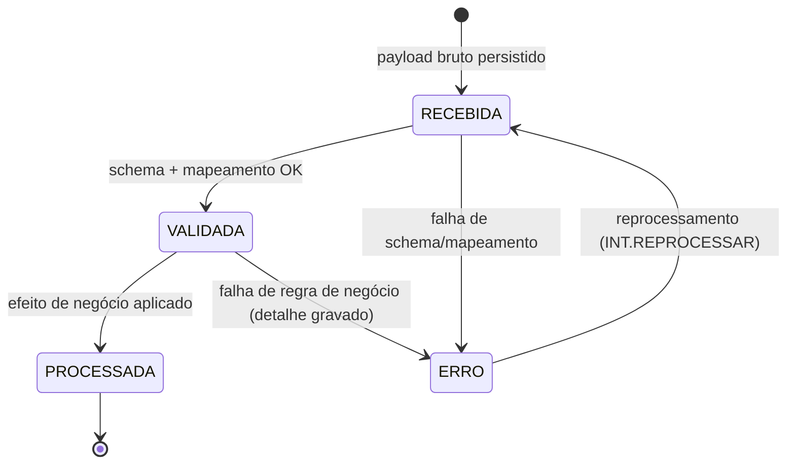

# DOC-13 — INTEGRAÇÕES
## Especificação de Requisitos do Sistema WMS Enterprise 3PL

| Metadado | Valor |
|---|---|
| Código do documento | DOC-13 |
| Versão | 1.0.0 |
| Status | APROVADO PARA USO |
| Data | 2026-08-10 |
| Depende de | DOC-00 v1.2.0, DOC-01, DOC-02, DOC-04, DOC-06, DOC-08, DOC-09, DOC-12 |
| Módulo (prefixo de requisitos) | INT |

---

## 1. ESCOPO E OBJETIVO

Este documento especifica a camada de integração (AD-010): API pública REST versionada, webhooks assinados, os contratos canônicos de dados (catálogo, ASN, pedidos, saldos, documentos fiscais, pré-faturas), a arquitetura de conectores ERP plugáveis por cliente e a reconciliação diária de saldos.

**Fronteiras:** a infraestrutura de mensageria (outbox, streams, DLQ) é do DOC-01. A autenticação de usuários humanos é do DOC-12 — aqui trata-se de credenciais de SISTEMA. Os conectores específicos de cada ERP (SAP, TOTVS, Sankhya etc.) serão especificados como ANEXOS deste documento a cada novo cliente (AD-010), obedecendo aos contratos canônicos daqui.

---

## 2. DEPENDÊNCIAS E TERMOS

| Termo | Identificador técnico | Definição única |
|---|---|---|
| Cliente de API | `api_client` | Credencial de sistema (client_id/secret) vinculada a um Cliente (tenant) ou ao operador, com escopos. |
| Contrato Canônico | `canonical_contract` | Esquema JSON versionado de cada recurso/evento trocado com sistemas externos. Catálogo fechado (§4.3). |
| Conector | `erp_connector` | Adaptador executado como worker que traduz entre o formato do ERP do cliente e os Contratos Canônicos. |
| Mensagem de Integração | `integration_message` | Registro persistente de cada payload trocado (entrada ou saída), com estado e correlação. |
| Reconciliação | `reconciliation_run` | Comparação diária de saldos WMS × ERP por cliente. |

---

## 3. ATORES E PERMISSÕES ENVOLVIDAS

| Ator | Interação |
|---|---|
| Sistemas do cliente (ERP) | Consomem a API, recebem webhooks, trocam mensagens via Conector |
| ERP do operador logístico | Recebe pré-faturas (DOC-09) |
| Administrador de Integrações | Credenciais, assinaturas de webhook, monitoração, reprocessamento |

**Permissões:** `INT.CREDENCIAL_GERIR` (CLIENT_WAREHOUSE, sensível), `INT.WEBHOOK_GERIR` (CLIENT_WAREHOUSE), `INT.MONITOR` (WAREHOUSE), `INT.REPROCESSAR` (WAREHOUSE, sensível).

**Exceções:** `INT.DIVERGENCIA_RECONCILIACAO` (1 passo, motivo obrigatório, expira 72 h).

---

## 4. REQUISITOS

### 4.1 API pública

**RNF-INT-001 — Padrões da API [INVIOLÁVEL]**
- Base: `https://<host>/api/v1/...`; versionamento por caminho; quebra de contrato = nova versão, com convivência mínima de 12 meses;
- Autenticação: OAuth2 client credentials (token 15 min) por `api_client`; o token carrega o `tenant_id` do cliente — a RLS (RG-001) aplica-se integralmente às chamadas de API;
- Idempotência: TODA requisição de escrita EXIGE header `Idempotency-Key` (UUID); repetição retorna o resultado original (RG-009), janela de 48 h;
- Paginação: cursor (`?cursor=&limit=`, máx. 200); ordenação estável por `id`;
- Erros: RFC 9457 (`application/problem+json`) com `type`, `title`, `detail`, `correlation_id` e, quando aplicável, `violations[]` (campo, código, mensagem) — códigos de erro do catálogo fechado por endpoint (inclui `FLOW_STEP_ORDER_VIOLATION`, RN-EXP-011);
- Rate limit por `api_client`: 600 req/min (burst 100), resposta 429 com `Retry-After`;
- Datas ISO 8601 UTC; quantidades na unidade base (RN-DAD-021).

**RF-INT-002 — Recursos expostos [catálogo fechado]**

| Recurso | Operações | Módulo |
|---|---|---|
| `/products`, `/products/{sku}/packagings`, `/products/{sku}/barcodes` | GET, POST, PUT (upsert de catálogo) | DOC-02 |
| `/asns` | POST (criar ASN/XML NF-e), GET | DOC-04 |
| `/inbound-orders` | GET (acompanhamento + divergências) | DOC-04 |
| `/outbound-orders` | POST, GET, POST `/cancel` | DOC-06 |
| `/stock-balances` | GET (por produto/lote/endereço; visão física) | DOC-05 |
| `/fiscal-stock-balances` | GET (por nota de armazenagem) | DOC-08 |
| `/stock-movements` | GET (extrato paginado) | DOC-05 |
| `/fiscal-documents` | POST (nota de armazenagem, NF venda p/ vínculo), GET (XML/DANFE) | DOC-08 |
| `/return-orders` | POST (autorizar devolução), GET | DOC-07 |
| `/appointments` | POST, GET, POST `/cancel` | DOC-03 |
| `/pre-invoices` | GET (conferência), POST `/approve`, POST `/contest` | DOC-09 |
Nenhum outro recurso na v1; endpoint fora do catálogo = `[LACUNA]`.

### 4.2 Webhooks

**RNF-INT-010 — Entrega assinada [INVIOLÁVEL]**
Assinaturas por `api_client`: URL + lista de `event_type` do catálogo público (§4.3). Entrega HTTP POST com envelope canônico do evento (RNF-ARQ-030, sem campos internos `actor.user_id`), headers `X-WMS-Signature` (HMAC-SHA256 do corpo com secret da assinatura), `X-WMS-Event-Id`, `X-WMS-Delivery-Attempt`. Sucesso = 2xx em 10 s. Retry: backoff exponencial 1/5/15/60 min + 6/6 h, máx. 10 tentativas; esgotado → assinatura `SUSPENDED` + alerta + reativação manual com reenvio dos pendentes (janela 7 dias). Ordem garantida POR AGREGADO (mesmo documento entrega em ordem; entre documentos não há garantia) — consumidor DEVE tratar por `event_id`/`occurred_at`.

### 4.3 Contratos Canônicos

**RN-INT-020 — Catálogo e versionamento [INVIOLÁVEL]**
Esquemas JSON Schema versionados (`schema_version` no payload), publicados em `/api/v1/schemas/{contract}`. Catálogo: `product.v1`, `asn.v1`, `outbound_order.v1`, `stock_balance.v1`, `stock_movement.v1`, `fiscal_document.v1`, `return_order.v1`, `appointment.v1`, `pre_invoice.v1`, e os eventos públicos: `recebimento.concluido`, `recebimento.divergencia_registrada`, `expedicao.etapa_concluida`, `expedicao.pedido_concluido`, `expedicao.pedido_cancelado`, `reversa.concluida`, `fiscal.nota_autorizada`, `fiscal.pendencia_documental_criada`, `faturamento.prefatura_emitida`, `faturamento.prefatura_aprovada`, `estoque.ajuste_aplicado`, `estoque.lote_vencido_bloqueado`. Payload validado contra o schema na ENTRADA e na SAÍDA; inválido = rejeição com `violations[]` (nunca aceitação parcial).

**Exemplo normativo (`outbound_order.v1`, criação):**
```json
{
  "schema_version": "outbound_order.v1",
  "external_ref": "ERP-PED-88231",
  "warehouse_code": "SP01",
  "expected_dispatch_date": "2026-08-14",
  "recipient": { "legal_name": "...", "cnpj": "04252011000110",
                 "address": { "...": "..." } },
  "items": [
    { "sku": "ABC-1", "qty": 120, "uom": "UN" },
    { "sku": "XYZ-9", "qty": 10, "packaging_code": "CX12" }
  ]
}
```
`external_ref` é UNIQUE por cliente (idempotência de negócio adicional à `Idempotency-Key`); o retorno traz o número `PED-SP01-...` e o mapeamento é permanente.

### 4.4 Arquitetura de conectores (AD-010)

**RNF-INT-030 — Núcleo + adaptadores [INVIOLÁVEL]**
O núcleo de integração conversa EXCLUSIVAMENTE em Contratos Canônicos. Cada Conector é um worker (perfil `worker`, RNF-ARQ-003) registrado por cliente com: direção (in/out), transporte do lado ERP (REST polling/push; outros transportes = anexo do conector), mapeamento de/para o canônico e tabela de-para de códigos (`code_mapping`: SKU externo↔interno, depósitos, naturezas). TODA troca gera `integration_message` com payload bruto + canônico + estado. Falha de transformação/validação → estado `ERRO` com detalhe, visível no monitor, reprocessável por `INT.REPROCESSAR` (idempotente). É PROIBIDO conector escrever diretamente em tabelas de negócio — apenas via serviços/API interna com as mesmas validações da API pública.

**RF-INT-031 — Monitor de integrações**
Tela com: mensagens por estado/cliente/contrato, taxa de erro, lag, reprocessamento em massa (auditado), pausa de conector. Erros e DLQ alimentam o tópico `alertas` (RF-PAI-010).

### 4.5 Reconciliação diária de saldo (AD-010)

**RN-INT-040 — Execução [INVIOLÁVEL]**
Para cada cliente com conector de saldo ativo, o `scheduler` executa diariamente (após o snapshot de faturamento): obtém do ERP o saldo por SKU (contrato `stock_balance.v1` na direção in), compara com o saldo físico total do WMS (disponível+reservado+bloqueado+quarentena+avariado+trânsito) por SKU×armazém, e grava o resultado. Divergência (diferença ≠ 0): item de relatório com as duas fontes e a diferença; abre `INT.DIVERGENCIA_RECONCILIACAO` consolidada do dia (uma por cliente×armazém) quando houver ≥ 1 divergência. **O WMS é a fonte de verdade do estoque FÍSICO** (AD-010): a decisão da exceção documenta a causa e a ação (ajuste no ERP, inventário dirigido no WMS via `POR_ENDERECO`/`ROTATIVO_PRODUTO`, ou correção de mapeamento) — o sistema NUNCA ajusta saldo físico automaticamente por reconciliação.

**Exemplo normativo:** SKU ABC-1 em SP01: WMS 1.240 (1.100 disponível + 120 reservado + 20 bloqueado); ERP 1.250 → divergência −10 registrada; relatório exibe a decomposição do WMS; exceção do dia aberta; decisão "inventário dirigido" gera `INV` tipo `ROTATIVO_PRODUTO` do SKU.

### 4.6 Pré-fatura ao ERP do operador (DOC-09)

**RF-INT-050:** o evento `faturamento.prefatura_aprovada` dispara o conector do ERP do operador com `pre_invoice.v1`; o retorno (número do faturamento) é gravado (RF-FAT-023). Falha segue o fluxo padrão de erro/reprocessamento.

### 4.7 Eventos de domínio deste módulo

`integracoes.mensagem_recebida`, `integracoes.mensagem_processada`, `integracoes.mensagem_erro`, `integracoes.webhook_entregue`, `integracoes.webhook_suspenso`, `integracoes.reconciliacao_concluida`, `integracoes.reconciliacao_divergente`.

---

## 5. MÁQUINAS DE ESTADO E FLUXOS

### 5.1 Mensagem de integração



### 5.2 Entrega de webhook

`PENDENTE → TENTANDO → ENTREGUE | FALHA(n) → (retry) → ESGOTADA` → assinatura `SUSPENDED` (reativação manual reenvia janela de 7 dias).

---

## 6. CRITÉRIOS DE ACEITE (GHERKIN)

```gherkin
Cenário: Idempotência de escrita na API
  Dado POST /outbound-orders com Idempotency-Key "K1" criando o pedido PED-SP01-00000500
  Quando a mesma requisição com "K1" for repetida por timeout do cliente
  Então a resposta deve ser o resultado original com PED-SP01-00000500
  E nenhum segundo pedido deve existir

Cenário: external_ref único por cliente
  Dado pedido criado com external_ref "ERP-PED-88231"
  Quando outro POST do mesmo cliente usar "ERP-PED-88231" com Idempotency-Key diferente
  Então a resposta deve ser 409 com o número do pedido existente

Cenário: RLS na API
  Dado api_client do cliente A
  Quando GET /stock-balances?sku=SKU-DO-CLIENTE-B for chamado
  Então a resposta deve ser 200 com lista vazia

Cenário: Violação de fluxo pela API
  Dado pedido com etapa Embalagem pendente
  Quando a API tentar registrar pesagem
  Então a resposta deve ser problem+json com type FLOW_STEP_ORDER_VIOLATION

Cenário: Webhook assinado e reentregue
  Dado assinatura para expedicao.pedido_concluido com endpoint retornando 500 nas 2 primeiras tentativas
  Quando o evento ocorrer
  Então as entregas devem seguir o backoff 1 e 5 minutos
  E a terceira tentativa com 200 deve marcar ENTREGUE
  E todas devem conter X-WMS-Signature válida sobre o corpo

Cenário: Webhook esgotado suspende assinatura
  Dado endpoint retornando 500 em 10 tentativas
  Quando o retry esgotar
  Então a assinatura deve ficar SUSPENDED com alerta
  E a reativação manual deve reenviar os eventos pendentes dos últimos 7 dias

Cenário: Payload inválido nunca é aceito parcialmente
  Dado POST /asns com 10 itens sendo 1 com qty negativa
  Quando a validação de schema executar
  Então a resposta deve rejeitar a requisição inteira
  E violations deve apontar o item e o campo inválidos

Cenário: Reconciliação diverge e não ajusta sozinha (exemplo normativo RN-INT-040)
  Dado WMS com 1.240 UN do SKU ABC-1 e ERP reportando 1.250
  Quando a reconciliação diária executar
  Então a divergência de -10 deve constar no relatório com a decomposição do WMS
  E a exceção INT.DIVERGENCIA_RECONCILIACAO do dia deve ser aberta
  E nenhum saldo físico deve ser alterado automaticamente

Cenário: Conector não escreve direto no banco
  Dado a implementação de um conector
  Quando inspecionada
  Então toda escrita deve ocorrer via serviços internos com as validações da API
  E nenhum acesso direto a tabelas de negócio deve existir
```

---

## 7. REQUISITOS DE DADOS (DELTA SOBRE O DOC-02)

| ID | Estrutura | Classificação | Observações |
|---|---|---|---|
| RD-INT-001 | `api_client` + `api_client_scope` | TENANT (credencial do operador = tenant do operador) | secret hash, escopos, rate limit |
| RD-INT-002 | `idempotency_record` | TENANT | chave, hash da requisição, resposta, TTL 48 h |
| RD-INT-003 | `webhook_subscription` + `webhook_delivery` | TENANT (delivery particionada mensal) | RNF-INT-010 |
| RD-INT-004 | `integration_message` | TENANT (particionada mensal, RNF-ARQ-090) | §5.1 |
| RD-INT-005 | `erp_connector` + `code_mapping` | TENANT | RNF-INT-030 |
| RD-INT-006 | `reconciliation_run` + `reconciliation_item` | TENANT | RN-INT-040 |

---

## 8. FORA DE ESCOPO (NÃO IMPLEMENTAR)

- Transportes SFTP/arquivo (EDI, TXT posicional) na v1 — entram como anexo de conector quando um cliente exigir.
- GraphQL, gRPC, SOAP (DOC-01 §8).
- Portal de desenvolvedor self-service (credenciais são emitidas pelo operador).
- Sincronização de cadastros DO WMS PARA o ERP além dos contratos listados.
- Barramento de integração genérico/iPaaS.
- Webhooks para eventos internos não listados no catálogo público.

---

## 9. MATRIZ DE RASTREABILIDADE LOCAL

| Necessidade (DOC-00 §8) | Requisitos deste documento |
|---|---|
| N15 APIs de integração com ERP (entrada e saída) | §4.1–§4.4 |
| AD-010 conectores + reconciliação | RNF-INT-030, RN-INT-040 |
| RG-009 idempotência | RNF-INT-001, RNF-INT-010, RD-INT-002 |
| RF-FAT-023 pré-fatura ao ERP | RF-INT-050 |

---

## CHANGELOG

| Versão | Data | Alteração |
|---|---|---|
| 1.0.0 | 2026-08-10 | Versão inicial aprovada |
