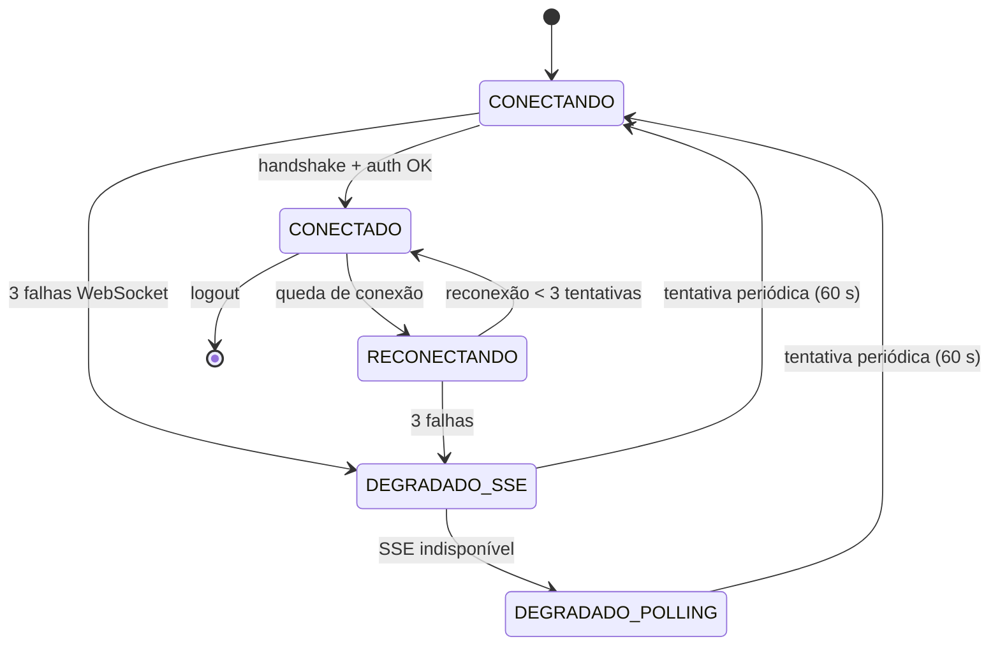
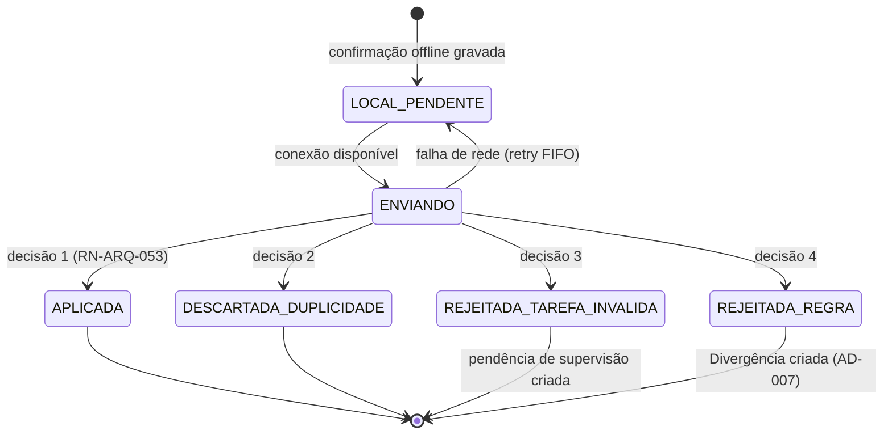

# DOC-01 — ARQUITETURA E INFRAESTRUTURA
## Especificação de Requisitos do Sistema WMS Enterprise 3PL

| Metadado | Valor |
|---|---|
| Código do documento | DOC-01 |
| Versão | 1.0.0 |
| Status | APROVADO PARA USO |
| Data | 2026-08-10 |
| Depende de | DOC-00 v1.1.0 |
| Módulo (prefixo de requisitos) | ARQ |

---

## 1. ESCOPO E OBJETIVO

Este documento especifica a arquitetura técnica, a infraestrutura e os requisitos não-funcionais do sistema: topologia de aplicação, multi-tenancy por RLS, backbone de eventos, tempo real (WebSocket/SSE), PWA offline-first, visão geral do WMS Edge Agent, observabilidade, particionamento de dados e metas numéricas de desempenho.

**Este documento resolve:** LAC-006 (particionamento de tabelas de log e saldo).
**Este documento NÃO cobre:** regras de negócio operacionais (DOC-03 a DOC-09), protocolo detalhado do Edge Agent (DOC-11), modelo RBAC e trilha de auditoria funcional (DOC-12), contratos de API pública (DOC-13).

---

## 2. DEPENDÊNCIAS E TERMOS

Aplicam-se integralmente o Glossário (DOC-00 §4), as Regras Globais RG-001 a RG-014 e as Decisões AD-001 a AD-010. Termos técnicos adicionais deste módulo:

| Termo | Identificador técnico | Definição única |
|---|---|---|
| Instância de Aplicação | `app_instance` | Processo NestJS stateless em contêiner, replicável horizontalmente. |
| Contexto de Tenant | `tenant_context` | Conjunto {`tenant_id[]`, `warehouse_id`, `user_id`} propagado em toda requisição, transação e evento. |
| Evento de Domínio | `domain_event` | Fato imutável ocorrido no sistema, publicado no backbone de eventos com envelope canônico (§4.4). |
| Fila de Sincronização | `sync_queue` | Fila local (IndexedDB) de operações executadas offline no PWA, pendentes de envio. |
| Canal de Tempo Real | `realtime_channel` | Tópico de assinatura WebSocket com escopo tenant+armazém. |

---

## 3. ATORES E PERMISSÕES ENVOLVIDAS

| Ator | Interação com este módulo |
|---|---|
| Todos os usuários | Autenticação, contexto de tenant, tempo real, PWA |
| Administrador de Sistema (operador logístico) | Configuração de instâncias, parâmetros, monitoramento |
| Sistemas externos (ERP) | Consomem a camada de integração (DOC-13) sobre esta arquitetura |
| WMS Edge Agent | Conecta-se ao backend por canal dedicado (§4.7) |

---

## 4. REQUISITOS

### 4.1 Topologia de aplicação

**RNF-ARQ-001 — Monolito modular stateless [INVIOLÁVEL]**
O backend DEVE ser um monolito modular NestJS (um módulo NestJS por documento-módulo de negócio: `portaria`, `recebimento`, `estoque`, `expedicao`, `fiscal`, `faturamento`, `paineis`, `perifericos`, `seguranca`, `integracoes`), empacotado em imagem Docker única, SEM estado em memória de processo (sessões, locks e caches compartilhados residem em Redis). É PROIBIDO decompor em microsserviços nesta versão.

**RNF-ARQ-002 — Escala horizontal**
O sistema DEVE suportar N instâncias de aplicação idênticas atrás de load balancer com health check (`GET /health/live`, `GET /health/ready`). Dimensionamento de projeto: 6 instâncias ativas para a carga nominal do §4.9, com capacidade de dobrar sem alteração de código.

**RNF-ARQ-003 — Separação de workloads**
O sistema DEVE executar três perfis de processo a partir da mesma imagem, selecionados por variável de ambiente `APP_ROLE`:
- `api`: HTTP REST + WebSocket;
- `worker`: consumidores de Redis Streams (eventos, integrações, impressão, faturamento);
- `scheduler`: tarefas temporais (reconciliação diária, expiração de prazos, apuração de tarifas), com eleição de líder via lock Redis (`SET NX PX`) para garantir execução única.

**RNF-ARQ-004 — Frontend**
O frontend DEVE ser uma aplicação Next.js (App Router) única servindo três áreas: aplicação interna, portal do cliente (AD-004) e telas de coletor (§4.6), com code-splitting por área. Estilização exclusivamente com Tailwind CSS; biblioteca de componentes própria e única (`@wms/ui`) construída sobre primitivas acessíveis (Radix UI), ícones exclusivamente Lucide (RG-013).

**RNF-ARQ-005 — Compatibilidade de navegador**
O sistema DEVE funcionar nas duas últimas versões estáveis de Chrome, Edge, Firefox e Safari, e no Chrome Android ≥ 120 (coletores). É PROIBIDO uso de APIs não suportadas nesses alvos sem fallback.

**RNF-ARQ-006 — Armazenamento de objetos**
O sistema DEVE usar armazenamento de objetos compatível com S3 (MinIO em implantação própria) para: XMLs fiscais (retenção ≥ 5 anos, WORM/object-lock), fotos de avaria/conferência, PDFs gerados e anexos. É PROIBIDO armazenar binários no PostgreSQL.

### 4.2 Multi-tenancy por RLS (implementação da AD-001 / RG-001)

**RNF-ARQ-010 — Contexto de tenant na conexão [INVIOLÁVEL]**
QUANDO o backend iniciar qualquer transação de banco, DEVE executar `SET LOCAL app.tenant_ids = '<lista>'` e `SET LOCAL app.user_id = '<uuid>'` antes de qualquer outra instrução, a partir do token autenticado — nunca de parâmetro do cliente HTTP.

**RNF-ARQ-011 — Política RLS padrão [INVIOLÁVEL]**
Toda tabela transacional DEVE ter RLS habilitado (`ENABLE ROW LEVEL SECURITY` + `FORCE ROW LEVEL SECURITY`) com política padrão:
```sql
USING (tenant_id = ANY (string_to_array(current_setting('app.tenant_ids'), ',')::uuid[]))
```
O usuário de banco da aplicação NÃO PODE ser owner das tabelas nem possuir `BYPASSRLS`.

**RNF-ARQ-012 — Tabelas globais**
Tabelas sem `tenant_id` são exclusivamente: cadastros do operador logístico (armazéns, docas, endereços, estruturas, usuários internos, papéis), configuração e i18n. A lista exaustiva está no DOC-02; a IA geradora NÃO PODE criar tabela transacional sem `tenant_id`.

**RN-ARQ-013 — Modo multi-tenant explícito**
ONDE o usuário interno possuir papel com acesso a múltiplos clientes, o sistema DEVE popular `app.tenant_ids` com a lista exata autorizada pelo RBAC (DOC-12). É PROIBIDO valor curinga.

### 4.3 Cache (Redis)

**RNF-ARQ-020 — Padrão cache-aside com invalidação por evento**
O sistema DEVE cachear em Redis, com chave `cache:{tenant}:{entidade}:{id|hash}` e TTL padrão 300 s: cadastros de produto, endereços, parâmetros de configuração e permissões resolvidas. QUANDO um evento de domínio alterar entidade cacheada, o worker DEVE invalidar as chaves afetadas (delete, nunca update). É PROIBIDO cachear Saldo de Estoque e Estoque Fiscal (leitura sempre no PostgreSQL, RG-004/RG-014).

**RNF-ARQ-021 — Locks distribuídos**
Operações de concorrência crítica (alocação de saldo, geração de numeração, eleição de scheduler) DEVEM usar lock Redis `SET key value NX PX <ms>` com liberação verificada por token e timeout máximo de 10.000 ms; o fallback em caso de perda do Redis é a serialização pela transação PostgreSQL (`SELECT ... FOR UPDATE`), que é a fonte final de consistência.

### 4.4 Backbone de eventos (AD-009)

**RNF-ARQ-030 — Envelope canônico de evento [INVIOLÁVEL]**
Todo Evento de Domínio DEVE ser publicado com o envelope JSON:
```json
{
  "event_id": "uuid-v7",
  "event_type": "estoque.saldo_alterado",
  "occurred_at": "2026-08-10T14:32:11.482Z",
  "tenant_id": "uuid",
  "warehouse_id": "uuid",
  "actor": { "user_id": "uuid", "origin": "web|pwa|api|edge|scheduler" },
  "correlation_id": "uuid",
  "causation_id": "uuid",
  "requirement_ids": ["RF-EST-021"],
  "payload": { }
}
```
`event_type` segue o padrão `<modulo>.<fato_no_passado>` em snake_case pt-BR sem acentos. O catálogo de eventos é definido em cada documento-módulo; a IA geradora NÃO PODE emitir tipos fora do catálogo.

**RNF-ARQ-031 — Publicação transacional (outbox) [INVIOLÁVEL]**
QUANDO uma transação de negócio gerar eventos, o sistema DEVE gravá-los na tabela `event_outbox` NA MESMA transação PostgreSQL; um worker dedicado publica da outbox para o Redis Stream `events:{modulo}` e marca como publicado. É PROIBIDO publicar evento diretamente de dentro do fluxo HTTP.

**RNF-ARQ-032 — Consumo com grupos e reprocessamento**
Consumidores DEVEM usar Redis Streams consumer groups (`XREADGROUP`), com ACK após efeito idempotente (RG-009), redelivery por `XAUTOCLAIM` após 60 s e, após 5 falhas, movimentação para `events:dlq` com alerta. Retenção dos streams: `XTRIM MAXLEN ~ 1000000`; a fonte durável permanente é a `event_outbox` (particionada, §4.10).

**RNF-ARQ-033 — Fan-out de tempo real**
Um worker `realtime-fanout` DEVE assinar os streams e republicar eventos relevantes em Redis Pub/Sub no canal `rt:{tenant_id}:{warehouse_id}:{topico}`, consumido pelos gateways WebSocket de todas as instâncias `api`.

### 4.5 Tempo real (WebSocket/SSE)

**RF-ARQ-040 — Gateway WebSocket**
O sistema DEVE expor gateway WebSocket (Socket.IO sobre NestJS, adapter Redis) autenticado pelo mesmo token da API. QUANDO o cliente assinar um Canal de Tempo Real, o gateway DEVE validar no RBAC o acesso ao tenant/armazém/tópico antes de aceitar a assinatura.

**RF-ARQ-041 — Tópicos padrão**
Tópicos mínimos: `painel_operacoes` (DOC-10), `fluxo:{operation_flow_id}`, `tarefas:{user_id}`, `chat:{sala}`, `patio`, `docas`, `alertas`. Cada documento-módulo declara seus tópicos adicionais.

**RNF-ARQ-042 — Latência e fallback**
A latência fim-a-fim (commit da transação → recebimento no cliente) DEVE ser ≤ 2 s em P95 e ≤ 5 s em P99. SE o WebSocket falhar 3 tentativas de reconexão (backoff 1 s/2 s/4 s), ENTÃO o cliente DEVE degradar para SSE (`GET /events/stream`) e, em última instância, polling a cada 15 s, sinalizando o modo degradado na interface.

**RF-ARQ-043 — Recuperação de intervalo**
QUANDO um cliente reconectar, DEVE informar o último `event_id` recebido por tópico; o servidor DEVE reenviar os eventos perdidos (janela de 15 min via stream) ou instruir `RESYNC` (recarga do estado via REST) se a janela for excedida.

### 4.6 PWA offline-first (AD-005)

**RNF-ARQ-050 — Escopo do offline [INVIOLÁVEL]**
O modo offline aplica-se EXCLUSIVAMENTE às telas de operação de campo: execução de tarefas de picking, putaway, conferência, contagem de inventário e leitura de LPN. Todas as demais funcionalidades (cadastros, pedidos, fiscal, faturamento, painéis) DEVEM exigir conexão. É PROIBIDO criar/alterar documentos fiscais ou pedidos offline.

**RF-ARQ-051 — Aprovisionamento de trabalho**
QUANDO o operador de campo iniciar sessão, o PWA DEVE pré-carregar em IndexedDB: suas tarefas atribuídas, dados dos produtos/endereços/LPNs envolvidos e parâmetros de validação, com marca d'água de versão. O pacote é dimensionado para o turno (máx. 2.000 tarefas).

**RF-ARQ-052 — Execução offline e fila de sincronização**
ENQUANTO sem conexão, o PWA DEVE permitir executar as tarefas aprovisionadas, gravando cada confirmação na `sync_queue` com: `operation_id` (UUID v7 gerado no dispositivo — chave de idempotência RG-009), timestamp do dispositivo, tarefa, leituras de LPN/endereço e medições. A interface DEVE exibir permanentemente o estado offline e o tamanho da fila.

**RN-ARQ-053 — Resolução determinística de conflitos [INVIOLÁVEL]**
QUANDO a sincronização enviar a fila (ordem FIFO por dispositivo), o servidor DEVE validar cada operação contra o estado atual e aplicar exatamente uma das decisões:

| # | Situação no servidor | Decisão |
|---|---|---|
| 1 | Tarefa ainda válida e saldo/estado compatível | `APLICADA` — efeitos executados normalmente |
| 2 | Tarefa já concluída por outro ator | `DESCARTADA_DUPLICIDADE` — sem efeito, operador notificado |
| 3 | Tarefa cancelada/reatribuída após o aprovisionamento | `REJEITADA_TAREFA_INVALIDA` — sem efeito, vira pendência de supervisão |
| 4 | Efeito violaria RG-004/RG-005/RG-014 | `REJEITADA_REGRA` — sem efeito, vira Divergência para workflow (AD-007) |

É PROIBIDO last-write-wins ou aplicação parcial de uma operação. Toda decisão gera log (RG-003) e notificação ao operador.

**RNF-ARQ-054 — Limites do offline**
SE a fila local exceder 500 operações ou 8 h desde a sincronização bem-sucedida, ENTÃO o PWA DEVE bloquear novas execuções offline até sincronizar, preservando a fila existente.

### 4.7 WMS Edge Agent — visão arquitetural (AD-008 / RG-008)

**RNF-ARQ-060 — Canal do Edge Agent**
Cada armazém DEVE ter ≥ 1 Edge Agent registrado, que estabelece conexão WebSocket de saída (outbound) autenticada por token de dispositivo para o backend. O navegador NUNCA fala com o agent: o fluxo é navegador → backend → agent → periférico → agent → backend → navegador. Comandos e respostas trafegam como jobs com timeout e estado (`PENDENTE`, `ENVIADO`, `EXECUTANDO`, `CONCLUIDO`, `FALHA`, `EXPIRADO`). Protocolo, drivers e modelos de periféricos: DOC-11.

**RNF-ARQ-061 — Indisponibilidade de periférico**
SE nenhum Edge Agent do armazém estiver conectado, ENTÃO o sistema DEVE enfileirar jobs de impressão (validade 30 min), bloquear operações que dependem de medição em tempo real (pesagem, cancela) com mensagem determinística e emitir alerta no tópico `alertas`.

### 4.8 Observabilidade e logs técnicos

**RNF-ARQ-070 — Logs estruturados**
Todo log DEVE ser JSON por linha (stdout) com campos mínimos: `timestamp` (UTC), `level`, `service`, `app_role`, `instance_id`, `trace_id`, `span_id`, `tenant_id`, `warehouse_id`, `user_id`, `requirement_id` (quando aplicável), `message`, `context`. É PROIBIDO logar: senhas, tokens, dados pessoais além de IDs (LGPD — DOC-12). Logs técnicos NÃO substituem a trilha de auditoria funcional (RG-003/DOC-12), que é persistida em banco.

**RNF-ARQ-071 — Tracing e métricas**
O sistema DEVE instrumentar OpenTelemetry (traces HTTP, banco, Redis, eventos, jobs de periférico) e expor métricas Prometheus em `/metrics`: latência P50/P95/P99 por rota, profundidade de streams e DLQ, lag da outbox, conexões WebSocket, taxa de sincronizações offline por decisão (§4.6), e as métricas de negócio declaradas nos módulos.

**RNF-ARQ-072 — Alertas mínimos**
Alertas obrigatórios: DLQ > 0 por 5 min; lag da outbox > 30 s; P95 de rota crítica acima do §4.9 por 10 min; Edge Agent de armazém ativo desconectado > 2 min; falha de reconciliação diária (DOC-13).

### 4.9 Metas numéricas de desempenho (derivadas do DOC-00 §2.3)

Premissas de projeto: pico = 20% do volume diário concentrado em 1 h; 50.000 pedidos/dia com média de 12 interações de API por pedido no ciclo completo.

| ID | Métrica | Meta |
|---|---|---|
| RNF-ARQ-080 | Throughput sustentado de API em pico | ≥ 600 req/s (com folga 2× = dimensionar para 1.200 req/s) |
| RNF-ARQ-081 | Latência de leitura (P95) | ≤ 300 ms |
| RNF-ARQ-082 | Latência de escrita transacional (P95) | ≤ 800 ms |
| RNF-ARQ-083 | Confirmação de tarefa de campo (P95, leitura de código→resposta) | ≤ 500 ms |
| RNF-ARQ-084 | Conexões WebSocket simultâneas | ≥ 4.000 (folga 2× = 8.000) |
| RNF-ARQ-085 | Eventos de domínio em pico | ≥ 500 eventos/s |
| RNF-ARQ-086 | Disponibilidade mensal (horário operacional 24×7) | ≥ 99,5% |
| RNF-ARQ-087 | RPO / RTO | RPO ≤ 5 min (WAL archiving) / RTO ≤ 1 h |
| RNF-ARQ-088 | Painel de Operações: atualização após evento | ≤ 2 s (P95), conforme RNF-ARQ-042 |

**Exemplo numérico de verificação (RNF-ARQ-080):** 50.000 pedidos × 12 interações = 600.000 req do ciclo de pedidos/dia; pico 20% em 1 h = 120.000 req/h = 33,3 req/s; somando recebimento, inventário, painéis, portal e tempo real estimados em 15× esse volume ≈ 500 req/s; meta arredondada 600 req/s, dimensionamento com folga 2×.

### 4.10 Particionamento e retenção (resolve LAC-006)

**RNF-ARQ-090 — Tabelas particionadas [INVIOLÁVEL]**
DEVEM ser particionadas por RANGE mensal (`occurred_at`/`created_at`):
`audit_log` (DOC-12), `event_outbox`, `stock_movement` (DOC-05), `task` (histórico), `peripheral_job` (DOC-11), `integration_message` (DOC-13). Criação automática da partição do mês seguinte pelo `scheduler` no dia 20; partição ausente = alerta crítico.

**RNF-ARQ-091 — Tabelas de saldo NÃO particionadas**
`stock_balance` e `fiscal_stock_balance` DEVEM permanecer não particionadas (volume ≈ posições × SKUs ativos, ordem de 10⁶–10⁷ linhas), com índices compostos definidos no DOC-02 e `fillfactor 85` para reduzir bloat de updates.

**RNF-ARQ-092 — Retenção**
| Dado | Online (PostgreSQL) | Arquivo (objeto S3) |
|---|---|---|
| `audit_log` | 24 meses | +36 meses (total 5 anos) |
| `event_outbox` | 3 meses | 24 meses |
| `stock_movement` | 24 meses | +36 meses |
| XML fiscal | metadados sempre | ≥ 5 anos (object-lock) |
| Logs técnicos | 30 dias (agregador) | 12 meses |
Descarte além da retenção somente por rotina auditada do `scheduler`.

### 4.11 Segurança de transporte e segredos (complementa DOC-12)

**RNF-ARQ-100:** TLS ≥ 1.2 em todas as conexões externas; tokens JWT de curta duração (15 min) com refresh token rotativo; segredos exclusivamente por variáveis de ambiente/secret manager; CORS restrito às origens do frontend; rate limiting por usuário e por IP (padrão 60 req/min em rotas de autenticação; 1.200 req/min autenticado) com resposta 429 determinística.

---

## 5. MÁQUINAS DE ESTADO E FLUXOS

### 5.1 Estados de conexão do cliente de tempo real



| Origem | Evento | Guarda | Destino | Efeitos |
|---|---|---|---|---|
| CONECTADO | reconexão bem-sucedida | último `event_id` na janela de 15 min | CONECTADO | reenvio de eventos perdidos (RF-ARQ-043) |
| CONECTADO | reconexão bem-sucedida | janela excedida | CONECTADO | comando `RESYNC` ao cliente |

### 5.2 Estados da operação offline (item da `sync_queue`)



---

## 6. CRITÉRIOS DE ACEITE (GHERKIN)

```gherkin
Cenário: RLS bloqueia acesso entre tenants
  Dado o cliente A com produto SKU-A e o cliente B com produto SKU-B no mesmo armazém
  E um usuário autenticado com acesso apenas ao cliente A
  Quando ele consultar GET /produtos?sku=SKU-B
  Então a resposta deve ser 200 com lista vazia
  E nenhum dado do cliente B deve trafegar na resposta

Cenário: Outbox garante evento após commit
  Dado uma confirmação de picking que altera saldo e grava evento na event_outbox na mesma transação
  Quando o Redis estiver indisponível no momento do commit
  Então a transação deve concluir com sucesso
  E o evento deve ser publicado pelo worker em até 30 segundos após o Redis voltar

Cenário: Conflito offline — tarefa já concluída por outro operador
  Dado a tarefa T-100 aprovisionada nos coletores de João e Maria
  E Maria concluiu T-100 online às 10:00
  E João executou T-100 offline às 10:05 com operation_id "01J..."
  Quando a fila de João sincronizar
  Então a operação deve receber decisão DESCARTADA_DUPLICIDADE
  E o saldo não deve sofrer segundo efeito
  E João deve ser notificado no coletor

Cenário: Reenvio idempotente da sincronização
  Dado uma operação offline com operation_id "01J..." já APLICADA
  Quando a mesma operação for reenviada por falha de rede na resposta
  Então o servidor deve responder o resultado original APLICADA
  E nenhum efeito adicional deve ocorrer

Cenário: Degradação de tempo real
  Dado um cliente CONECTADO ao WebSocket
  Quando a conexão cair e 3 reconexões falharem em sequência
  Então o cliente deve assinar SSE em /events/stream
  E a interface deve exibir o indicador de modo degradado

Cenário: Meta de latência do painel
  Dado o sistema sob carga nominal de 600 req/s
  Quando 100 eventos de conclusão de etapa forem commitados
  Então 95 ou mais devem estar renderizados nos painéis assinantes em até 2 segundos
```

---

## 7. REQUISITOS DE DADOS (DELTA SOBRE O DOC-02)

| ID | Estrutura | Definição mínima |
|---|---|---|
| RD-ARQ-001 | `event_outbox` | `event_id` PK, envelope completo (§4.4) em colunas + `payload` JSONB, `published_at` NULL até publicação; particionada mensal |
| RD-ARQ-002 | `sync_operation` | Registro servidor de cada operação sincronizada: `operation_id` PK (idempotência), dispositivo, decisão (enum §5.2), detalhes; particionada mensal |
| RD-ARQ-003 | `edge_agent` | Registro de agents: armazém, token hash, versão, último heartbeat, status |
| RD-ARQ-004 | `app_parameter` | Parâmetros de configuração por escopo (global/armazém/cliente), tipados, com trilha de alteração |

Detalhamento completo (tipos, índices, constraints) no DOC-02.

---

## 8. FORA DE ESCOPO (NÃO IMPLEMENTAR)

- Microsserviços, service mesh, gRPC, GraphQL.
- Brokers externos (Kafka, RabbitMQ, SQS) — o backbone é Redis Streams.
- Multi-região ativa-ativa; réplicas de leitura são permitidas apenas para relatórios (DOC-10).
- Aplicativos nativos (iOS/Android) — a operação de campo é exclusivamente PWA.
- Sincronização offline de qualquer funcionalidade fora do RNF-ARQ-050.
- Autenticação social/SSO externo na versão 1 (preparação para OIDC fica no DOC-12 como extensão futura).
- Edição de layout de dashboards pelo usuário final (DOC-10 define painéis fixos).

---

## 9. MATRIZ DE RASTREABILIDADE LOCAL

| Necessidade (DOC-00 §8) | Requisitos deste documento |
|---|---|
| N14 Multi-armazéns/multi-empresas | RNF-ARQ-010..013 |
| N19 Qualquer navegador | RNF-ARQ-004, RNF-ARQ-005 |
| N20 Periféricos | RNF-ARQ-060, RNF-ARQ-061 |
| N21 Visual clean/padronizado | RNF-ARQ-004 (RG-013) |
| N23 Alta concorrência | RNF-ARQ-001..003, RNF-ARQ-080..088 |
| N24 Tempo real | RNF-ARQ-030..043, RNF-ARQ-084, RNF-ARQ-088 |
| N26 Coletores/offline | RNF-ARQ-050..054, RNF-ARQ-083 |
| N18 Logs robustos (parte técnica) | RNF-ARQ-070..072 (funcional no DOC-12) |
| LAC-006 particionamento | RNF-ARQ-090..092 |

---

## CHANGELOG

| Versão | Data | Alteração |
|---|---|---|
| 1.0.0 | 2026-08-10 | Versão inicial aprovada |
