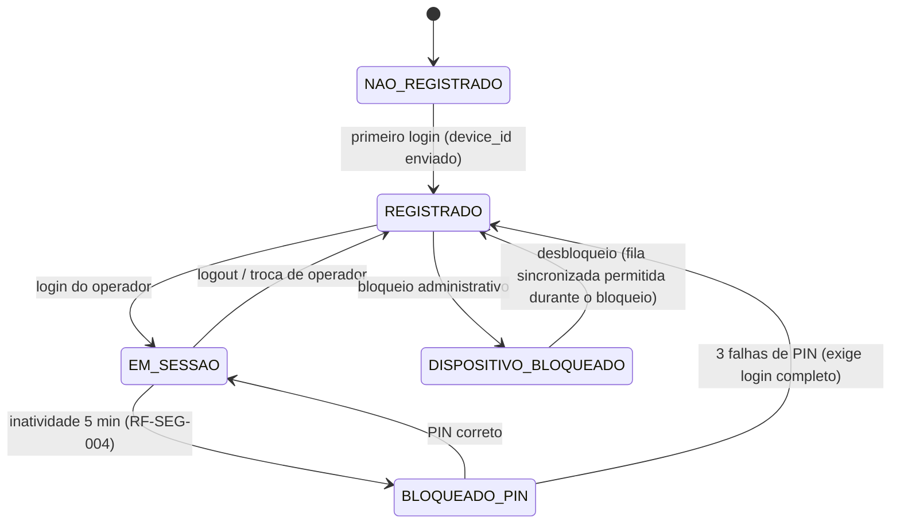

# DOC-15 — OPERAÇÃO EM CAMPO (PWA PARA COLETORES E SMARTPHONES ANDROID)
## Especificação de Requisitos do Sistema WMS Enterprise 3PL

| Metadado | Valor |
|---|---|
| Código do documento | DOC-15 |
| Versão | 1.1.0 |
| Status | APROVADO PARA USO |
| Data | 2026-08-16 |
| Depende de | DOC-00 v1.3.0, DOC-01 (RNF-ARQ-050..054, RN-ARQ-053), DOC-02, DOC-11 (RN-PER-010), DOC-12 (RF-SEG-004) |
| Módulo (prefixo de requisitos) | COL |
| Posição no plano | Implementar APÓS o MARCO (ver §10) |

---

## 1. ESCOPO E OBJETIVO

Este documento especifica a aplicação de operação em campo: a área `field` do
PWA (RNF-ARQ-004) executada em **coletores de dados Android** (Zebra,
Honeywell e similares) e em **smartphones Android**, cobrindo: integração com
o leitor de código de barras físico e por câmera, UX de chão de armazém,
sessão e troca de operador, aprovisionamento e sincronização offline, as telas
de execução de tarefas da versão 1 e a estratégia de atualização do aplicativo.

**Relação com o já especificado:** este documento NÃO redefine o modelo
offline — ele o consolida. O escopo do offline (RNF-ARQ-050), o
aprovisionamento (RF-ARQ-051), a fila de sincronização (RF-ARQ-052), a
resolução determinística de conflitos (RN-ARQ-053), os limites (RNF-ARQ-054),
o PIN de coletor (RF-SEG-004) e o conteúdo dos códigos (RN-PER-010)
permanecem como estão nos documentos de origem e são aqui referenciados, não
reescritos. Este documento acrescenta a camada de DISPOSITIVO e de EXPERIÊNCIA.

---

## 2. DEPENDÊNCIAS E TERMOS

| Termo | Identificador técnico | Definição única |
|---|---|---|
| Dispositivo de Campo | `field_device` | Coletor ou smartphone registrado, identificado por `device_id` gerado na primeira execução e persistido localmente. |
| Leitor Físico | `hardware_scanner` | Engine de leitura integrada do coletor (laser/imager), operando em modo teclado (wedge). |
| Leitura por Câmera | `camera_scan` | Decodificação de código via câmera do dispositivo, fallback universal para smartphones. |
| Pacote de Turno | `shift_package` | Conjunto de tarefas e dados aprovisionados para operação offline (RF-ARQ-051). |
| Modo Quiosque | `kiosk_mode` | Instalação do PWA em tela cheia com o dispositivo dedicado à operação. |

---

## 3. ATORES E PERMISSÕES ENVOLVIDAS

| Ator | Interação |
|---|---|
| Operadores de campo (`OPERADOR_EMPILHADEIRA`, `OPERADOR_PICKING`, `CONFERENTE`, `INVENTARIANTE`) | Executam tarefas no dispositivo |
| Líder de Turno | Consulta fila de tarefas da equipe; pendências de sincronização rejeitada |
| Administrador de Sistema | Registro e monitoração de dispositivos |

**Catálogo de permissões deste módulo:**

| Código | Escopo |
|---|---|
| `COL.OPERAR` (acesso à área field) | WAREHOUSE |
| `COL.DISPOSITIVO_GERIR` | WAREHOUSE (sensível) |
| `COL.CONSULTA_SALDO` (tela de consulta no coletor) | CLIENT_WAREHOUSE |

As permissões de cada TAREFA são as dos módulos de origem (`REC.CONFERIR`,
`EXP.PICKING_EXECUTAR` etc.) — o coletor não cria permissões operacionais novas.

Sem exceções próprias: rejeições de sincronização geram os efeitos já
definidos na RN-ARQ-053 (pendência de supervisão / Divergência).

---

## 4. REQUISITOS

### 4.1 Dispositivos e plataforma

**RNF-COL-001 — Alvos suportados**
Coletores Android e smartphones com Chrome Android ≥ 120 (RNF-ARQ-005),
tela ≥ 4", Android ≥ 11. O aplicativo é EXCLUSIVAMENTE o PWA (área `field`)
— aplicativo nativo é PROIBIDO nesta versão (DOC-01 §8). Modelos homologados
por armazém são configuração de implantação; o software não pode depender de
API proprietária de fabricante fora do modo teclado (RNF-COL-010).

**RNF-COL-002 — Instalação e Modo Quiosque**
O PWA DEVE ser instalável (manifest completo: `display: standalone`,
orientação retrato travada, ícones, tema). Em coletores dedicados, a
instalação em Modo Quiosque usa o pinning de app do próprio Android — MDM
completo é fora de escopo (§8). A tela DEVE solicitar wake-lock durante
execução de tarefa (leitura em sequência não pode ser interrompida por
bloqueio de tela).

**RNF-COL-003 — Registro do dispositivo**
Na primeira execução, o PWA gera `device_id` (UUID v7) persistido em
IndexedDB e o envia no login; o backend mantém `field_device` (§7) com
armazém, modelo/user-agent, versão do app, último acesso e última
sincronização. Dispositivo PODE ser bloqueado por `COL.DISPOSITIVO_GERIR`
(sessões derrubadas, sincronização da fila existente PERMITIDA, novas
execuções negadas).

### 4.2 Leitura de códigos

**RNF-COL-010 — Leitor físico em modo teclado [INVIOLÁVEL]**
A integração com o leitor físico é EXCLUSIVAMENTE por modo teclado (wedge):
o coletor digita o código lido como sequência de teclas. O PWA DEVE capturar
leituras por listener global de teclado com detecção por velocidade de
digitação e terminador (Enter/Tab configurável por parâmetro
`COL.SCAN_TERMINADOR`), SEM depender de campo focado — a leitura vale na tela
inteira da tarefa. É PROIBIDO integrar por intent/SDK proprietário (DataWedge
Intent, Honeywell SDK) nesta versão: o modo teclado é o denominador comum que
mantém o PWA portável entre fabricantes. (Perfil do fabricante — ex.:
DataWedge em modo keystroke — é configuração de implantação do dispositivo,
documentada por modelo.)

**RNF-COL-011 — Leitura por câmera (fallback universal)**
ONDE não houver leitor físico (smartphones), o PWA DEVE oferecer Leitura por
Câmera usando `BarcodeDetector` nativo quando disponível e biblioteca de
decodificação como fallback, suportando: Code 128, GS1-128, EAN-13/8, DUN-14
e QR Code — o conjunto da RN-PER-010. A alternância físico↔câmera é
automática (câmera acionada por botão sempre visível).

**RN-COL-012 — Validação universal de leitura [INVIOLÁVEL]**
TODA leitura, de qualquer origem, passa pelo MESMO validador: identificação do
tipo (LPN por AI (00) com verificação do dígito SSCC — RN-PER-010; endereço
pelo padrão RN-DAD-011; EAN/DUN por comprimento e dígito), rejeição imediata
de código de tipo inesperado para o passo atual da tarefa (ex.: leu produto
quando o passo pede endereço → erro claro, não aceitação silenciosa).
Digitação manual de LPN/endereço somente com `EST.DIGITACAO_LPN`, auditada
(RG-007).

**RF-COL-013 — Feedback imediato**
Cada leitura DEVE produzir feedback em < 100 ms (RG-013): sonoro (tom de
sucesso ≠ tom de erro), vibração (padrões distintos) e visual de alto
contraste (flash verde/vermelho de borda). Parâmetro por dispositivo para
volume/vibração.

### 4.3 UX de chão de armazém

**RNF-COL-020 — Padrões de interface [INVIOLÁVEL]**
- Alvos de toque ≥ 48×48 dp; tipografia mínima 16 sp, números de
  quantidade/endereço em destaque ≥ 24 sp;
- Contraste WCAG 2.1 AA sobre RG-013, com tema de ALTO BRILHO (armazém tem
  luz forte e telas reflexivas);
- Operação com uma mão e com luvas: ações principais na metade inferior da
  tela; teclado NUMÉRICO nativo para quantidades;
- Uma decisão por tela: o fluxo de tarefa avança passo a passo (ler endereço →
  ler LPN/produto → confirmar quantidade), nunca formulário longo;
- Estado permanente visível no topo: operador, armazém, estação/zona, estado
  da conexão e tamanho da fila de sincronização (RF-ARQ-052);
- Sem gestos ocultos: toda ação tem botão visível.

**RF-COL-021 — Interrupção e retomada**
QUANDO o operador sair de uma tarefa em andamento (troca de tela, bloqueio,
queda do app), o estado do passo atual DEVE ser preservado localmente e a
retomada volta EXATAMENTE ao passo interrompido. Tarefa iniciada permanece
atribuída ao operador até conclusão, devolução explícita ou reatribuição pelo
líder.

### 4.4 Sessão no dispositivo

**RF-COL-030 — Login e troca de operador**
Login individual obrigatório (RF-SEG-001); bloqueio por inatividade com PIN
conforme RF-SEG-004 (5 min, PIN 6 dígitos, 3 falhas → login completo, fila de
sincronização preservada). Troca de operador = logout/login; a fila offline do
operador anterior permanece no dispositivo, identificada por usuário, e
sincroniza no próximo contato COM O TOKEN DO OPERADOR QUE EXECUTOU (a autoria
das operações offline é do executor — coerente com a RG-003; o middleware
anti-spoofing NÃO se aplica ao `operation_id`/executor da fila offline, que é
assinado pela sessão que gravou).

**RF-COL-031 — Seleção de contexto**
Após o login, o operador confirma armazém (quando tiver atribuição em mais de
um) e, quando aplicável, a zona/estação de trabalho — usados no filtro de
tarefas e no vínculo de periféricos (RF-PER-004).

### 4.5 Telas da versão 1 (catálogo fechado)

| # | Tela | Conteúdo | Offline? (RNF-ARQ-050) |
|---|---|---|---|
| T1 | Minhas Tarefas | fila do operador ordenada por prioridade/rota, auto-atribuição quando permitido | sim (do Pacote de Turno) |
| T2 | Putaway | execução RF-REC-042 (dupla leitura LPN → endereço) | sim |
| T3 | Picking | execução RF-EXP-031 (endereço → produto/LPN → quantidade; corte RN-EXP-032) | sim |
| T4 | Conferência | contagem cega/informada RF-REC-021 (produto → lote/validade → embalagem → quantidade) | sim |
| T5 | Contagem de Inventário | execução detalhada na §4.8 (rodadas RN-EST-062, contagem cega) | sim |
| T6 | Transferência/Reposição | RF-EST-050/042 (dupla leitura) | sim |
| T7 | Consulta | por leitura de LPN/endereço/EAN: conteúdo, saldo, validade, situação — somente leitura | NÃO (exige conexão) |
| T8 | Sincronização | fila local por estado (§DOC-01 5.2), decisões recebidas, reenvio | — |

É PROIBIDO criar telas fora deste catálogo sem nova versão deste documento.
As REGRAS de cada tarefa são as dos módulos de origem — as telas as executam,
nunca as reimplementam com variação.

### 4.6 Offline e sincronização (consolidação — normas nos documentos de origem)

**RN-COL-040 — Aplicação integral do modelo DOC-01**
O Pacote de Turno segue RF-ARQ-051 (máx. 2.000 tarefas); cada confirmação
offline segue RF-ARQ-052 (`operation_id` UUID v7 local = chave RG-009); os
limites da RNF-ARQ-054 (500 operações ou 8 h) bloqueiam novas execuções com
aviso claro e destaque do botão de sincronizar; as decisões do servidor são as
QUATRO da RN-ARQ-053, exibidas ao operador na tela T8 com linguagem simples
("aplicada", "outro operador já concluiu", "tarefa cancelada — procure o
líder", "bloqueada por regra — virou divergência").

**RF-COL-041 — Sincronização oportunista**
QUANDO a conexão retornar, a sincronização inicia automaticamente (FIFO por
dispositivo), sem ação do operador, com progresso visível e sem bloquear a
execução de novas tarefas aprovisionadas.

### 4.7 Contagem de inventário no coletor (detalhamento da T5)

A tela T5 executa as contagens do motor de inventário do DOC-05 §4.7
(tipos, escopo, congelamento RN-EST-061, rodadas RN-EST-062, ajuste com alçada
RN-EST-063). Este bloco especifica a EXPERIÊNCIA no dispositivo — as regras
permanecem no DOC-05.

**RF-COL-060 — Fila de contagem**
A T5 lista os endereços atribuídos ao operador no inventário ativo, ordenados
pela rota (zona → rua → módulo → nível), com progresso (contados ÷ total).
Endereço em contagem exibe o indicador de congelado (`INVENTORY`,
RN-EST-061).

**RN-COL-061 — Contagem cega absoluta no dispositivo [INVIOLÁVEL]**
Em NENHUM momento a T5 exibe, sugere ou pré-preenche o saldo do sistema, a
contagem de rodada anterior ou qualquer indicação de divergência durante a
contagem (1ª e 2ª rodadas — RN-EST-062). O Pacote de Turno para inventário
NÃO inclui os saldos dos endereços em contagem (diferença deliberada em
relação às demais tarefas). A 3ª contagem (líder) PODE exibir as rodadas
anteriores, pois é decisória por definição.

**RF-COL-062 — Fluxo de contagem por endereço**
1. Ler a etiqueta do endereço (RN-COL-012) — confirma o endereço certo;
2. Para cada item encontrado: ler produto (EAN/DUN) ou LPN; QUANDO a espécie
   exigir (RN-DAD-020), ler/registrar lote e validade; informar quantidade na
   embalagem lida com conversão automática à unidade base (RN-DAD-021),
   exibindo a conversão ("2 CX12 = 24 UN");
3. Itens adicionais no mesmo endereço: repetir o passo 2 (a lista do que JÁ
   FOI CONTADO neste endereço nesta rodada fica visível — isso não é saldo do
   sistema, é a própria digitação do operador);
4. Encerrar o endereço com confirmação explícita.

**RN-COL-063 — Contagem zero é declaração ativa [INVIOLÁVEL]**
Endereço encontrado vazio DEVE ser encerrado pela ação explícita "endereço
vazio" (com confirmação). É PROIBIDO tratar ausência de leituras como zero
implícito — encerramento sem itens e sem a declaração é rejeitado.

**RN-COL-064 — Identidade por rodada**
O dispositivo envia cada contagem com a rodada e o executor; a validação de
"2ª rodada por operador DIFERENTE" (RN-EST-062) é do SERVIDOR, mas a T5 DEVE
avisar antecipadamente quando o operador logado for o mesmo da 1ª rodada
daquele endereço (evita deslocamento inútil até um endereço que ele não pode
recontar).

**RF-COL-065 — Offline na contagem**
Contagens seguem o modelo offline padrão (RN-COL-040). Particularidade: a
decisão de divergência (abrir exceção, 3ª contagem) é exclusivamente do
servidor na sincronização — o dispositivo nunca calcula nem exibe divergência.

### 4.8 Atualização e versão

**RNF-COL-050 — Atualização controlada [INVIOLÁVEL]**
O service worker DEVE verificar a versão do app a cada login e a cada
sincronização. Versão nova compatível: aplicada no próximo login. QUANDO o
backend declarar versão mínima obrigatória (`app_parameter`
`COL.VERSAO_MINIMA`) maior que a instalada, o PWA DEVE bloquear novas
execuções até atualizar — MAS SEMPRE permitir a sincronização da fila
existente antes (nunca prender operações confirmadas num app bloqueado).

**RNF-COL-051 — Telemetria mínima**
A cada sincronização o dispositivo reporta: versão, `device_id`, nível de
bateria, tamanho da fila, falhas de leitura por origem (físico/câmera).
Painel de dispositivos por armazém (reuso do padrão RNF-PER-003) com alerta
para dispositivo sem contato > 24 h com fila > 0.

---

## 5. MÁQUINAS DE ESTADO E FLUXOS

### 5.1 Sessão do dispositivo



### 5.2 Item da fila de sincronização
É a máquina do DOC-01 §5.2, sem alteração — referenciada, não redefinida.

---

## 6. CRITÉRIOS DE ACEITE (GHERKIN)

```gherkin
Cenário: Leitura wedge sem campo focado
  Dado a tela de putaway aguardando a leitura do endereço
  E nenhum campo de texto com foco
  Quando o leitor físico disparar "A1-012-03-02" + terminador
  Então a leitura deve ser capturada e validada como endereço
  E o feedback de sucesso deve ocorrer em menos de 100 ms

Cenário: Tipo de código inesperado é rejeitado
  Dado o passo atual pedindo a leitura de um ENDEREÇO
  Quando o operador ler o LPN 129000000000012346
  Então a leitura deve ser rejeitada com tom e vibração de erro
  E a mensagem deve indicar "esperado: endereço"

Cenário: LPN com dígito verificador inválido
  Quando qualquer origem ler "129000000000012345"
  Então a leitura deve ser rejeitada por falha na verificação SSCC (RN-PER-010)

Cenário: Interrupção preserva o passo
  Dado picking com endereço já lido e produto pendente
  Quando o app for fechado e reaberto
  Então a tarefa deve retomar exatamente no passo "ler produto"

Cenário: Autoria offline pertence ao executor
  Dado João executou 3 operações offline e fez logout
  E Maria fez login no mesmo dispositivo
  Quando a conexão retornar
  Então as 3 operações de João devem sincronizar com a autoria de João
  E as execuções de Maria com a autoria de Maria

Cenário: Versão mínima bloqueia execução mas não a sincronização
  Dado COL.VERSAO_MINIMA maior que a versão instalada
  E fila local com 12 operações pendentes
  Quando o operador abrir o app
  Então novas execuções devem estar bloqueadas com aviso de atualização
  E a sincronização das 12 operações deve ser permitida e concluída

Cenário: Limite de fila bloqueia com clareza (RNF-ARQ-054)
  Dado 500 operações na fila local sem sincronização
  Quando o operador tentar confirmar a 501ª
  Então a execução deve ser bloqueada
  E a tela deve destacar a ação de sincronizar

Cenário: Consulta exige conexão
  Dado o dispositivo offline
  Quando o operador abrir a tela de Consulta (T7)
  Então a tela deve indicar indisponibilidade offline sem erro técnico

Cenário: Contagem cega não expõe saldo (RN-COL-061)
  Dado inventário em 1ª rodada no endereço A1-010-02-01 com saldo de sistema 100 UN
  Quando o operador abrir a contagem do endereço no coletor
  Então nenhum saldo, contagem anterior ou indicação de divergência deve ser exibido
  E o Pacote de Turno sincronizado não deve conter o saldo desse endereço

Cenário: Endereço vazio exige declaração ativa (RN-COL-063)
  Dado a contagem do endereço B2-001-01-01 sem nenhuma leitura registrada
  Quando o operador tentar encerrar o endereço
  Então o encerramento deve ser rejeitado
  E somente a ação explícita "endereço vazio" com confirmação deve concluir com contagem zero

Cenário: Aviso de recontagem pelo mesmo operador (RN-COL-064)
  Dado João executou a 1ª contagem do endereço A1-010-02-01
  E a 2ª rodada do endereço está na fila
  Quando João abrir esse endereço na T5
  Então o coletor deve avisar que a recontagem exige operador diferente
  E ao sincronizar uma tentativa de João o servidor deve rejeitá-la (RN-EST-062)

Cenário: Conversão exibida na contagem
  Dado produto com embalagem CX12 (fator 12)
  Quando o operador contar 2 CX12
  Então a tela deve exibir "2 CX12 = 24 UN"
  E a contagem registrada deve ser 24 na unidade base
```

---

## 7. REQUISITOS DE DADOS (DELTA SOBRE O DOC-02)

| ID | Estrutura | Classificação | Observações |
|---|---|---|---|
| RD-COL-001 | `field_device` | GLOBAL | device_id UNIQUE, armazém, modelo/UA, versão, último acesso/sync, status (`ACTIVE`/`BLOCKED`), bateria da última telemetria |
| RD-COL-002 | (nenhuma tabela nova de operação) | — | a fila offline usa `sync_operation` (RD-ARQ-002), já existente |

Parâmetros: `COL.SCAN_TERMINADOR`, `COL.VERSAO_MINIMA`, `COL.FEEDBACK_SONORO`,
`COL.PACOTE_TURNO_MAX` (herda o teto de RF-ARQ-051).

---

## 8. FORA DE ESCOPO (NÃO IMPLEMENTAR)

- Aplicativo nativo Android/iOS (DOC-01 §8) e publicação em loja.
- MDM completo (inventário/política de frota de dispositivos) — apenas o
  registro e bloqueio do §4.1.
- Integração por SDK/intent proprietário de fabricante (DataWedge Intent,
  Honeywell SDK) — somente modo teclado nesta versão.
- Voice picking, wearables, ring scanners com SDK próprio.
- Impressão a partir do coletor além do job padrão via estação (DOC-11).
- Modo offline para telas fora do catálogo §4.5 (reafirma RNF-ARQ-050).
- Mapas/navegação indoor.

---

## 9. MATRIZ DE RASTREABILIDADE LOCAL

| Necessidade (DOC-00 §8) | Requisitos deste documento |
|---|---|
| N26 Coletores/tablets com offline | documento completo (consolida RNF-ARQ-050..054) |
| N19 Qualquer navegador | RNF-COL-001 (PWA, sem app nativo) |
| RG-007 leitura de LPN | RN-COL-012 |
| RG-013 interface | RNF-COL-020, RF-COL-013 |
| RF-SEG-004 PIN | RF-COL-030, §5.1 |
| RN-ARQ-053 conflitos | RN-COL-040 (referência normativa) |

---

## 10. POSIÇÃO NO PLANO DE EXECUÇÃO

Recomendação: implementar em **1 a 2 sessões logo APÓS o MARCO** (o MARCO é
demonstrável com execução de tarefas no navegador desktop/tablet online; o
offline-first e a experiência de coletor são o passo seguinte de maior valor
operacional). Sequência sugerida: **Sessão COL-1** (plataforma: registro de
dispositivo, wedge+câmera, validador universal, sessão/PIN, T1/T7/T8, online)
→ **Sessão COL-2** (offline: Pacote de Turno, fila, RN-ARQ-053 no servidor,
T2–T6 offline, atualização controlada). A Sessão COL-2 fecha o débito
declarado nas auditorias como "PWA — Session 3".

**Dependência da T5 (inventário):** a tela de contagem exige o motor de
inventário do DOC-05 §4.7 (Sessão 5C do plano econômico) implementado no
servidor. Por decisão do cliente (2026-08-16), o inventário é prioritário:
a **Sessão 5C é promovida de "pode esperar" para o bloco imediatamente
posterior ao MARCO**, na ordem `5C → COL-1 → COL-2` — assim a primeira
entrega de coletor já nasce com a contagem de inventário completa, que é a
operação de campo de maior valor de acuracidade para um 3PL.

---

## CHANGELOG

| Versão | Data | Alteração |
|---|---|---|
| 1.0.0 | 2026-08-16 | Versão inicial aprovada — consolida a operação em campo |
| 1.1.0 | 2026-08-16 | Inventário detalhado: nova §4.7 (RF-COL-060..065), 5 cenários Gherkin, promoção da Sessão 5C no plano (§10) |
