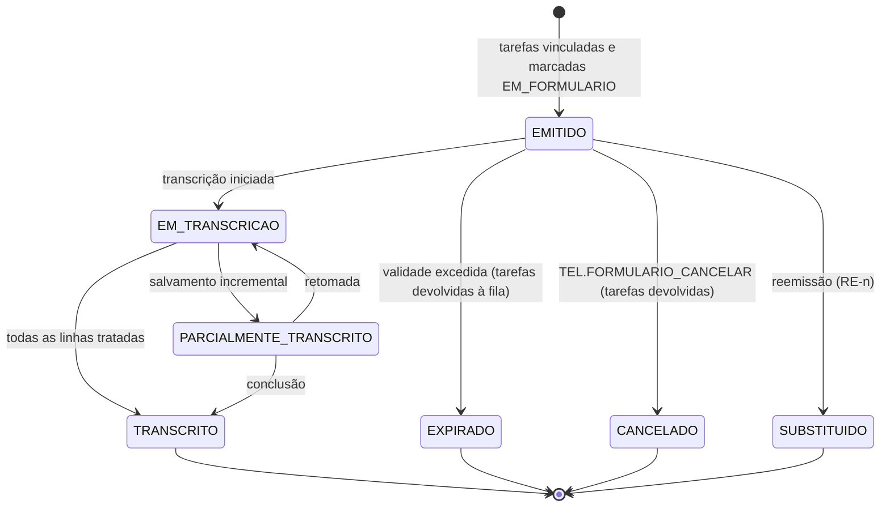

# DOC-17 — DETALHE DE ETAPAS E MODO DE EXECUÇÃO POR TELA
## Operação sem coletores · Formulários de campo · Drill-down do Fluxo Operacional
### Especificação de Requisitos do Sistema WMS Enterprise 3PL

| Metadado | Valor |
|---|---|
| Código do documento | DOC-17 |
| Versão | 1.0.0 |
| Status | APROVADO PARA USO |
| Data | 2026-08-16 |
| Depende de | DOC-00 v1.4.0, DOC-04, DOC-05, DOC-06, DOC-07, DOC-10, DOC-11, DOC-12, DOC-15 |
| Módulo (prefixo de requisitos) | TEL |
| Origem | Solicitação de clientes (2026-08-16) |
| Posição no plano | Ver §10 |

---

## 1. ESCOPO E OBJETIVO

Este documento especifica duas capacidades solicitadas por clientes:

**(A) Detalhe de etapa (drill-down):** ao clicar em QUALQUER etapa da trilha do
Fluxo Operacional — concluída, em execução ou futura — o sistema abre a tela de
detalhe daquela operação (o pedido completo, o picking completo, a conferência
completa, os documentos fiscais etc.).

**(B) Modo de execução por tela:** toda operação hoje disponível em coletor
(putaway, picking, conferência, contagem de inventário, reposição,
transferência, packing, carregamento) DEVE poder ser executada por telas do
próprio sistema, com **emissão de formulário impresso** que guia o operador no
campo e retorna para digitação. Destina-se a clientes e armazéns sem coletores
ou smartphones — e a contingência quando o parque de coletores falha.

**Fronteira essencial:** este documento NÃO cria caminho paralelo de regras.
Toda execução por tela produz os MESMOS efeitos, pelos MESMOS serviços, com as
MESMAS validações da execução por coletor. O que muda é a interface e o momento
da captura, nunca a regra.

---

## 2. A TENSÃO COM A RG-002 E SUA RESOLUÇÃO

A RG-002 e a RN-EXP-011 estabelecem que a única etapa **acionável** é a
primeira pendente, e que etapas posteriores são inertes. A solicitação (A) pede
que qualquer etapa abra tela ao clique.

**Resolução [INVIOLÁVEL] — separar DETALHE de EXECUÇÃO:**

| Ação | Quem pode | Etapas |
|---|---|---|
| **Ver detalhe** (somente leitura) | qualquer usuário com permissão de consulta do módulo | TODAS: concluídas, em execução e futuras |
| **Executar** (registrar, concluir, movimentar) | usuário com a permissão da operação | APENAS a primeira pendente cuja antecessora esteja concluída |

Ou seja: o clique **sempre abre**; o que varia é o que a tela permite fazer.
Etapa futura abre em modo **previsão** (o que está planejado: itens a separar,
saldo reservado, documentos previstos) com o aviso "esta etapa ainda não pode
ser executada — conclua a etapa anterior" e **nenhum controle de ação
habilitado**. A guarda de ordem permanece no serviço (não na interface), e a
API continua retornando `FLOW_STEP_ORDER_VIOLATION` para qualquer tentativa de
execução fora de ordem.

**Emendas decorrentes** — ✅ **APLICADAS em 2026-08-25**:
- **DOC-00 RG-002** (v2.0.0): incorporada a separação DETALHE × EXECUÇÃO na
  própria regra global. Era a emenda mais importante e não constava desta
  lista original — sem ela, a regra de maior precedência continuava dizendo
  "a única etapa clicável é a primeira pendente", contradizendo este §2.
- **DOC-06 RN-EXP-011 item 3** (v2.0.0): "clique em etapa pendente posterior
  é inerte" passou a "abre o detalhe em modo previsão, sem controles de
  execução"; o cenário Gherkin de §6 foi atualizado no mesmo sentido.
- **DOC-10 RF-PAI-005 itens 2 e 4** (v2.0.0): idem na apresentação, e fica
  proibido marcar as etapas posteriores como desabilitadas.
Nada mais muda: os itens 1, 2, 5 e 6 da RN-EXP-011 permanecem intactos.

---

## 3. DEPENDÊNCIAS E TERMOS

| Termo | Identificador técnico | Definição única |
|---|---|---|
| Modo de Execução | `execution_mode` | Configuração por armazém (e, quando aplicável, por operação): `COLETOR`, `TELA` ou `HIBRIDO`. |
| Formulário de Campo | `field_form` | Documento impresso, numerado e com validade, que guia a execução física de um lote de tarefas e retorna para digitação. |
| Transcrição | `form_transcription` | Registro no sistema do resultado anotado em um Formulário de Campo. |
| Detalhe de Etapa | `step_detail` | Visão completa e somente-leitura do conteúdo de uma etapa do Fluxo Operacional. |
| Modo Previsão | `forecast_view` | Detalhe de etapa ainda não executável, exibindo o planejado sem controles de ação. |

---

## 4. ATORES E PERMISSÕES

| Ator | Interação |
|---|---|
| Operadores internos | Executam por tela; recebem e devolvem formulários |
| Líder de Turno | Emite formulários, atribui, reemite, cancela; transcreve ou supervisiona |
| Digitador / Auxiliar administrativo | Transcreve formulários preenchidos |
| Gestor | Configura o Modo de Execução do armazém |
| Cliente (portal) | Apenas Detalhe de Etapa em modo consulta (DOC-16 C-10/C-13) |

**Catálogo de permissões deste módulo:**

| Código | Escopo | Uso |
|---|---|---|
| `TEL.DETALHE_CONSULTAR` | CLIENT_WAREHOUSE | abrir detalhe de qualquer etapa |
| `TEL.EXECUCAO_TELA` | CLIENT_WAREHOUSE | executar operação por tela (sem coletor) |
| `TEL.FORMULARIO_EMITIR` | WAREHOUSE | emitir Formulário de Campo |
| `TEL.FORMULARIO_REEMITIR` | WAREHOUSE (sensível) | reemitir formulário perdido/danificado |
| `TEL.FORMULARIO_CANCELAR` | WAREHOUSE (sensível) | cancelar formulário emitido |
| `TEL.TRANSCREVER` | CLIENT_WAREHOUSE | digitar o resultado de um formulário |
| `TEL.TRANSCREVER_PROPRIO` | CLIENT_WAREHOUSE | transcrever formulário que o próprio usuário executou (ver RN-TEL-032) |
| `TEL.MODO_EXECUCAO_CONFIGURAR` | WAREHOUSE (sensível) | definir o Modo de Execução |

**Catálogo de exceções:**

| Código | Passos | Motivo obrigatório | Expira em |
|---|---|---|---|
| `TEL.TRANSCRICAO_DIVERGENTE` (transcrição fora do previsto no formulário) | 1 | sim | 24 h |
| `TEL.FORMULARIO_EXPIRADO` (transcrever após a validade) | 1 | sim | 24 h |
| `TEL.SEGREGACAO_TRANSCRICAO` (executor transcreve a si mesmo sem permissão) | 1 | sim | 8 h |

---

## 5. REQUISITOS — PARTE A: DETALHE DE ETAPA

### RF-TEL-001 — Contrato único de detalhe
Cada etapa do Fluxo Operacional DEVE expor um **detalhe** por meio de um
contrato único (`GET .../flows/{id}/steps/{step}/detail`), com: cabeçalho da
operação, conteúdo específico da etapa (§5.2), estado, timestamps, executantes
(ocultos no portal do cliente — RF-PAI-020), exceções vinculadas e ações
disponíveis ao usuário no contexto (lista possivelmente vazia).
A tela consome esse contrato — é PROIBIDO cada etapa inventar sua própria
leitura.

### RN-TEL-002 — Modos do detalhe [INVIOLÁVEL]
| Estado da etapa | Modo | Conteúdo | Ações |
|---|---|---|---|
| Concluída | **Consulta** | o que foi feito: quantidades, lotes, leituras, divergências, quem e quando | apenas estorno, quando permitido (RN-EXP-070) |
| Em execução / acionável | **Execução** | o que falta fazer + o já registrado | ações da operação, conforme permissão |
| Futura | **Previsão** | o planejado: itens, reservas, documentos previstos, pré-requisitos pendentes | **nenhuma** — aviso de etapa anterior pendente |
| Bloqueada por exceção | **Consulta + bloqueio** | conteúdo + a exceção e sua alçada | decidir a exceção, se houver alçada |

### RF-TEL-003 — Conteúdo por etapa (catálogo fechado)
| Etapa | Detalhe exibido |
|---|---|
| Pedido | itens pedidos × reservados × separados × cortados, destinatário, datas, onda, saldo fiscal por item |
| Picking | tarefas com endereço, produto, lote, quantidade, executante, leituras, cortes e motivos |
| Embalagem | volumes com LPN, conteúdo declarado, tara, divergência de conteúdo |
| Pesagem | por volume: peso teórico, lido, origem do peso (balança/manual), tolerância, divergências |
| Expedição | documentos fiscais (chave, situação, DANFE/XML), carga consolidada, staging |
| Carregamento | volumes lidos × esperados, veículo, doca, horários |
| Saída | gate-out, lacres, conferências, pendências que foram validadas |
| Chegada/Doca/Descarga (recebimento) | agendamento, veículo, motorista, lacres, doca, horários |
| Conferência | esperado × contado × recontado por item, conferentes, fotos |
| Divergências | tipo, quantidade, evidências, decisão, aprovador |
| Etiquetagem | paletes formados, LPN, conteúdo, impressões e reimpressões |
| Putaway | tarefa, sugestão do motor, endereço escolhido, override e motivo |
| Triagem/Destinação (reversa) | item, estado físico, fotos, destinação sugerida × aplicada |
| Contagem (inventário) | rodadas, contadores, resultado por rodada (respeitando a cegueira — §7) |

### RF-TEL-004 — Navegação
Do detalhe, o usuário navega para os objetos relacionados (produto, lote,
pedido de origem, documento fiscal, exceção, tarefa) e volta sem perder
filtros. Link permanente por etapa.

---

## 6. REQUISITOS — PARTE B: EXECUÇÃO POR TELA

### RN-TEL-010 — Modo de Execução [INVIOLÁVEL]
Parâmetro `TEL.MODO_EXECUCAO` por armazém (e opcionalmente por tipo de
operação): `COLETOR` (apenas dispositivos), `TELA` (apenas telas e
formulários), `HIBRIDO` (ambos, à escolha do operador).
Em `HIBRIDO`, uma tarefa já iniciada em um modo NÃO pode ser concluída no
outro — evita dupla contagem. A troca exige devolução/cancelamento da execução
em curso.

### RN-TEL-011 — Paridade de regras [INVIOLÁVEL]
A execução por tela DEVE chamar exatamente os mesmos serviços de domínio da
execução por coletor: serviço único de movimentação (RN-EST-001), seleção de
saldo (RN-EST-011), motor de putaway (RN-REC-040), validação de conteúdo do
packing (RF-EXP-040), tolerância de pesagem (RN-EXP-051), rodadas de contagem
(RN-EST-062). É PROIBIDO criar validação alternativa, mais permissiva ou
duplicada, para o modo tela.

### RN-TEL-012 — Controles compensatórios [INVIOLÁVEL]
A execução por tela perde a verificação física da dupla leitura (RF-REC-042,
RF-EXP-031). Em compensação, DEVE aplicar:
1. **Digitação, não seleção:** códigos de endereço (RN-DAD-011), LPN
   (RN-DAD-030) e produto (EAN/SKU) são **digitados** e validados (inclusive
   dígito verificador do SSCC), nunca escolhidos em lista suspensa. Listas de
   apoio podem existir para consulta, mas o campo de confirmação exige a
   digitação do código.
2. **Confirmação explícita de divergência:** quantidade diferente da esperada
   exige motivo tipificado antes de prosseguir.
3. **Origem registrada:** toda movimentação criada por tela ou transcrição
   grava `origin = WEB` ou `SYNC`/`PAPEL` conforme o caso, permitindo auditar e
   comparar acuracidade entre modos (RG-003).
4. **Permissão própria** (`TEL.EXECUCAO_TELA`), concedida deliberadamente.

### RF-TEL-013 — Telas de execução (catálogo fechado)
| Tela | Operação | Origem das regras |
|---|---|---|
| T-P1 | Putaway por tarefa/lote de tarefas | DOC-04 RF-REC-042 |
| T-P2 | Picking por pedido/onda | DOC-06 RF-EXP-031 |
| T-P3 | Conferência de recebimento | DOC-04 RF-REC-021/022 |
| T-P4 | Contagem de inventário | DOC-05 RN-EST-062 |
| T-P5 | Reposição e transferência | DOC-05 RF-EST-042/050 |
| T-P6 | Packing (volumação) | DOC-06 RF-EXP-040 |
| T-P7 | Pesagem (entrada manual com permissão) | DOC-06 RF-EXP-050 |
| T-P8 | Carregamento (leitura/digitação de volumes) | DOC-06 RF-EXP-061 |

Cada tela opera em **lote**: várias linhas na mesma sessão, com salvamento
incremental por linha (não perde trabalho se a sessão cair) e confirmação
final que efetiva as movimentações em transação única por linha.

---

## 7. REQUISITOS — FORMULÁRIOS DE CAMPO

### RF-TEL-020 — Emissão
Usuário com `TEL.FORMULARIO_EMITIR` emite um Formulário de Campo para um
conjunto de tarefas (uma onda de picking, um lote de putaway, um conjunto de
endereços de contagem). O formulário é gerado em PDF e impresso pelo Edge
Agent (DOC-11 `PRINT_PDF`) ou baixado.

**Conteúdo obrigatório de todo formulário:**
- número do formulário (máscara `FRM-<ARMAZÉM>-<SEQ8>`, RN-DAD-040);
- **código de barras Code 128 do número** — para localizar rapidamente na
  transcrição;
- armazém, cliente, operação, data/hora de emissão, **validade** (parâmetro
  `TEL.FORMULARIO_VALIDADE_H`, padrão 12 h);
- emitente e campo para identificação do executante (nome e matrícula);
- as linhas de trabalho, com campos em branco para anotação do realizado;
- campo de observação por linha (para divergências);
- rodapé com instruções e aviso de que o formulário deve retornar para
  digitação.

### RN-TEL-021 — Reserva do trabalho na emissão [INVIOLÁVEL]
A emissão **vincula** as tarefas ao formulário e as marca como
`EM_FORMULARIO`: elas deixam de aparecer para atribuição em coletor ou em
outra emissão. Isso impede que a mesma tarefa seja executada duas vezes por
canais diferentes. Cancelamento ou expiração do formulário devolve as tarefas
à fila.

### RF-TEL-022 — Conteúdo por tipo de formulário
| Formulário | Linhas contêm | Campos para preencher |
|---|---|---|
| **Picking** | sequência da rota, endereço, produto, descrição, lote sugerido, validade, quantidade a separar, embalagem | quantidade separada, lote efetivo, motivo se divergente |
| **Putaway** | LPN, produto/conteúdo, endereço sugerido e 4 alternativas | endereço utilizado, motivo se diferente da sugestão |
| **Conferência** | (cega: sem quantidades) produto esperado ou lista em branco conforme `blind_checking` | produto, lote, validade, embalagem, quantidade contada |
| **Contagem de inventário** | endereço, **sem saldo do sistema** (RN-COL-061 vale igualmente no papel) | produto, lote, validade, quantidade contada; campo "endereço vazio" |
| **Reposição/Transferência** | origem, produto, lote, quantidade, destino | quantidade movida, destino efetivo |
| **Carregamento** | volumes esperados com LPN e sequência n/N | marcação de carregado por volume |

### RN-TEL-023 — Cegueira preservada no papel [INVIOLÁVEL]
Formulário de contagem de inventário NÃO imprime saldo do sistema, contagem
anterior nem indicação de divergência (1ª e 2ª rodadas). Formulário de
conferência cega não imprime as quantidades esperadas. A cegueira é regra de
negócio (RN-EST-062, RF-REC-021), não característica do dispositivo.

### RF-TEL-024 — Reemissão e cancelamento
Reemissão exige `TEL.FORMULARIO_REEMITIR` + motivo, e o novo impresso carrega
marca **`RE1`, `RE2`…** (mesmo padrão das etiquetas, RF-PER-021) — o formulário
anterior é invalidado e sua transcrição passa a ser rejeitada. Cancelamento
exige `TEL.FORMULARIO_CANCELAR` + motivo e devolve as tarefas à fila.

---

## 8. REQUISITOS — TRANSCRIÇÃO

### RF-TEL-030 — Tela de transcrição
Localiza o formulário pela leitura/digitação do número, exibe as linhas
emitidas e captura o realizado linha a linha, com salvamento incremental.
Ao confirmar, cada linha efetiva sua operação pelos serviços de domínio
(RN-TEL-011), gerando as mesmas movimentações, eventos e auditoria.

### RN-TEL-031 — Idempotência [INVIOLÁVEL]
1. Cada **linha** do formulário tem chave de idempotência própria
   (`form_line_id`), gerada na emissão e persistida (RG-009).
2. Um formulário só pode ser transcrito **uma vez**. Nova tentativa retorna o
   resultado da transcrição original, sem efeito adicional, exibindo quando e
   por quem foi transcrito.
3. Linha cuja tarefa já foi concluída por outro canal é **descartada com
   aviso** (`DESCARTADA_DUPLICIDADE`), sem efeito — mesma semântica da
   RN-ARQ-053 do offline.
4. Transcrição parcial é permitida e retomável: linhas não preenchidas
   permanecem pendentes e o formulário fica `PARCIALMENTE_TRANSCRITO` até
   conclusão ou cancelamento do saldo restante (com motivo).

### RN-TEL-032 — Segregação de funções
ONDE o parâmetro `TEL.EXIGE_SEGREGACAO_TRANSCRICAO` estiver ativo (padrão
**true**), o usuário que consta como executante do formulário NÃO pode
transcrevê-lo, salvo com a permissão `TEL.TRANSCREVER_PROPRIO`, que registra
exceção `TEL.SEGREGACAO_TRANSCRICAO`. Motivo: no papel, quem anota e quem
digita ser a mesma pessoa elimina a única verificação independente restante.

### RN-TEL-033 — Validade e divergência
Transcrição após a validade do formulário exige exceção
`TEL.FORMULARIO_EXPIRADO`. Linha transcrita com valores fora do previsto
(endereço diferente do sugerido sem permissão de override, quantidade acima do
disponível, lote não constante) segue as regras do módulo de origem; quando o
módulo exigir aprovação, a exceção correspondente é aberta e a linha fica
pendente — **nunca é aplicada parcialmente**.

### RF-TEL-034 — Conferência de digitação
Para formulários de **contagem de inventário** e **conferência de
recebimento**, o parâmetro `TEL.DUPLA_DIGITACAO` (padrão true para inventário)
exige digitação em duas passagens independentes das quantidades, com
divergência entre as passagens apontada antes de confirmar. Reduz o erro de
transcrição, que é o risco central do modo papel.

---

## 9. MÁQUINAS DE ESTADO

### 9.1 Formulário de Campo



| Origem | Evento | Guarda | Destino | Efeitos |
|---|---|---|---|---|
| EMITIDO | transcrever | dentro da validade; usuário ≠ executante ou permissão própria | EM_TRANSCRICAO | linhas efetivadas por serviço de domínio |
| EM_TRANSCRICAO | reenvio da mesma transcrição | idempotência (RN-TEL-031) | TRANSCRITO | resultado original devolvido, sem efeito novo |

### 9.2 Linha de formulário
`PENDENTE → APLICADA` | `DESCARTADA_DUPLICIDADE` | `REJEITADA_REGRA` (vira
exceção) | `NAO_PREENCHIDA` (ao concluir parcialmente, com motivo).

---

## 10. CRITÉRIOS DE ACEITE (GHERKIN)

```gherkin
Cenário: Etapa futura abre em modo previsão sem executar
  Dado um pedido com Embalagem pendente acionável e Pesagem pendente seguinte
  Quando o usuário clicar em Pesagem
  Então a tela de detalhe deve abrir em modo previsão
  E deve exibir os volumes previstos e o aviso de etapa anterior pendente
  E nenhum controle de registro de peso deve estar habilitado
  E uma chamada de API de pesagem deve retornar FLOW_STEP_ORDER_VIOLATION

Cenário: Etapa concluída abre em consulta com quem e quando
  Dado a etapa Picking concluída
  Quando o usuário clicar nela
  Então devem aparecer as tarefas, quantidades, lotes, cortes e executantes
  E a única ação disponível deve ser o estorno, se permitido

Cenário: Emissão de formulário reserva as tarefas
  Dado 12 tarefas de picking pendentes
  Quando um formulário for emitido para 5 delas
  Então essas 5 devem ficar EM_FORMULARIO
  E não devem aparecer para atribuição em coletor nem em nova emissão

Cenário: Cancelamento devolve as tarefas
  Dado o formulário anterior
  Quando ele for cancelado com motivo
  Então as 5 tarefas devem voltar à fila de atribuição

Cenário: Formulário de inventário não imprime saldo
  Dado um inventário em 1ª rodada
  Quando o formulário de contagem for emitido
  Então nenhum saldo do sistema, contagem anterior ou divergência deve constar
  E deve haver campo explícito para declarar "endereço vazio"

Cenário: Transcrição é idempotente
  Dado um formulário já transcrito
  Quando a mesma transcrição for enviada novamente
  Então o resultado original deve ser devolvido
  E nenhuma movimentação adicional deve ocorrer
  E a tela deve informar quando e por quem foi transcrito

Cenário: Linha de tarefa já concluída por outro canal é descartada
  Dado a tarefa T-100 impressa em formulário e concluída em coletor por outro operador
  Quando a linha correspondente for transcrita
  Então ela deve ser DESCARTADA_DUPLICIDADE
  E o saldo não deve sofrer segundo efeito

Cenário: Segregação na transcrição
  Dado o formulário executado por João, com TEL.EXIGE_SEGREGACAO_TRANSCRICAO ativo
  Quando João tentar transcrevê-lo sem TEL.TRANSCREVER_PROPRIO
  Então o sistema deve rejeitar
  E com a permissão, deve registrar a exceção TEL.SEGREGACAO_TRANSCRICAO

Cenário: Digitação de código, não seleção
  Dado a tela de putaway por tela
  Quando o operador informar o endereço destino
  Então o campo de confirmação deve exigir a digitação do código A1-012-03-02
  E LPN digitado com dígito verificador inválido deve ser rejeitado

Cenário: Paridade de regras entre modos
  Dado produto INFLAMAVEL e endereço reprovado no filtro de espécie
  Quando o endereço for digitado na execução por tela
  Então a rejeição deve ser idêntica à do coletor (RG-005), sem exceção

Cenário: Dupla digitação em contagem
  Dado TEL.DUPLA_DIGITACAO ativo para inventário
  Quando o digitador informar 95 na primeira passagem e 96 na segunda
  Então a divergência deve ser apontada antes de confirmar
  E nada deve ser gravado até a resolução

Cenário: Transcrição fora da validade
  Dado formulário com validade de 12 h emitido há 20 h
  Quando a transcrição for tentada
  Então a exceção TEL.FORMULARIO_EXPIRADO deve ser aberta
  E a transcrição só prossegue após aprovação
```

---

## 11. REQUISITOS DE DADOS (DELTA)

| ID | Estrutura | Classificação | Observações |
|---|---|---|---|
| RD-TEL-001 | `field_form` | TENANT | número, tipo, tarefas vinculadas, validade, estado §9.1, emitente, executante declarado, marca de reemissão, PDF no S3 |
| RD-TEL-002 | `field_form_line` | TENANT | `form_line_id` (chave de idempotência), tarefa, previsto, transcrito, estado §9.2, motivo |
| RD-TEL-003 | `form_transcription` | TENANT | usuário, início/fim, passagens (dupla digitação), resultado por linha |
| RD-TEL-004 | coluna `execution_channel` em tarefas e movimentações | — | `COLETOR` \| `TELA` \| `FORMULARIO`, para auditoria e comparação de acuracidade |

Parâmetros: `TEL.MODO_EXECUCAO`, `TEL.FORMULARIO_VALIDADE_H`,
`TEL.EXIGE_SEGREGACAO_TRANSCRICAO`, `TEL.DUPLA_DIGITACAO`.

---

## 12. FORA DE ESCOPO (NÃO IMPLEMENTAR)

- Reconhecimento óptico (OCR) de formulários preenchidos à mão.
- Formulário com código de barras por linha para leitura na transcrição
  (avaliar após uso real; a chave de idempotência já existe no dado).
- Execução por tela de operações que exigem hardware por natureza (pesagem
  automática permanece manual com permissão — RF-EXP-050).
- Modo papel para operações fiscais (emissão de NF-e continua exclusivamente
  no sistema).
- Impressão de formulário no portal do cliente.
- Edição de layout de formulário pelo usuário final (templates versionados,
  como as etiquetas do DOC-11).

---

## 13. POSIÇÃO NO PLANO E RISCOS

**Posição recomendada:** logo após **COL-1** e antes de **COL-2**, em
1 a 2 sessões. Razão: a Parte A (detalhe) é aditiva e barata sobre o que já
existe; a Parte B (execução por tela) amplia o alcance comercial imediatamente
— um cliente sem coletores passa a ser atendível — enquanto o offline (COL-2)
serve a quem já tem o parque de dispositivos.

Alternativa: **PARTE A antes**, junto do próximo ajuste de interface (é
pequena e muito visível para o usuário), e **PARTE B** na posição acima.

**Riscos reconhecidos e mitigações:**

| Risco | Mitigação |
|---|---|
| Erro de transcrição (o principal do modo papel) | dupla digitação (RF-TEL-034), digitação de códigos com dígito verificador, confirmação de divergência |
| Execução duplicada (papel + coletor) | reserva de tarefas na emissão (RN-TEL-021) e descarte por duplicidade (RN-TEL-031) |
| Perda da verificação física | controles compensatórios (RN-TEL-012) + segregação na transcrição (RN-TEL-032) + `execution_channel` para medir acuracidade por modo |
| Regras divergirem entre modos | paridade obrigatória (RN-TEL-011): mesmos serviços de domínio, sem caminho alternativo |
| Formulário virar "estoque paralelo" de trabalho | validade curta com devolução automática das tarefas (RN-TEL-021) |

**Indicador recomendado:** comparar acuracidade e taxa de divergência entre
`execution_channel = COLETOR` e `FORMULARIO` (novo KPI derivado, a propor no
DOC-10) — dá base objetiva para o cliente decidir investir em coletores.

---

## 14. MATRIZ DE RASTREABILIDADE LOCAL

| Necessidade | Requisitos |
|---|---|
| Clicar em qualquer etapa e ver o detalhe | §5 completo, RN-TEL-002 |
| Todas as operações executáveis em telas do sistema | RN-TEL-010, RF-TEL-013, RN-TEL-011 |
| Formulários impressos para operação sem coletor | §7 completo |
| Retorno para digitação com segurança e idempotência | §8 completo, RN-TEL-031 |
| Preservação da RG-002 | §2 (separação detalhe × execução) |
| Preservação da cegueira de contagem | RN-TEL-023 |

---

## CHANGELOG

| Versão | Data | Alteração |
|---|---|---|
| 1.0.0 | 2026-08-16 | Versão inicial — solicitação de clientes |
