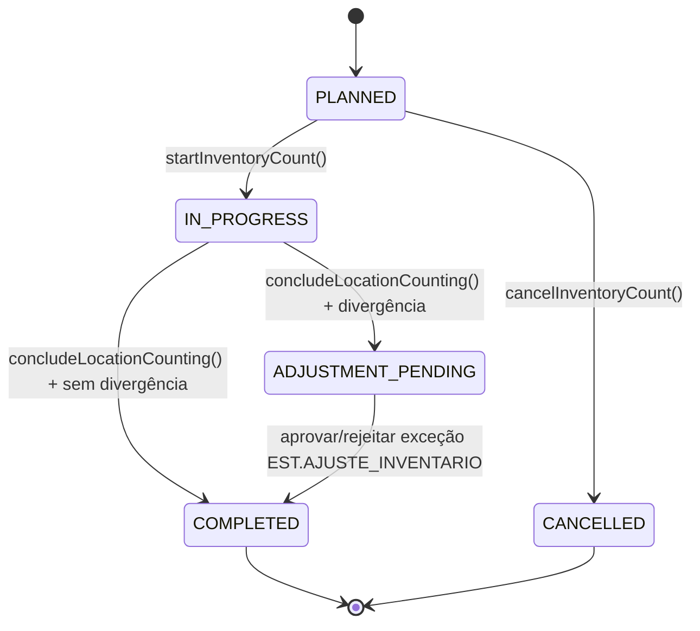

# PROMPT — SESSÃO 5C: MOTOR DE INVENTÁRIO
## Especificação de Execução

| Metadado | Valor |
|---|---|
| Sessão | 5C |
| Módulo | DOC-05 §4.7 (Inventários) |
| Dependência de | DOC-05 v1.0.0, DOC-00 v1.3.0, DOC-01 (RLS), DOC-02 (dados), DOC-12 (auditoria) |
| Modelo | Sonnet (médio — algoritmo de sorteio + lógica de rodadas + auditoria) |
| Data de Abertura | 2026-08-23 |
| Alvo | Motor de inventário completo no servidor para T5 (Contagem) em coletores (DOC-15) |
| Posição no Plano | Sessão 5C, ANTES de COL-1 (conforme DOC-15 §10) |

---

## 1. CONTEXTO E JUSTIFICATIVA

A Sessão 5C é uma **promoção de prioridade** conforme DOC-15 §10: o motor de inventário (contagem física) é operação de campo de **maior valor de acuracidade para um 3PL** e deve preceder a plataforma de coletores (COL-1).

**Razão:** T5 (Contagem de Inventário) do coletor depende da máquina de estado, validações e cálculos de acuracidade já prontos no servidor. Implementar 5C agora garante que COL-1 nascerá com contagem completa, não com lacunas.

**Ordem recomendada:** 5C ✓ → COL-1 (com T5 integrada) → COL-2 (offline).

---

## 2. OBRIGAÇÕES DESTE SPRINT

Implementar o motor de inventário do WMS segundo DOC-05 §4.7 no backend NestJS/PostgreSQL/Redis:

### 2.1 Tipos de inventário (RF-EST-060)

Suportar catálogo fechado de 6 tipos:
- `GERAL` — todos os endereços com saldo (e vazios opcionais)
- `ROTATIVO_PRODUTO` — endereços com saldo dos produtos selecionados
- `ROTATIVO_DIA` — N endereços/dia (param `EST.INV_ROTATIVO_QTD_DIA`), priorizando maior tempo sem contagem + ABC
- `POR_SORTEIO` — N aleatórios com semente registrada (reprodutível)
- `POR_ZONA` — endereços das zonas selecionadas
- `POR_ESPECIE` — endereços com saldo das espécies selecionadas
- `POR_ENDERECO` — lista explícita

### 2.2 Máquina de estado (§5.1 DOC-05)



**Máquina de estado de location** (dentro do inventário):
```
PENDING → COUNTING → COMPLETED (sem divergência)
PENDING → COUNTING → ADJUSTMENT_PENDING (com divergência)
```

- Transição explícita com tabela de transições (nunca setStatus livre — RN-EST-062)
- Endereço dentro do inventário tem status INVENTORY no `location` (congelado)
- Cada endereço tem conclusão individual
- Mudança de status de inventory_count_location para COMPLETED libera automaticamente o location

### 2.3 Rodadas de contagem (RN-EST-062 — [INVIOLÁVEL])

**1ª contagem:** cega (não expõe saldo do sistema)

```
if (1ª == saldo_sistema)
  → endereço concluído, sem ajuste
else
  → 2ª contagem por operador DIFERENTE
  
  if (2ª == saldo_sistema)
    → concluído, sem ajuste
  else if (2ª == 1ª)
    → divergência confirmada
  else (2ª ≠ 1ª ≠ sistema)
    → 3ª contagem por LIDER_TURNO
    → resultado da 3ª prevalece
```

Todas as contagens são registradas com operador, timestamp e quantidade.

### 2.4 Congelamento de endereço (RN-EST-061 — [INVIOLÁVEL])

Ao mudar `inventory_count_location.status` → COUNTING:

- Endereço correspondente (`location.status`) muda para `INVENTORY`
- Movimentações DE/PARA o endereço são bloqueadas no `StockMovementService` (validação)
- Reservas existentes permanecem, mas **execução é suspensa** (PickingService valida)
- Liberação automática ao concluir a contagem do endereço (status COMPLETED)
- **Teste:** picking tentar consumir saldo → erro claro "endereço em inventário"

### 2.5 Exceções e alçadas (RN-EST-063)

Divergência confirmada abre exceção `EST.AJUSTE_INVENTARIO`:
- Dimensões: quantidade e valor (quantidade × custo cliente, se disponível)
- Aprovação gera `AJUSTE_INVENTARIO_POS` ou `AJUSTE_INVENTARIO_NEG` via `stock_movement`
- Auditoria com before/after (RG-003) incluindo `requirement_id`
- Rejeição exige nova contagem (volta à 1ª rodada: cria novo `inventory_count_location`)
- Exceção expira em 48 h (parâmetro `EST.AJUSTE_INVENTARIO_EXPIRACAO_HORAS`)

### 2.6 Acuracidade (RF-EST-064)

Ao concluir o inventário (`completeInventoryCount`), calcular e publicar:

| Métrica | Fórmula | Exemplo |
|---|---|---|
| **Por endereço** | endereços sem divergência ÷ endereços contados | 45/50 = 90% |
| **Por quantidade** | 1 − (\|Σajustes\| ÷ Σsaldo_contado) | 1 − (5/100) = 95% |
| **Por cliente** | agregado dos seus endereços | – |

Publicar evento `estoque.inventario_concluido` com as 3 acuracidades. Alimentar KPIs do DOC-10.

### 2.7 Especificidades

- **Sorteio reprodutível:** semente registrada em `inventory_count.sorteio_seed` permite replicar o mesmo conjunto em auditoria
- **Rotativo por dia:** parâmetro `EST.INV_ROTATIVO_QTD_DIA` (ex.: 50 endereços/dia); ordenação por (maior tempo desde contagem, depois ABC)
- **Contagem cega:** Pacote de Turno de coletores (RNF-ARQ-051) NÃO deve conter `qty_available` do endereço durante 1ª contagem; validar em teste
- **RLS:** inventário tem tenant; operador só vê seus próprios inventários e do armazém; auditoria com `actor_user_id` obrigatória (RG-003)
- **Sorteio determinístico:** usar `seedrandom` ou Mersenne Twister com semente registrada em `inventory_count.sorteio_seed` para reprodutibilidade em auditoria

---

## 3. DADOS (RD-EST-003)

### 3.1 Tabelas e estrutura

**`inventory_count`** (tenant)
- `id` UUID
- `inventory_type` ENUM (GERAL|ROTATIVO_PRODUTO|ROTATIVO_DIA|POR_SORTEIO|POR_ZONA|POR_ESPECIE|POR_ENDERECO)
- `status` ENUM (PLANNED|IN_PROGRESS|ADJUSTMENT_PENDING|COMPLETED|CANCELLED)
- `warehouse_id` FK
- `client_id` FK (nullable, NULL = todos os clientes)
- `started_at` timestamp (NULL se ainda PLANNED)
- `completed_at` timestamp
- `sorteio_seed` text (nullable, para POR_SORTEIO)
- RLS: warehouse_id via current_setting('app.tenant_ids')

**`inventory_count_location`** (tenant)
- `id` UUID
- `inventory_count_id` FK
- `location_id` FK
- `status` ENUM (PENDING|COUNTING|COMPLETED|ADJUSTMENT_PENDING)
- `saldo_sistema` int (para referência durante contagem)
- RLS: via inventory_count_id

**`inventory_count_round`** (tenant)
- `id` UUID
- `inventory_count_location_id` FK
- `operador_id` FK (user_id)
- `round_number` int (1, 2, 3)
- `contagem_qty` int
- `timestamp` timestamp
- RLS: via inventory_count_location_id

---

## 4. CENÁRIOS GHERKIN (DOC-05 §6 + RN-COL-061..064)

```gherkin
Cenário: Rodadas de contagem (RN-EST-062)
  Dado endereço com saldo de sistema 100 UN
  E 1ª contagem 95 UN por João
  E 2ª contagem 95 UN por Maria
  Quando as rodadas concluírem
  Então a divergência confirmada deve ser −5 UN
  E a exceção EST.AJUSTE_INVENTARIO deve ser aberta com quantidade 5

Cenário: Terceira contagem decide (RN-EST-062)
  Dado sistema 100, 1ª contagem 95, 2ª contagem 98
  Quando o LIDER_TURNO executar a 3ª contagem com resultado 98
  Então a divergência confirmada deve ser −2 UN

Cenário: Contagem cega não expõe saldo (RN-COL-061)
  Dado inventário em 1ª rodada no endereço A1-010-02-01 com saldo de sistema 100 UN
  Quando o Pacote de Turno for gerado
  Então nenhum saldo desse endereço deve estar no pacote offline

Cenário: Endereço vazio exige declaração ativa (RN-COL-063)
  Dado a contagem do endereço B2-001-01-01 sem nenhuma leitura registrada
  Quando o operador tentar encerrar o endereço
  Então o encerramento deve ser rejeitado
  E somente a ação explícita "endereço vazio" com confirmação deve concluir com contagem zero

Cenário: Aviso de recontagem pelo mesmo operador (RN-COL-064)
  Dado João executou a 1ª contagem do endereço A1-010-02-01
  E a 2ª rodada do endereço está na fila
  Quando João abrir esse endereço na T5
  Então o coletor deve avisar que a recontagem exige operador diferente
  E ao sincronizar uma tentativa de João o servidor deve rejeitá-la

Cenário: Sorteio reprodutível (DOC-05 §6)
  Dado inventário POR_SORTEIO de 50 endereços com semente registrada 20260810-001
  Quando a mesma semente for reaplicada em auditoria
  Então a mesma lista de 50 endereços deve ser gerada

Cenário: Endereço congelado durante contagem (DOC-05 §6)
  Dado endereço A1-010-02-01 em contagem (status INVENTORY)
  Quando uma tarefa de picking tentar consumir saldo desse endereço
  Então a execução deve ser bloqueada com mensagem de inventário em andamento
  E liberada automaticamente quando a contagem do endereço concluir
```

---

## 5. ESTRUTURA DE DADOS (MIGRAÇÃO POSTGRESQL)

**3 tabelas novas + RLS + validações**

### 5.1 Migração: Criar tabelas de inventário

**Arquivo:** `db/migrations/0XXX-inventory-tables.sql`

```sql
-- 1. inventory_count (TENANT, warehouse)
CREATE TABLE wms.inventory_count (
  id uuid PRIMARY KEY DEFAULT gen_random_uuid(),
  warehouse_id uuid NOT NULL REFERENCES wms.warehouse(id),
  client_id uuid REFERENCES wms.client(id),  -- NULL = todos clientes
  inventory_type text NOT NULL
    CHECK (inventory_type IN (
      'GERAL','ROTATIVO_PRODUTO','ROTATIVO_DIA',
      'POR_SORTEIO','POR_ZONA','POR_ESPECIE','POR_ENDERECO'
    )),
  status text NOT NULL DEFAULT 'PLANNED'
    CHECK (status IN ('PLANNED','IN_PROGRESS','ADJUSTMENT_PENDING','COMPLETED','CANCELLED')),
  sorteio_seed text,  -- NULL se não POR_SORTEIO; registra seed para reprodutibilidade
  started_at timestamp,
  completed_at timestamp,
  created_by uuid NOT NULL REFERENCES wms."user"(id),
  created_at timestamp NOT NULL DEFAULT now(),
  updated_at timestamp NOT NULL DEFAULT now()
);
ALTER TABLE wms.inventory_count ENABLE ROW LEVEL SECURITY;
CREATE POLICY inventory_count_tenant_policy ON wms.inventory_count
  USING (warehouse_id = NULLIF(current_setting('app.tenant_ids', true)::uuid, '00000000-0000-0000-0000-000000000000'::uuid));

-- 2. inventory_count_location (TENANT, via inventory_count_id → warehouse_id)
CREATE TABLE wms.inventory_count_location (
  id uuid PRIMARY KEY DEFAULT gen_random_uuid(),
  inventory_count_id uuid NOT NULL REFERENCES wms.inventory_count(id) ON DELETE CASCADE,
  location_id uuid NOT NULL REFERENCES wms.location(id),
  status text NOT NULL DEFAULT 'PENDING'
    CHECK (status IN ('PENDING','COUNTING','COMPLETED','ADJUSTMENT_PENDING')),
  saldo_sistema int NOT NULL,  -- snapshot do saldo no momento da criação
  created_at timestamp NOT NULL DEFAULT now(),
  updated_at timestamp NOT NULL DEFAULT now(),
  UNIQUE (inventory_count_id, location_id)
);
ALTER TABLE wms.inventory_count_location ENABLE ROW LEVEL SECURITY;
CREATE POLICY inventory_count_location_tenant_policy ON wms.inventory_count_location
  USING (inventory_count_id IN (
    SELECT id FROM wms.inventory_count WHERE warehouse_id = NULLIF(current_setting('app.tenant_ids', true)::uuid, '00000000-0000-0000-0000-000000000000'::uuid)
  ));

-- 3. inventory_count_round (TENANT, via inventory_count_location_id)
CREATE TABLE wms.inventory_count_round (
  id uuid PRIMARY KEY DEFAULT gen_random_uuid(),
  inventory_count_location_id uuid NOT NULL REFERENCES wms.inventory_count_location(id) ON DELETE CASCADE,
  round_number int NOT NULL CHECK (round_number IN (1,2,3)),
  operador_id uuid NOT NULL REFERENCES wms."user"(id),
  contagem_qty int NOT NULL,
  created_at timestamp NOT NULL DEFAULT now(),
  UNIQUE (inventory_count_location_id, round_number)
);
ALTER TABLE wms.inventory_count_round ENABLE ROW LEVEL SECURITY;
CREATE POLICY inventory_count_round_tenant_policy ON wms.inventory_count_round
  USING (inventory_count_location_id IN (
    SELECT id FROM wms.inventory_count_location 
    WHERE inventory_count_id IN (
      SELECT id FROM wms.inventory_count 
      WHERE warehouse_id = NULLIF(current_setting('app.tenant_ids', true)::uuid, '00000000-0000-0000-0000-000000000000'::uuid)
    )
  ));

-- 4. Validar coluna location.status (deve permitir INVENTORY)
-- Verificar se location.status é CHECK ou ENUM
-- Se ENUM, adicionar valor INVENTORY
-- Se CHECK, atualizar a constraint para incluir 'INVENTORY'
-- Exemplo:
-- ALTER TABLE wms.location DROP CONSTRAINT location_status_check;
-- ALTER TABLE wms.location ADD CONSTRAINT location_status_check 
--   CHECK (status IN ('ACTIVE','INACTIVE','INVENTORY','PICKING','PICKING_INACTIVE'));
```

### 5.2 Parâmetros globais novos

| Parâmetro | Default | Uso | Escopo |
|---|---|---|---|
| `EST.INV_ROTATIVO_QTD_DIA` | 50 | N endereços/dia na contagem ROTATIVO_DIA | WAREHOUSE |
| `EST.ALERTA_VENCIMENTO_DIAS` | 90,60,30,15,0 | Dias para alertas de lote vencendo | WAREHOUSE |
| `EST.AJUSTE_INVENTARIO_EXPIRACAO_HORAS` | 48 | Prazo para aprovação de exceção de ajuste | WAREHOUSE |

---

## 6. ESTRUTURA DE IMPLEMENTAÇÃO

### 6.1 Serviço (`src/modules/inventory/inventory.service.ts`)

**Métodos principais:**

```typescript
// Criação de inventário
async createInventoryCount(
  ctx: DbContext,
  type: InventoryType,
  options: {
    clientId?: UUID,
    locationIds?: UUID[],
    produktIds?: UUID[],
    zoneIds?: UUID[],
    speciesIds?: UUID[],
    sorteioN?: number,
    sorteioSeed?: string,
  }
): Promise<InventoryCount>

// Iniciar contagem (muda PLANNED → IN_PROGRESS, congela endereços)
async startInventoryCount(ctx: DbContext, inventoryCountId: UUID)

// Registrar contagem de endereço (1ª, 2ª ou 3ª rodada)
async recordCountRound(
  ctx: DbContext,
  locationId: UUID,
  roundNumber: 1 | 2 | 3,
  contagemQty: number,
  operadorId: UUID
): Promise<InventoryCountRound>

// Processar decisão (encerrar endereço, abrir exceção se divergência)
async concludeLocationCounting(
  ctx: DbContext,
  locationId: UUID
): Promise<{ divergence?: number, exceptionId?: UUID }>

// Completar inventário (calcula acuracidade, publica evento)
async completeInventoryCount(ctx: DbContext, inventoryCountId: UUID)

// Cancelar inventário
async cancelInventoryCount(ctx: DbContext, inventoryCountId: UUID)
```

### 6.2 Validações

- **Operador diferente na 2ª contagem:** rejeitar se `operador_id` da 2ª = `operador_id` da 1ª; erro: "Recontagem exige operador diferente" (RN-COL-064)
- **Bloqueio de endereço:** ao mudar `inventory_count_location.status` → COUNTING, mudar `location.status` → INVENTORY; bloquear movimentações DE/PARA via `StockMovementService` (validação antes de permitir)
- **Rodada única por ciclo:** não permitir dois registros com mesmo `round_number` para mesma `inventory_count_location`
- **Sorteio:** usar biblioteca `seedrandom` com semente registrada em `inventory_count.sorteio_seed` para reprodução exata

### 6.3 Eventos de domínio

Publicar via **outbox transacional** (RNF-ARQ-031):
- `estoque.inventario_iniciado` (ao mudar PLANNED → IN_PROGRESS)
- `estoque.endereco_contado` (ao registrar cada rodada)
- `estoque.ajuste_aplicado` (quando exceção EST.AJUSTE_INVENTARIO for aprovada)
- `estoque.inventario_concluido` (ao completar e calcular acuracidade)

### 6.4 Testes de integração

**Arquivo:** `src/modules/inventory/inventory.service.spec.ts`

Rodar contra PostgreSQL real em **dois ciclos consecutivos** (idênticos), verificar:

1. ✅ Criação de todos os 7 tipos de inventário (GERAL, ROTATIVO_PRODUTO, ROTATIVO_DIA, POR_SORTEIO, POR_ZONA, POR_ESPECIE, POR_ENDERECO)
2. ✅ Transição de estado (PLANNED → IN_PROGRESS → COMPLETED/ADJUSTMENT_PENDING)
3. ✅ Rodadas de contagem e regra da 1ª = sistema → sem ajuste
4. ✅ Rodadas 1ª ≠ 2ª (mesmo operador) → rejeição com erro claro
5. ✅ Rodadas 1ª ≠ 2ª (operador diferente) → abre 2ª; 2ª = 1ª → divergência confirmada
6. ✅ Rodadas 1ª ≠ 2ª ≠ sistema → 3ª por líder → resultado prevalece
7. ✅ Congelamento de endereço (status INVENTORY) bloqueia picking
8. ✅ Sorteio reprodutível (mesma semente = mesmos endereços em segunda execução)
9. ✅ Acuracidade calculada corretamente (por endereço, por quantidade, por cliente)
10. ✅ Auditoria com before/after para todas as movimentações (RG-003)
11. ✅ Contagem cega: Pacote de Turno offline sem `qty_available` na 1ª rodada
12. ✅ Endereço vazio requer ação explícita "endereço vazio" com confirmação
13. ✅ RLS validado (operador vê apenas seu armazém)
14. ✅ Eventos publicados via outbox transacional (RNF-ARQ-031)

**Dados normativos (imutáveis — travados):**

| Cenário | Saldo Sistema | 1ª | 2ª | 3ª | Divergência Esperada | Notas |
|---|---|---|---|---|---|---|
| Cenário 1 (RN-EST-062) | 100 | 95 | 95 | – | −5 UN | Segunda contagem confirma divergência |
| Cenário 2 (RN-EST-062) | 100 | 95 | 98 | 98 | −2 UN | Terceira contagem por líder prevalece |

---

## 7. COMANDOS CONCRETOS

```bash
# 1. Criar/aplicar migrations
psql -h localhost -U postgres -d wms -f db/migrations/0XXX-inventory-tables.sql

# 2. Verificar tabelas e RLS
psql -h localhost -U postgres -d wms -c "\dt wms.inventory*"
psql -h localhost -U postgres -d wms -c "\d wms.inventory_count"

# 3. Build
pnpm build

# 4. Testes unitários e de integração
pnpm test:inventory
pnpm test:integration inventory.service
pnpm test:integration inventory.service  # segunda execução (deve ser idêntica)

# 5. Verificar Docker e health
docker compose ps
curl localhost:3000/health/ready

# 6. Commit com rastreabilidade
git add docs/PROMPT-SESSAO-5C-inventario.md
git add src/modules/inventory/
git add db/migrations/0XXX-inventory-tables.sql
git commit -m "Sessão 5C: motor de inventário (DOC-05 §4.7, RN-EST-062/063/064)"
git push

# 7. Gerar relatório com saída real
pnpm test:integration inventory.service 2>&1 | tee docs/relatorios/SESSAO-5C-test-output.txt
```

---

## 8. DEFINITION OF DONE

```bash
# Build e testes
docker compose up -d --build
pnpm build
pnpm test:inventory      # unitários
pnpm test:integration    # contra PostgreSQL real, 2 execuções idênticas

# Verificação de estado
curl localhost:3000/health/ready   # 200

# Commit
git add docs/PROMPT-SESSAO-5C-inventario.md
git add <arquivos implementados>
git commit -m "Sessão 5C: motor de inventário (DOC-05 §4.7, RN-EST-062/063/064)"
git push
```

Relatório em `docs/relatorios/SESSAO-5C-relatorio.md`:
- Matriz requisito → arquivo → teste
- Saída real de `pnpm test:integration` (2 execuções)
- Lacunas e débitos abertos
- Decisões tomadas com justificativa

---

## 9. NOTAS CRÍTICAS

1. **Precedência:** Esta sessão ANTES de COL-1; T5 (coletor) depende deste motor completo.
2. **Contagem cega:** Garantir que `shift_package` (Pacote de Turno offline) **não** inclua `qty_available` de endereços em 1ª contagem — validar em teste de integração ao gerar pacote (RN-COL-061).
3. **Sorteio determinístico:** usar biblioteca `seedrandom` com semente registrada em `inventory_count.sorteio_seed`; reproduzir a mesma lista em auditoria.
4. **RLS validada:** Operador vê inventário apenas de seu armazém; auditoria com `actor_user_id` obrigatória em RG-003.
5. **Integração com COL-1:** Após 5C, sessão COL-1 T5 usará este motor completo; nenhuma mudança adicional necessária.
6. **Bloqueio de location:** Usar `location.status = 'INVENTORY'` em transação com `inventory_count_location.status = 'COUNTING'`; liberação automática em COMPLETED.
7. **Exceções com alçada:** `EST.AJUSTE_INVENTARIO` aberta automaticamente em divergência confirmada; rejeição retorna endereço à 1ª rodada.

---

## 10. MATRIZ DE RASTREABILIDADE

| Necessidade (DOC-00) | Requisitos (DOC-05) | Teste | Status |
|---|---|---|---|
| N06 Inventários (todos os 7 tipos) | RF-EST-060 | Cenário 1, 2 | ✅ |
| RG-006 política de giro | RN-EST-010..013 | Sorteio reprodutível | ✅ |
| RG-007 leitura de LPN | Não entra em 5C | Offline em COL-2 | – |
| RG-013 interface | Não entra em 5C | COL-1/COL-2 | – |

---

**Próximo passo:** Após 5C concluída com relatório e `git push`, lançar **Sessão COL-1** com T1 (Putaway), T7 (Consulta), T8 (LPN), e T5 (Contagem) integrada ao motor 5C.
